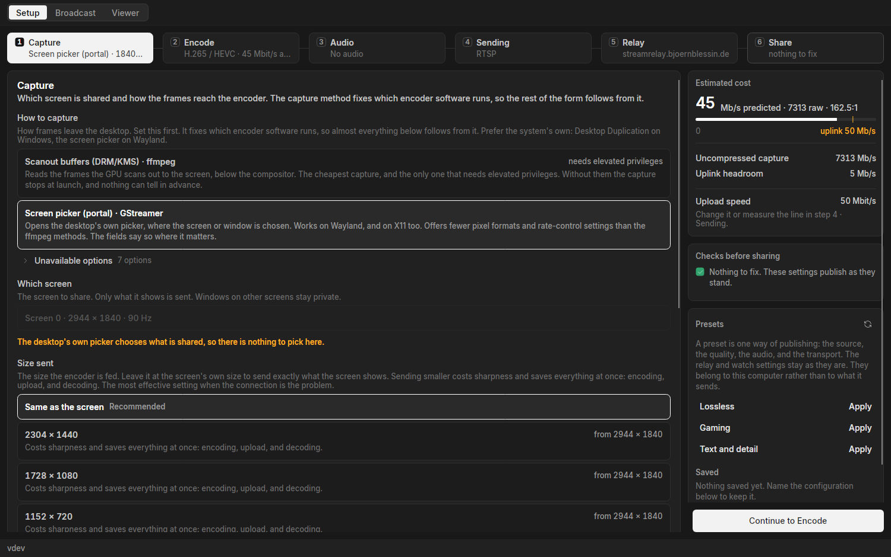
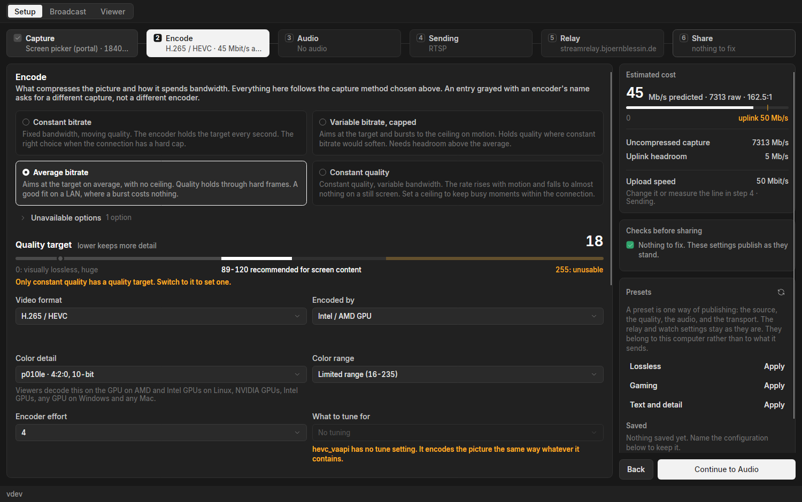

# MirrorMe

Screen sharing for a group, at the quality the machine can produce.
Everyone shares and everyone watches, at once.
Free and open source, with no accounts.

Built for the screens a video call blurs: code, a terminal, a spreadsheet, a game at 60 fps.
A call spends two to five megabits a second on a screen and softens everything on it.
MirrorMe spends forty and leaves the text readable, the thin lines whole and the dark scenes dark.

## What it does

- Everyone in a group shares and watches at the same time, each stream a tile in one window.
- Text stays sharp at its own size, so a terminal or a code editor reads the way it reads on the desk it came from.
- Resolution, frame rate and quality are settings, from a still page of text to a game at 60 fps.
- Presets name the picture wanted, Lossless, Gaming or Text and detail, and the app works out how to reach it here.
- What this machine cannot do is greyed out with the reason beside it, so nothing fails halfway through.
- The graphics card does the encoding wherever it can, leaving the processor to the work being shared.
- Desktop sound travels with the picture.
- The delay from screen to viewer is measured and shown while sharing.
- Streams are watchable in the app, in a browser, or in a media player.
- A group is a key. Passing the key on is how someone joins, and dropping it is how they leave.

Windows and Linux.

## Install

Downloads are on the [releases page](https://github.com/bjoern621/screen-sharing/releases), one file per platform.
[`docs/install.md`](docs/install.md) covers what each one carries and what a first run asks for.

| Platform | Get it |
| --- | --- |
| Windows | `mirrorme-<version>-windows-x86_64-setup.exe`, or the `.zip` to run from anywhere |
| Arch Linux | `sudo pacman -U mirrorme-<version>-1-x86_64.pkg.tar.zst` |
| Fedora | `sudo dnf install ./mirrorme-*.rpm` |
| Flatpak | `flatpak install --user ./mirrorme-<version>-x86_64.flatpak` |
| Nix | `nix run github:bjoern621/screen-sharing` |
| Other Linux | `mirrorme-<version>-linux-x86_64-portable.tar.gz` |

One window, and nothing to set up before the first run.

## Share a screen

1. Open MirrorMe on the Setup tab.
2. Create a group, or paste in the key a member sent.
3. Pick a screen and a preset, or walk the steps and set the picture by hand.
4. Share.

Every stream in the group arrives on the Viewer tab, one tile each.
Sharing without a group key makes the stream public, and the app says so before it starts.

## Who sees it

Streams travel through a relay, one server the group's members publish to and read from.
Each member uploads one copy however many people watch, and no home connection has to be reachable from outside.
The relay can read what it carries, so a group that wants that ruled out runs its own: [`docs/install.md`](docs/install.md), "The relay".
The app comes pointed at the project's relay.

A group's key is what grants access to its streams, and anybody holding it can watch and share.

`docs/` holds the rest:
[`network-architecture.md`](docs/network-architecture.md) for what travels where,
[`membership.md`](docs/membership.md) for what a group is,
[`video-stack.md`](docs/video-stack.md) for how the picture is made.

## Developing

Go backend, Avalonia shell, a gRPC contract between them in [`api/`](api/).
`task` lists the development and packaging tasks, and `task all` runs relay, backend and shell together.
[`docs/development-principles.md`](docs/development-principles.md) governs every change, and [`docs/readme-audience.md`](docs/readme-audience.md) governs this page.
`api/`, `backend/` and `avalonia/` each carry a README for their layout.

## License

Apache-2.0 ([`LICENSE`](LICENSE)).
The Windows downloads also carry ffmpeg and the GStreamer runtime, under their own GPL and LGPL terms.
[`THIRD-PARTY-NOTICES.md`](THIRD-PARTY-NOTICES.md) states what every artifact ships and where its source is.
