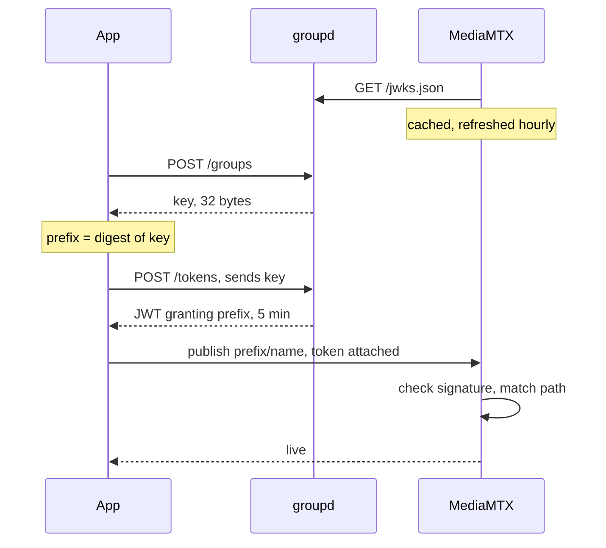
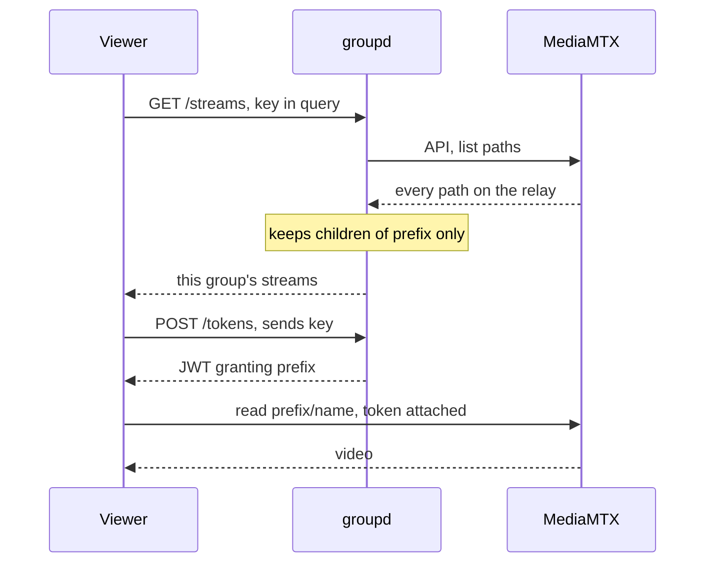
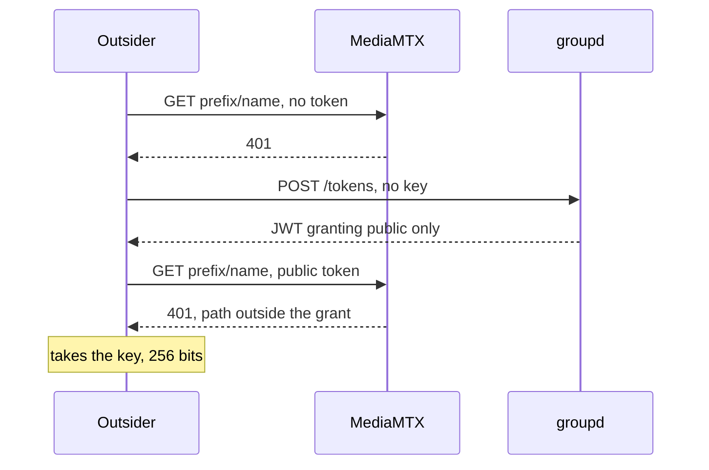

# Paths and auth

Key is the secret.
Path is public and rides in every URL.

Path is `<group-id>/<name>`, and the group id is a digest of the key.

## Make a group, then publish

groupd is never called per connection.
The relay holds the key set ahead of the handshake and refreshes it on a timer, so a connection is checked by arithmetic and never by a round trip.

## Watch

The viewer never reaches the relay API.
Filtering happens at groupd, so a listing carries one group and never all of them.

## Outsider knows the path

Read is an authenticated action on every listener, not only on the API.
Knowing the path buys a 401.

## What each door takes

| Door | Takes | Path alone enough |
| --- | --- | --- |
| `POST /groups` | nothing, rate limited per address | makes a fresh group, reaches no existing one |
| `POST /tokens` | key, or nothing for public | no, the request has no path field at all |
| `GET /streams` | key, or nothing for public | no, a prefix is not a key |
| publish or read | JWT | no, the grant is `~^prefix` and the relay matches it |

## What a leak costs

One grant covers both actions, so a leak publishes into the group as well as reading it.
A leaked token lasts five minutes.
A leaked key lasts until the group draws a new one, which is `POST /groups` again.
The relay and groupd see plaintext either way, since nothing here is end to end.

`network-architecture.md` covers who holds what, and `backend/internal/groupsvc` is the service itself.
