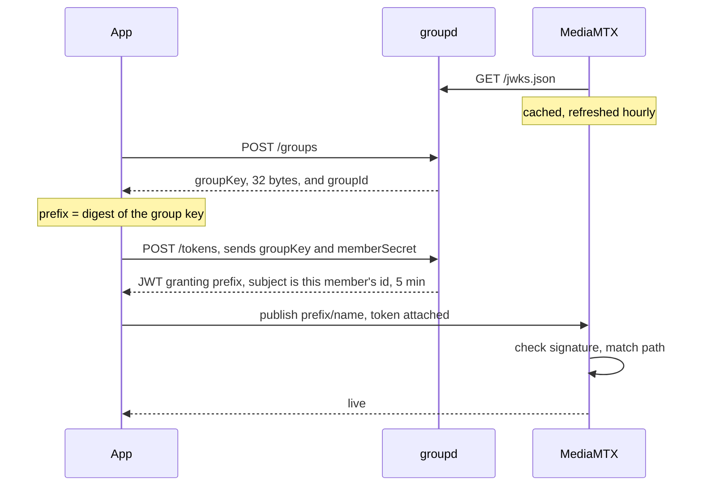
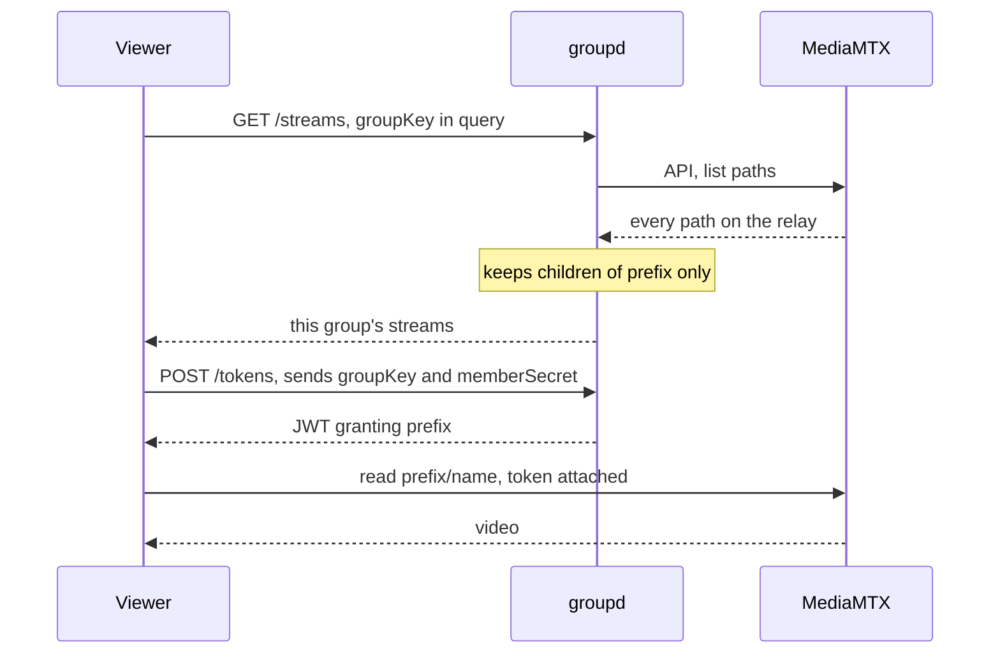
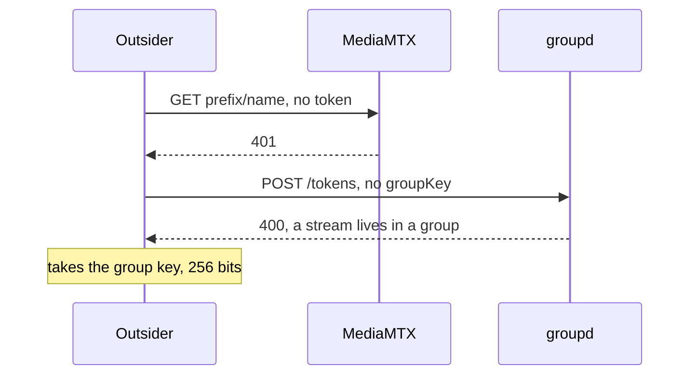

# Paths and auth

Group key is the secret.
Path is public and rides in every URL.

Path is `<group-id>/<name>`, and the group id is a digest of the group key.

## Make a group, then publish

groupd is never called per connection.
The relay holds the key set ahead of the handshake and refreshes it on a timer, so a connection is checked by arithmetic.

## Watch

The viewer never reaches the relay API.
Filtering happens at groupd, so a listing carries one group.

## Outsider knows the path

Read is an authenticated action on every listener, not only on the API.
Knowing a group's path buys a 401, and there is no path outside a group to know.
A browser reaches a stream on the same terms, its address carrying the token as userinfo.

## Leaving

A token cannot be taken back.
The relay reads one at the handshake and not again, so a connection outlives its token and a client that is closed opens another with the same one.

Membership is therefore enforced by closing connections, against the presence leases the same service holds.
`membership.md` covers what states a lease, what a run closes and what it leaves alone.

## What each door takes

| Door | Takes | Path alone enough |
| --- | --- | --- |
| `POST /groups` | nothing, rate limited per address | makes a fresh group, reaches no existing one |
| `POST /tokens` | group key, and the member secret naming who asks | no, the request has no path field at all |
| `GET /streams` | group key | no, a prefix is not a group key |
| `PUT /members`, `DELETE /members`, `GET /members` | group key, and the member secret on the two that state and release | no |
| `POST /reconcile` | nothing, on loopback only | a path names a group and buys a run against the leases that group's own members stated, answered with no content |
| publish | JWT | no, the grant is `~^prefix` and the relay matches it |
| read | JWT | no, the grant is `~^prefix` and the relay matches it |

## What a leak costs

One grant covers both actions, so a leak publishes into the group as well as reading it.
A leaked token lasts five minutes.
A leaked group key lasts until the group draws a new one, which is `POST /groups` again.
A leaked member secret on its own buys nothing: every route that takes one takes the group key beside it.
The relay and groupd see plaintext throughout, since nothing here is end to end.

`network-architecture.md` covers who holds what.
