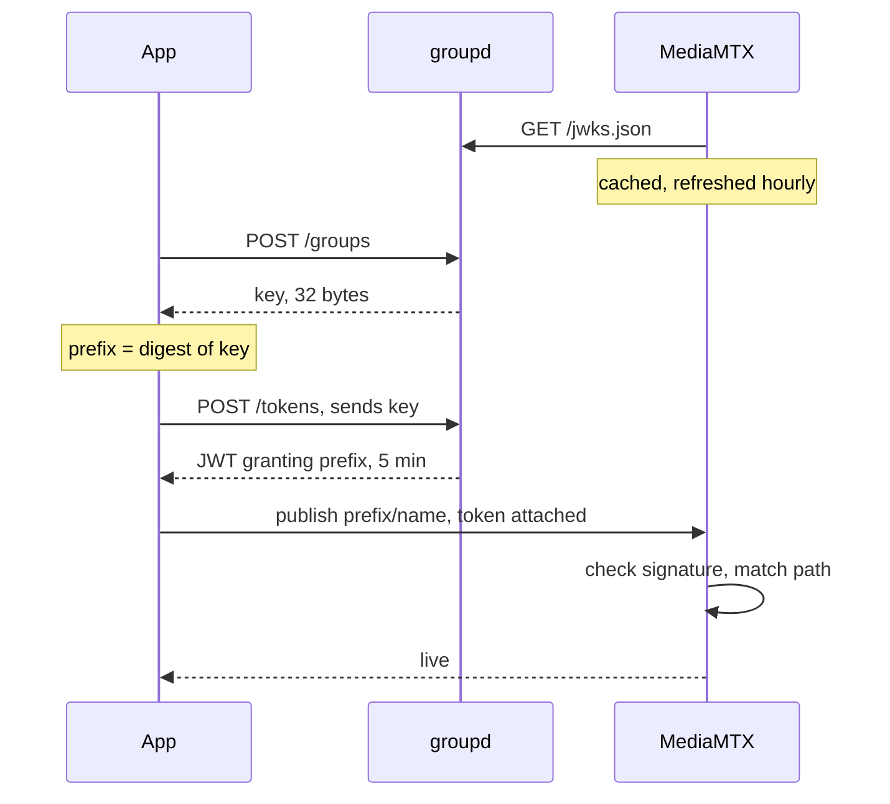
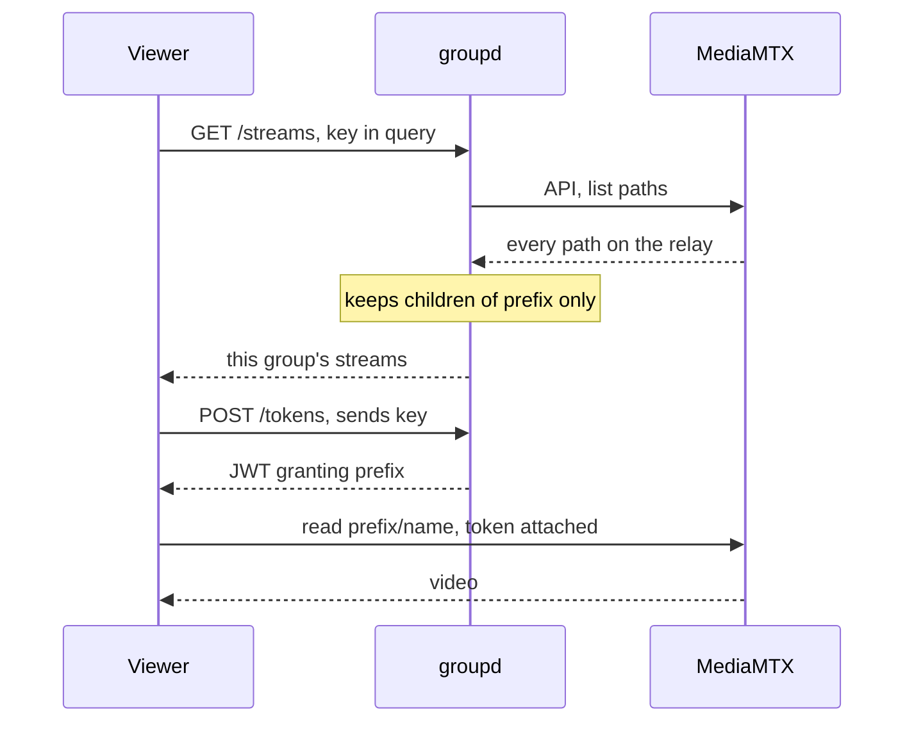
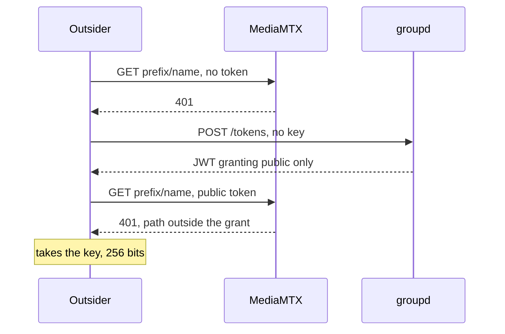
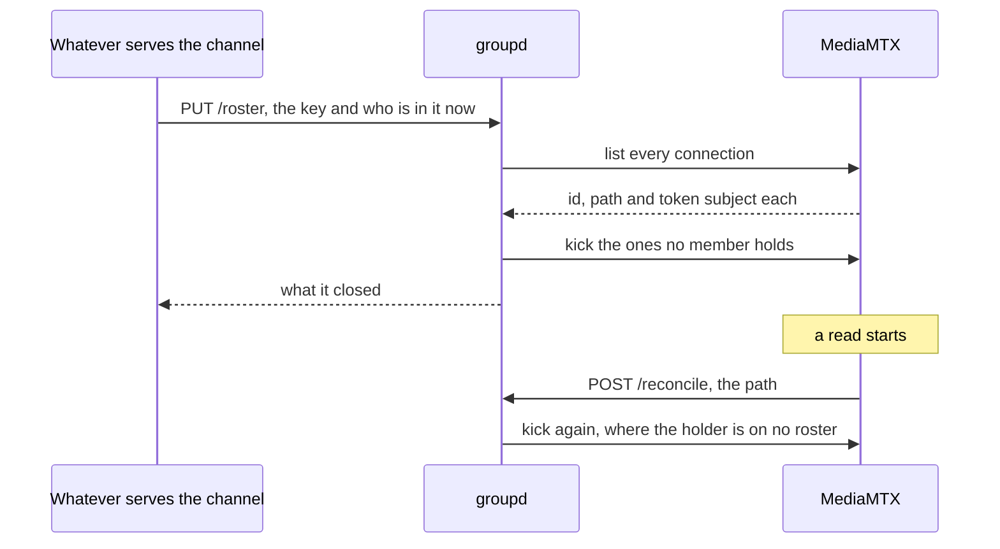

# Paths and auth

Key is the secret.
Path is public and rides in every URL.

Path is `<group-id>/<name>`, and the group id is a digest of the key.

## Make a group, then publish

groupd is never called per connection.
The relay holds the key set ahead of the handshake and refreshes it on a timer, so a connection is checked by arithmetic and never by a round trip.

## Watch

The viewer never reaches the relay API.
Filtering happens at groupd, so a listing carries one group and never all of them.

## Outsider knows the path

Read is an authenticated action on every listener, not only on the API.
Knowing a group's path buys a 401.

`public/` is the exception, and it is the whole of what the prefix means.
The relay excludes read there (`authJWTExclude`, `deploy/mediamtx-groups.yml`), so an address opened in a browser plays.
Publishing under it still takes a token.

## Leaving

A token cannot be taken back.
The relay reads one at the handshake and not again, so a connection outlives its token and a client that is closed opens another with the same one.

Membership is therefore enforced by closing connections.

A member's token names that member.
`POST /tokens` takes a `member` beside the key, and the subject becomes a keyed digest of that name under the group's key.
The relay lists and logs a connection under its subject, so a roster tells one member's connections from another's, and the name never reaches the relay.
The grant does not move with the subject: membership decides who connects, never what they reach.

The roster is stated whole and never as a departure, since two callers racing on "who left" can leave a member the last one did not name.
Stating the same roster twice closes nothing.

A group nobody stated a roster for is not enforced, which is not the same as a group whose roster is empty.
The first is membership this service was never told, and the second is a channel nobody is in.

Kicking is not revoking.
The member who left holds a token until it expires, so a second attempt is closed by the relay's read hook running the roster again (`deploy/reconcile-on-read.sh`), and keeping them out for good belongs to whatever issues tokens.

Streams under `public/` are outside all of it.
No key derives that prefix, so no roster can name it, and a run there is refused rather than answered: anybody may watch, so there is nobody to remove.

`GET /roster` and `GET /streams` ask different things of the same relay and neither keeps a copy.
The index is what a member may open, and the roster is who is connected.
Both name a stream the same way, by its name inside the group, so the two join without a caller deriving the prefix rule again.
Neither answers the relay's own session ids or the addresses connections came from: a group key is membership, not an operator's credential.

The proxy fronts neither `/roster` nor `/reconcile` (`deploy/Caddyfile`).
`/reconcile` takes no credential, being the relay's read hook on loopback, and `/roster` takes the group key and has no caller outside this host yet.

`backend/internal/roster` holds the rosters and `backend/internal/relay` sweeps and kicks, `readerKinds` naming the per-protocol lists that take one.

## What each door takes

| Door | Takes | Path alone enough |
| --- | --- | --- |
| `POST /groups` | nothing, rate limited per address | makes a fresh group, reaches no existing one |
| `POST /tokens` | key, or nothing for public | no, the request has no path field at all |
| `GET /streams` | key, or nothing for public | no, a prefix is not a key |
| `PUT /roster`, `GET /roster`, `DELETE /roster` | key, and the proxy fronts none of them | no |
| `POST /reconcile` | nothing, on loopback only | a path names a group and buys a run against a roster somebody else stated |
| publish | JWT | no, the grant is `~^prefix` and the relay matches it |
| read | JWT, nothing under `public/` | outside `public/` no, under it yes |

## What a leak costs

One grant covers both actions, so a leak publishes into the group as well as reading it.
A leaked token lasts five minutes.
A leaked key lasts until the group draws a new one, which is `POST /groups` again.
The relay and groupd see plaintext either way, since nothing here is end to end.

`network-architecture.md` covers who holds what, and `backend/internal/groupsvc` is the service itself.
