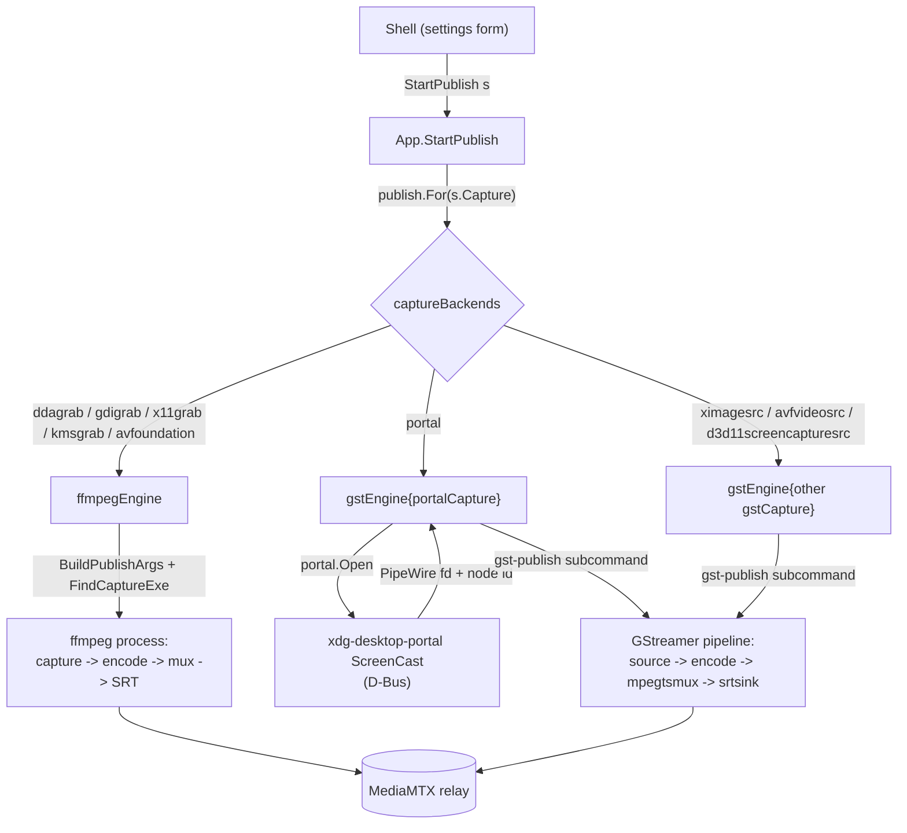

# Capture and publish architecture

Publishing a stream means capturing the screen, encoding it, and pushing it to the relay.
Different capture methods need different machinery: a screen grabber that feeds one ffmpeg process, or a desktop portal whose frames arrive over PipeWire and run through a separate media framework.
The architecture hides that difference behind one contract, so the code that starts, supervises and stops a stream never names ffmpeg or GStreamer.

## The seam

The seam is the `publish.Publisher` interface.
A capture backend owns its whole pipeline behind that contract: capture, encode, mux and transport.
Drawing the seam here, rather than at "ffmpeg input arguments", is what lets a backend bring its own engine.
A screen grabber and a portal session are both just "a supervised process that pushes to the relay".

Both engines return a `publish.Handle`, and the app supervises every backend through the same handle.

## Where responsibilities lie

The **app layer** (`publish.go`) is engine-agnostic.
It selects a `Publisher` for the settings, holds the running `Handle`, forwards progress and exit to the frontend as events, and rejects a second concurrent publish.
It has no knowledge of how any backend captures or encodes.

A **Publisher** owns the full pipeline for one family of capture backends.

- `ffmpegEngine` covers the screen grabbers (ddagrab, gdigrab, x11grab, kmsgrab, avfoundation).
  They differ only in ffmpeg input arguments, so one engine builds the whole `ffmpeg` command from `ffmpeg.BuildPublishArgs` and runs it as a single process.
- `gstEngine` covers the GStreamer backends, one instance per screen source.
  The source is a `gstCapture` field, not a branch inside the engine, so the engine builds, supervises and tears down a pipeline without naming a source.

Capture backend and publish engine are two axes.
`captureBackends` is the table pairing them, and which engine a row names follows from which framework has an element or an input device for that source, not from a property of the engine.
A screen both frameworks read is two rows, one per engine, each named as its own framework names the source: the macOS screen is `avfoundation` under ffmpeg and `avfvideosrc` under GStreamer, the Windows desktop `ddagrab` or `gdigrab` under ffmpeg and `d3d11screencapturesrc` under GStreamer.
A source only one framework reads is one row, and each framework has some: ffmpeg has no PipeWire input device, so the portal is GStreamer's, and GStreamer ships a `kmssink` and no capture element for DRM/KMS scanout buffers at all, so kmsgrab is ffmpeg's.
Both engines therefore have a row on Linux, Windows and macOS, and no platform decides the publish engine on the user's behalf.

A `gstCapture` produces raw frames up to and including the capsfilter that pins the encoder input, which is the point after which every backend is identical.
`portalCapture` performs the ScreenCast handshake and hands the child a descriptor; `ximageCapture` reads the X screen and acquires nothing.
The engine validates the settings before it calls `Open`, so a combination the tables forbid never pops the compositor's picker.

The **screensrc** package holds the GStreamer element that reads one of this machine's outputs, and the properties that single it out: `ximagesrc` cropped to the monitor's rectangle on X11, `d3d11screencapturesrc` on its `monitor-index` under Windows.
It sits below the engines because two consumers need the same rectangle.
The GStreamer capture heads above build from it, and so does the setup wizard's monitor preview, which reads a screen into the frame channel before anything is published (`viewer-architecture.md`, "What the screen picker draws").
A preview cropped differently from the stream would be a picture that lies about what is shared.
The same package also answers which sessions can read one output apart from another at all, which is where the wizard learns to offer a list instead of pictures: a Wayland session reaches a screen through the portal alone, and AVFoundation's screen source chooses its own display.

The **gpupath** package declares which capture backend and encoder family pairs hand frames to the encoder without a trip through system memory.
It sits below both engines because the fact is shared and the vocabulary is not: a row states that a path exists, and each engine builds it with its own elements or filters.

The **portal** package (`portal.Open`) performs the ScreenCast D-Bus handshake and returns the PipeWire remote fd and node id.
It knows nothing about encoding.

The **transport** package holds the destination, and each engine's serialization lives with the transport that knows its dialect.
A registry entry is one protocol, not one leg: the same entry serializes the publish leg for an encoder and the watch leg for a viewer, and the two legs of a stream need not use the same one (see `viewer-architecture.md`, "Two legs, two protocols").
Everything on this page is the publish leg unless it names the watch one.
The base `transport.Transport` is engine-neutral: it names itself and states what it carries per leg and per engine.
Each publish or watch engine has a peer capability interface a transport may implement: `FFmpegPublisher` (ffmpeg output args), `GstPublisher` (GStreamer muxer and sink), `Watcher` (a viewer URL), `GstWatcher` (receiving pipeline source).
No engine is privileged in the base contract; an engine asks for its own serialization through the matching package helper, and a transport that cannot supply it is simply unusable with that engine.
The carriage and the capability are two statements of one fact, so `transport.Register` asserts each against the other: an engine that states what it carries on a leg implements that leg's interface, and one that implements it says what it carries.
The serializations are not interchangeable: ffmpeg's SRT protocol takes a query-string URL with latency in microseconds, while GStreamer's `srtsink` uses libsrt properties with latency in milliseconds.
A transport carrying several engines implements several capabilities; keeping each dialect on the transport is what stops one engine's serialization from leaking into another.

The **watch** package mirrors this seam from the viewer side.
`watch.Select` picks the viewer engine for the chosen watch leg (ffplay by default, mpv via `SCREENSHARE_VIEWER`), and each engine builds its own command line from the transport's `Watcher` URL.
The leg is passed in by name rather than read off `settings.Publish.Transport`, which is what keeps a viewer free to receive over a protocol the stream was not published with.
A transport without a URL watch form (WebRTC, whose playback is the WHEP exchange rather than an address) is reachable by a receive pipeline's `GstWatcher` and by no viewer program here; an engine keyed on a capability of its own would touch only the watch package.

The **capabilities** package holds the codec facts both engines and the UI share.
Each engine maps those facts to its own vocabulary: `ffmpeg/args.go` to ffmpeg encoder flags, `publish/gstreamer.go` to GStreamer elements.

## Changing settings on a live stream

A publish engine runs a child process built from a command line, and `ffmpeg` takes no value back once it is running.
The GStreamer runner does: it is this application spawned with a subcommand (`backend/internal/gstrun`), and the engine gives each run a control socket to converge on whole states.
A stream carrying other settings is therefore another pipeline wherever the change is not one of those values, and reaching it means relaunching the child.
`App.Republish` is that operation, and it takes the cheaper half first: where the running child accepts the change it is written to the socket and every viewer keeps watching, and where it does not the pipeline is torn down and rebuilt.
Viewers reconnect across a rebuild, which is why the form asks for it rather than making it on every edit.
The settings form stays editable while a stream is live, and a bar appears once what it shows is no longer what is publishing.

**Which changes the child takes is one table.**
`publish/live.go` names each settings field a running pipeline accepts a new value for, what has to hold for it - the engine, and whatever decides that the encoder is being sent the value at all - and how the child is told.
`publish.LiveFields` answers it for a configuration and `publish.LiveOnly` asks whether a change stays inside it, by putting the running settings' live values back onto the proposal and comparing the rendered commands.
The same rows register into the rule evaluator, so a form marking a control live (`field-availability.md`) and an apply that skips the relaunch are one statement.
The bitrate is the field that carries it: every encoder element here has a rate property, and the socket's state is proved against `x264enc` taking a new one while it plays.
A write the child refuses falls back to the relaunch, because a socket that cannot be reached is a child that cannot be told anything, and reporting the apply as done would leave the stream on values nobody chose.

**The rendered command decides whether a relaunch is needed.**
`publish.SamePipeline` renders both settings objects and compares the strings.
The command is the whole of what an engine hands its child, so a field no builder reads cannot change it, and a field a builder reads always does.
A table of which fields matter would be a second statement of the same fact, and would fall behind the builders the first time one of them read a field the table did not name.
It is also what leaves the watch leg, the uplink figure and the relay's API port free to move under a running stream: no pipeline is built from them.

**A run is replaced whole, except where the child never restarted.**
`App.run` is the publish in force, and it carries the settings its pipeline was built from.
Those settings are what the pending state is measured against and what the form reverts to, so the value the user is shown as live is the one the child was started on rather than a copy kept beside it.
A relaunch kills a child whose last progress sample and whose exit arrive after the replacement is already running, so both callbacks check the run they were created for.
A write to the running child moves those settings in place instead: the handle, the start time and the attempts all belong to a process that is still playing, and replacing the run would leave that process's callbacks pointing at nothing.
The `publish:exit` event reports the run the app still holds, which is the run nobody asked to end: a stop was asked for, and a relaunch has a pipeline running in its place already.

**The order is refuse, tear down, launch.**
The new settings are rendered before anything is stopped, so a combination no engine can build refuses the relaunch and leaves the stream on what it is running.
The outgoing child is killed and not waited for: MediaMTX closes the publisher it holds when a new one connects to the same path, so the successor does not have to arrive after the old socket is gone.
A launch that fails after the teardown leaves nothing publishing: the pipeline that was carrying the stream is gone by then, and there is nothing to return to.
The reason is the failed launch's own error, or the new child's exit where it started and then died.

Each launch opens a portal session of its own, and the stored restore token is what keeps the compositor's picker from popping on a relaunch (see "The portal handshake").

## A pipeline that dies on its own

An encoder child can die without anyone asking it to: the relay restarts, a capture source goes away, a driver takes the GPU down under it.
`App.publishEnded` meets that with a bounded relaunch on the settings the dead pipeline was running, over the backoff in `publishBackoff`.
Only an unrequested exit reaches it, because a stop and a relaunch both replace what the app holds before their child's exit arrives.

**How long the pipeline ran is what the budget turns on.**
The exit alone cannot say whether another attempt would end differently: a relay that is not up yet and an encoder that hangs the GPU both leave a child dead within seconds, under the same signal and the same status.
A pipeline that reaches `publishHealthy` and dies later met something that moved underneath it, so its failure starts from a full budget however many attempts an earlier outage cost.
One that never reaches it is failing at launch, and the backoff is the whole of what the app will try before it reports the failure and stops.
The bound is what keeps a settings combination this machine cannot run from being retried forever, which for a VAAPI encoder that wedges the video engine would mean a driver reset per attempt.

**A publish between attempts is still a publish.**
`App.retry` holds the pending relaunch, and `App.run` is nil for as long as it does; the two are never both set.
`GetPublishState` answers `publishing` across that wait, with `retrying` and the attempt count separating a stream carrying frames from one waiting to come back.
The form therefore keeps showing the settings the stream will return on rather than reverting, the button keeps offering the stop, and a start is refused the way it is against a running stream.
`publish:exit` fires once the app stops retrying, so the reason reaches the user when publishing has actually ended rather than once per attempt.

## Frame memory

A capture backend that produces GPU frames and an encoder that reads GPU surfaces can be linked directly: the conversion to the encoder's layout runs on the device and no frame crosses the bus.
Where either end speaks system memory, every frame is downloaded, converted on the CPU, and uploaded again for a surface encoder.
The difference is a full round trip per frame at capture resolution, which is why the pair decides the shape of the whole capture chain rather than one filter in it.

`gpupath.Paths` is the pair table, and the `captureMemory` setting is how a run asks for one of the paths.
`auto` takes the direct path where the pair has one whose colour is the form's and the copy otherwise, `gpu` refuses a pair with no row, `gpu-encoder-color` takes a direct path whose colour is the encoder's, and `system` is the copy every pair can run.
Auto is the value every pair satisfies, which is what makes it the default a settings file with no frame memory migrates to.

Each engine states the direct path its own way, and both replace more than one element.

- The GStreamer engine pins `pipewiresrc` to `video/x-raw(memory:DMABuf)`, converts with the encoder family's own post-processor instead of `videoconvert`, and carries the family's caps feature on every capsfilter downstream of it, the framerate one `imagefreeze` paces to included.
  Plain `video/x-raw` means system memory, so a capsfilter that omits the feature pins the frames back into the round trip and the negotiation fails against a source offering only device memory.
  `gstGpuMemories` is the engine's half of the table: the caps feature a family's surfaces carry and the element that converts into them.
- The ffmpeg engine drops `hwdownload` from the grabber's chain, drops the `hwupload` and the device option a surface encode ends in, and maps the captured frames with `hwmap=derive_device=` onto the encoder's device.
  The conversion is the family's own device-side scaler, which also states the colour description, since there is no software stage left for a `setparams` tag.
  `gpuConverts` is the engine's half of the table.

Who converts is the second fact a row carries, because it decides whose colour the stream ends up in.
A row is `ColourExact` where a device-side filter is told the matrix, primaries, transfer and range and states them on what it wrote: `scale_vaapi` and `vpp_qsv` carry all four `out_` options, and `d3d11convert` is told the same four as a colorimetry on its output caps.
A row is `ColourEncoder` where the platform offers no such filter at all and the encoder converts the captured RGB itself.

The ffmpeg nvenc row on Windows is the one of those.
Nothing can stand between `ddagrab` and that encoder: `hwmap` derives neither a CUDA nor a Vulkan device from a Direct3D11 frame, answering `ENOSYS`, so `scale_cuda` and `libplacebo` are unreachable however they state their colour, and `scale_d3d11` is reachable and cannot create the encoder's layout from the captured BGRA.
So nvenc reads the texture on its own device and converts it, at BT.601 and limited range in 8-bit 4:2:0, and signals exactly that.
The description is complete and true, and it is not the one the form shows: `-color_range` and `-pix_fmt` are discarded, so the command drops them rather than displaying an option the run ignores.

That is a trade the publisher is entitled to make once it is stated, so the row is offered rather than withheld, under a frame memory of its own.
`gpu` asks to keep the frames on the device *and* keep the colour the form shows, and is refused on such a row with the cost named; `gpu-encoder-color` asks for the device path at the encoder's colour; `auto` never picks it, because a setting the user never touched must not change what the stream looks like.
The two fields the encoder overrides grey with the row's `Cost`, and the repair moves them onto what it actually signals.

### Capture GPU and encode GPU

Sharing memory needs one device holding both ends, and which check establishes that differs per row.

Three rows need no check.
The two ffmpeg ones map the captured frames onto a device derived from the frames themselves, and the Windows GStreamer one names the nvcodec auto-GPU encoder, which takes its adapter from the frames it is handed, so in all three the encoder runs on the GPU the capture came off by construction.
The portal names no device at all: the compositor renders where it renders, the PipeWire node carries frames without saying which GPU allocated them, and the va elements open their own.
The two are the same GPU exactly when the machine has one render node, so that is the condition `portalCapture.HoldsOneDevice` holds, and a machine with several is refused with them named.

The refusal binds under `auto` as well.
Auto answers whether the pair has a direct path, which this one has; a second GPU is a property of the machine, and demoting for it would hand back the round trip the setting was meant to avoid without saying so.
The way out is `system`, which the refusal names.
It runs before anything is acquired and before the rendered command is produced, so the command the form displays is one the button beside it can actually run.

## Audio

The audio setting adds a second track to the same mux; nothing changes on the viewer side, players pick the second track out of the stream on their own (an MPEG-TS elementary stream over SRT, an RTP track of its own over RTSP).

Two settings describe that track.
The source (`Audio`) says where it comes from: both engines capture the monitor of the default sink through the PulseAudio protocol, which PipeWire also serves.
The codec (`AudioCodec`) says how it is coded, and the row in `capabilities.AudioCodecs` carries the element each engine uses, the sample rate the branch resamples to and the bitrate it targets.
`ffmpeg/args.go` builds a `-f pulse` input and a `-c:a` from the row's ffmpeg encoder; `publish/gstreamer.go` builds a `pulsesrc` branch ending in the row's element and its parser, since a muxer pad needs framed caps to negotiate.
The branch attaches by element name, which is why `GstPublisher` sinks name their muxer `transport.GstMuxName`.
Which legs carry which codec is the `Carriage.Audio` half of the transport table, so both engines refuse a codec they cannot code (`capabilities.ValidateAudio`) and one the publish leg does not carry (`transport.ValidatePublishAudio`).

Desktop audio is Linux's alone, and each of the other platforms refuses it for its own reason.
ffmpeg has no WASAPI loopback, so the Windows grabbers reach no monitor source, and AVFoundation enumerates input devices only, so what a Mac plays is not a source the macOS grabber can open.

## The pointer

`Cursor` says what the mouse pointer does in the captured frames, and it takes three values because there are three answers rather than two: `embedded` draws it into the picture, `hidden` leaves it out, `metadata` sends its position beside the stream for a viewer to draw itself.
The third is not more or less of the first two.
An embedded pointer costs bitrate, since the encoder redraws the area it moves through, and it blurs with everything else the picture spends bits on; a metadata pointer stays sharp at any scale and reaches only a viewer that draws one.

What each backend can do is a table of its own (`publish/cursor.go`), keyed by capture backend, and its rows are written as rules rather than converted into them: the fact is about the backend and has nothing to do with the encoder, which is the shape the codec-scoped `Gap` could never carry.
Every backend serves `embedded` and `hidden` through a property of its own - `draw_mouse` on the ffmpeg grabbers, `show-pointer` on ximagesrc, `show-cursor` on d3d11screencapturesrc, `capture-screen-cursor` on avfvideosrc, `cursor_mode` on the portal.
Two rows are the reason the table exists.
kmsgrab reads the scanout's primary plane and the pointer is a hardware plane the display composes over it, so that path cannot draw one at all and `hidden` is the only mode describing what it does.
The portal is the only backend that reports a position instead of drawing it, so `metadata` is its alone.

`metadata` is refused everywhere for a second reason, which is this app's rather than any backend's: nothing on the wire carries a pointer position and no viewer draws one, so a stream sent that way would arrive with none.
Both facts cross where both hold, since they are different things to fix, and deleting that one rule is what ships the mode once the channel exists.

A monitor preview draws the pointer whatever the setting holds.
A preview answers what a screen looks like so a reader can tell one from another, and two desktops often differ by nothing else.

## Colour

A desktop is full-range RGB.
Every YUV chroma the encoders take is a smaller container, so the publish leg has to say which one it filled: the range setting picks it, and the bitstream carries it to the viewer.

Each engine states it its own way.
`ffmpeg/args.go` passes `-color_range`, which swscale converts by, and tags the frames with the colour description through a `setparams` filter (`colourFilter`), which is what puts that description in the bitstream: the output options reach only part of it, and the range stays off the tag because tagging it ahead of the conversion makes swscale write limited range whatever `-color_range` says.
`publish/gstpipeline.go` pins a colorimetry on the encoder input, and pins all four of its components.
A colorimetry with the range set and matrix, transfer and primaries left unknown is not partially applied: `videoconvert` drops the range along with them and converts to limited range whatever the range said, so the setting would reach the caps and change nothing about the frames.
The three named components are BT.709 for a standard-range surface, which is every screen this captures until one of them is not.

Which is why the encoder input states more than one colour where the pixel format can hold more than one.
`gstColorimetries` lists a structure per colour the publish accepts at the configured range: BT.709, and the two BT.2100 curves where the format carries ten bits.
The child narrows them to the one whose transfer the capture is producing, on a probe taken before the pipeline plays, so the surface's own colour is what negotiates and nothing converts it (`gstrun/surface.go`).
A value list would not do: `videoconvert` fixates one to its first entry whatever the frames carry, which is a conversion wearing negotiation's clothes.
The order is the answer for anything that does not narrow - a rendered command pasted into `gst-launch`, and the encode probe - and it leads with the standard-range row, which is what a capture stating no transfer at all is.
Mastering display metadata and the content light level ride through untouched, because the encoder input names neither and every field it does not name survives the intersection.

What the pipeline pins is only half of it: the bitstream is the only place a viewer reads the colour from, since RTP and MPEG-TS carry no colour description of their own.
A stream that signals none is watched in the viewer's own default, limited-range BT.709 off the picture size, whatever it holds.
Full range is therefore declared as a colour-range `Gap` wherever the stream would not carry it, and the gap's reason names what fails: an encoder that writes no colour description (the va elements and `av1enc` on the GStreamer engine), an encoder that writes limited range whatever it is told (the AMF and Vulkan AV1 encoders), or a format with no colour range field at all (VP8, on both engines).
Limited range is what an unsignalled stream is watched as, so it is the range that arrives as it was encoded, and where the other engine's encoder states the range the reason says so.
`publish.TestPublishedColorimetryReachesTheDecoder` and `ffmpeg.TestPublishedColorimetryIsSignalledInTheBitstream` encode and decode a real stream to hold both engines to it, for every codec the table publishes rather than for the two H.26x formats.
Both hand the decoder the bitstream and its framing alone, since a container that frames a stream records a colour description of its own and a round trip through one would assert what the muxer wrote.
An Annex B or OBU stream needs no framing at all; where a format does, it travels in IVF, whose header carries a fourcc, the picture size, the frame rate and the frame count, and nothing about colour.

Limited range is lossy by construction and viewers disagree about the expansion.
A receive pipeline's `videoconvert` lands about two code values below what ffplay and mpv land on for the same limited-range frame.
Full range has no expansion step, so both agree.

On Windows and NVIDIA the two engines differ in whose colour the stream carries, which is measured rather than argued.
The GStreamer device path is exact: `d3d11convert` is told a colorimetry on its output caps and converts to it, so a white patch published at full range stores Y=255 and at limited range Y=235, with all four components signalled.
The ffmpeg device path into the same encoder has no filter to tell anything, so the same patch arrives as BT.601 limited-range 4:2:0 whatever the form said.
GStreamer negotiates colour in caps and ffmpeg states it in filter options, which is why the contract holds by construction on one engine and has to be traded away on the other.

## Progress

Both engines feed the publish insights the same `Stats` sample, and each measures it with what its pipeline offers.
ffmpeg writes a `-progress` stream on stdout that `ffmpeg/proc.go` parses.
GStreamer has no equivalent, so `publish/gststats.go` splices two elements between the parser and the muxer: a `progressreport` printing the encoded frame count and the pipeline running time once a second, and a `tee` handing a second copy of the encoded video to a `tcpclientsink` on a loopback socket the app weighs, since no element reports byte throughput.

The byte branch reaches the app over a socket rather than an inherited descriptor because Windows inherits none: `os/exec` supports `ExtraFiles` on Unix alone, and a child handed one fails to start with `fork/exec ...: not supported by windows`, which took the whole GStreamer publish path down there for as long as the meter used a pipe.
The meter opens its listener on an ephemeral loopback port before the pipeline is built, so the port is what the branch is pointed at and the child always finds a peer; the listener closes on the first connection, since a run makes exactly one.
The portal descriptor is unaffected: `ExtraFiles` carries it on the one platform that has both a portal and descriptor inheritance.

A figure neither pipeline exposes is marked in the sample's `Missing` set and crosses the wire as null, because a zero is the reading that marks a stalled encoder and an unmeasured figure must not borrow it.
The zero value of the set means measured, so an engine flags only what it could not measure.

Falling behind and running ahead are two events with two counters.
`Dup` counts frames the encoder repeated to hold the output rate, which is what rises when capture or encode cannot keep up.
`Drop` counts frames discarded before the encoder for arriving faster than the output rate, which a pipeline that sets no output rate never does.
Naming one after the other is how a health column ends up structurally unable to move.
The instrumentation belongs to a run, not to the pipeline, so `Command` renders neither, the same way `-progress` stays out of the displayed ffmpeg line.

## The second sink

A run has one more branch than a rendered command shows, and it is not instrumentation: the broadcast screen's preview draws its local route from a copy the child sends to a loopback port.
On the GStreamer engine it is a second branch off the meter's own `tee` - a payloader and a `udpsink`, behind a leaky queue so a slow preview can never backpressure the encode path.
On the ffmpeg engine it is a second slave of the `tee` **muxer**, which is the one shape that writes the packets of one encoder to two muxers; two ordinary outputs would be two encoders on one capture.
That slave carries `onfail=ignore`, so a preview that cannot open leaves the stream alone, and the tee's own rule that automatic stream selection does not apply is what adds the `-map` arguments a tapped command has and a plain one does not.
The port is allocated per run, like the meter's, and `Command` renders neither for the same reason: whether two settings build one pipeline is decided by comparing the rendered string (`publish.SamePipeline`), and a per-run port would make every render differ.
`docs/viewer-architecture.md`, "What the broadcast preview draws", holds the carriage and the receiving half.

### Capture rate against encoded rate

How often the encoder emitted a frame and how often the screen produced a new one are two figures, and on a damage-driven backend they are far apart.
`imagefreeze` repeats the newest damage frame at the configured framerate, so the encoded rate equals the target whatever the screen does: a capture delivering three new pictures a second still encodes sixty.
A counter downstream of it therefore hands the target back as if it were a measurement, and the one figure a viewer actually experiences is missing.

So a capture backend places a second `progressreport` at the last point where one buffer is one new picture, ahead of anything that repeats or paces frames, and the sample carries both rates.
The capture rate falls below the target both when the shared screen is static and when the capture path is too slow to keep up, which are the two things worth telling apart from a healthy stream that merely encodes at its target.
It is a run's instrumentation like the rest, so a pipeline built without progress carries no probe and the rate reads unmeasured rather than zero.

The two engines' figures are not exactly comparable.
The GStreamer bytes are the video elementary stream, so its bitrate reads below the ffmpeg figure, which counts the muxed stream with its audio track and container overhead.

### Encode capacity

The counters above report a target the encoder could not reach only once the frames are already being discarded.
`encoderate` measures the same limit before a publish: it runs the configured encoder on generated frames of the captured monitor's size and times them, so the settings form can hold the target rate against what the machine does with it.
Nothing derives that figure, because it is the product of the CPU or fixed-function block, the picture size, the chroma and the rate-control mode together, and no table holds it.

The answer is a range, for the reason the bitrate estimate is one: encode cost depends on content.
The two ends are measured on the extremes an encoder can be handed, uncorrelated noise and a moving object over a flat field, and a screen sits between them.
A target under the low end is one no content can push the encoder off, and a target over the high end is one none can reach.

Each engine builds the probe out of what it would publish with, so the encoder, its rate-control properties and the conversion into its input are the run's own, and only frame acquisition and frame delivery are replaced.
The generator runs on a thread of its own, since a probe that serialises it prices the instrument into the figure.
A second run generates the same frames and encodes none, which bounds what the first could have measured: an encoder faster than the frames reaching it is timed against the generator, and the two readings together are what says so.
Each end carries that flag separately, because a floor at the high end is what a target above the range would otherwise be refused on, and refusing a rate the probe never reached is the one verdict the measurement cannot support.

The figure is not persisted, unlike the uplink one beside it in the form.
A line's capacity is a property of the line and survives a restart; an encode rate is a property of one settings combination on one machine, so it lives for as long as the settings it was taken under and is marked stale the moment they move.

## Interfaces

- `publish.Publisher`: `Command(s)` renders the pipeline for display; `Start(s, tag, Callbacks)` launches and supervises it.
- `publish.Handle`: `Running()` and `Stop()`, the lifecycle the app drives.
- `publish.Callbacks`: `OnStats` (best-effort progress) and `OnExit` (terminal result with the stderr tail and log path).
- `transport.Transport` (engine-neutral identity and carriage) plus the peer capability interfaces `FFmpegPublisher`, `GstPublisher`, `Watcher` and `GstWatcher`: each engine's serialization of one leg.
- `portal.Open(Options) (*Session, error)`: the ScreenCast handshake; `Session` carries `NodeID`, the remote `Fd`, a `Restore` token, and `Close`.

## The portal handshake

Every ScreenCast method is asynchronous: the call returns a Request object path and the result arrives on that object's `Response` signal.
`portal.Open` makes each Request path predictable through a `handle_token`, installs the signal match before invoking the method, and blocks for the response.
The sequence is `CreateSession`, `SelectSources`, `Start` (which pops the compositor picker unless a restore token is supplied), then `OpenPipeWireRemote` for the fd.
The fd is inherited by the GStreamer child as descriptor 3, and `pipewiresrc fd=3 path=<node>` reads the stream from it.

`SelectSources` names both monitor and window as source kinds, and which one is shared is the picker's answer rather than a setting here.
The compositor owns that choice and is the only side that knows which windows exist, which is also why the monitor index is inapplicable on this backend.

`Start` returns a restore token for the consent it granted, and `SelectSources` takes one back to skip the picker.
The token is machine- and consent-local, so it is stored on its own (`settings.PortalToken`) rather than as a field of the stream: a preset carries what the user chose about a stream, and one copied to another machine would carry a token no compositor there issued.
What the compositor returned is stored as it stands, an empty token included, since an empty one means the consent was not persisted and the token already on disk is spent.
`App.ForgetPortalConsent` drops it, which is how a share aimed at the wrong window is corrected.
Storing it is best effort: a failure costs a picker on the next publish and nothing else, so it is reported and the running stream is not failed over it.

## Adding a capture backend

A backend is a row in `captureBackends` pointing at the engine that runs it.
Under the ffmpeg engine that is an entry in `ffmpeg.captureBackends` building the input arguments; under the GStreamer engine it is a `gstCapture` implementation and the engine instantiated with it.
A backend that produces GPU frames adds a row per encoder family it can hand them to in `gpupath.Paths`, plus the engine's own half of that row: a caps feature and post-processor in `gstGpuMemories`, or a device and scaler in `gpuConverts`.
A row without its engine half is asserted rather than approximated, since the alternative is picking a memory the elements do not negotiate, so a backend whose engine states no half for any family it could pair with carries no row and captures into system memory.
An ffmpeg backend refuses settings naming something it cannot capture, a monitor this machine has no output for or a DRM download strategy no table row carries, rather than capturing whatever it can: a command that captures a different source than the form shows selected is the one failure no field can state.
A GStreamer backend that takes a monitor index builds its head from `screensrc` rather than spelling the element itself, which is what keeps the wizard's picture of a screen and the stream of that screen the same rectangle.
An engine is one type satisfying `publish.Publisher`, and a new one is needed only for a framework neither covers.
The backend's platform applicability (which OS and session it runs on) is its column in `publish.captureNeeds`, with the other capture-gating facts beside it in `form/availability.go`; its label and tooltip are the shell's, keyed by the identifier the row already carries (`ipc-api.md`).
It also states what it does with the pointer, in `publish.cursorServes`, which the package asserts against the registry: a backend that forgot the row would offer every mode and pass a flag nothing reads.
