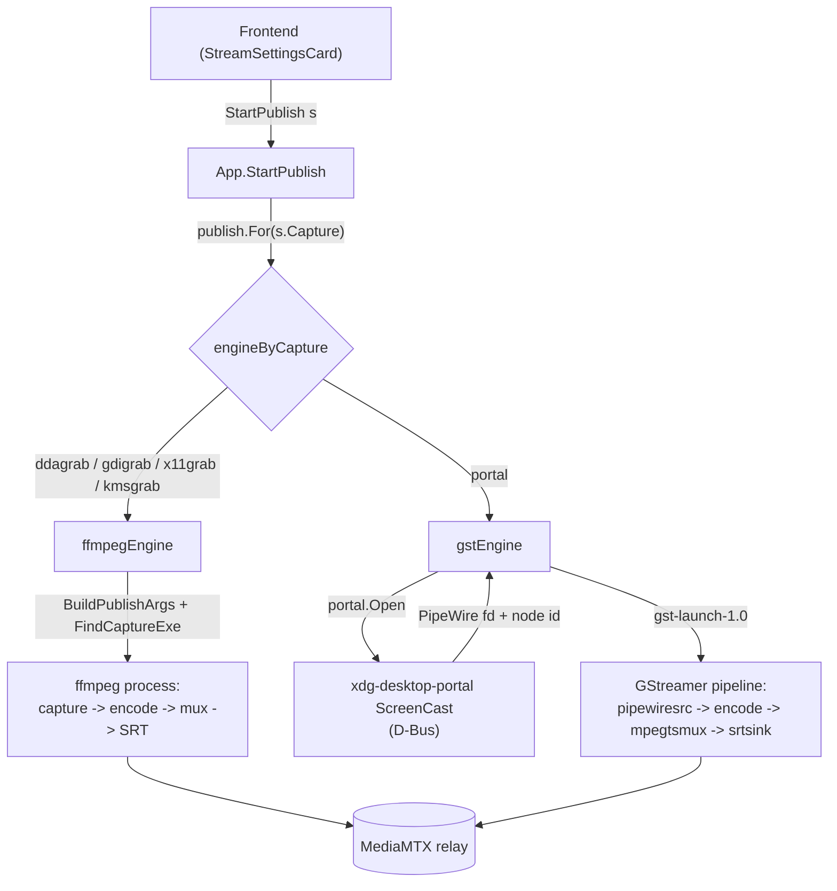

# Capture and publish architecture

Publishing a stream means capturing the screen, encoding it, and pushing it to the relay.
Different capture methods need different machinery: a screen grabber that feeds one ffmpeg process, or a Wayland portal whose frames arrive over PipeWire and run through a separate media framework.
The architecture hides that difference behind one contract, so the code that starts, supervises and stops a stream never names ffmpeg or GStreamer.

## The seam

The seam is the `publish.Publisher` interface.
A capture backend owns its whole pipeline behind that contract: capture, encode, mux and transport.
Drawing the seam here, rather than at "ffmpeg input arguments", is what lets a backend bring its own engine.
A screen grabber and a portal session are both just "a supervised process that pushes to the relay".

Both engines return a `publish.Handle`, and the app supervises every backend through the same handle.

## Where responsibilities lie

The **app layer** (`app_publish.go`) is engine-agnostic.
It selects a `Publisher` for the settings, holds the running `Handle`, forwards progress and exit to the frontend as events, and rejects a second concurrent publish.
It has no knowledge of how any backend captures or encodes.

A **Publisher** owns the full pipeline for one family of capture backends.

- `ffmpegEngine` covers the screen grabbers (ddagrab, gdigrab, x11grab, kmsgrab).
  They differ only in ffmpeg input arguments, so one engine builds the whole `ffmpeg` command from `ffmpeg.BuildPublishArgs` and runs it as a single process.
- `gstEngine` covers the portal path.
  It opens a ScreenCast session, feeds the PipeWire node into a GStreamer graph that encodes and ships, and closes the session when the process exits.

The **portal** package (`portal.Open`) performs the ScreenCast D-Bus handshake and returns the PipeWire remote fd and node id.
It knows nothing about encoding.

The **transport** package holds the destination, and each engine's serialization lives with the transport that knows its dialect.
The base `transport.Transport` is engine-neutral: it only identifies itself.
Each publish or watch engine has a peer capability interface a transport may implement: `FFmpegPublisher` (ffmpeg output args), `GstPublisher` (GStreamer muxer and sink), `Watcher` (a viewer URL).
No engine is privileged in the base contract; an engine asks for its own serialization through the matching package helper, and a transport that cannot supply it is simply unusable with that engine.
The serializations are not interchangeable: ffmpeg's SRT protocol takes a query-string URL with latency in microseconds, while GStreamer's `srtsink` uses libsrt properties with latency in milliseconds.
A transport carrying several engines implements several capabilities; keeping each dialect on the transport is what stops one engine's serialization from leaking into another.

The **watch** package mirrors this seam from the viewer side.
`watch.Select` picks the viewer engine for the configured transport (ffplay by default, mpv via `SCREENSHARE_VIEWER`), and each engine builds its own command line from the transport's `Watcher` URL.
A transport without a URL watch form (WebRTC, whose playback protocol is WHEP) is unwatchable until an engine keyed on a capability of its own exists; adding one touches only the watch package.

The **capabilities** package holds the codec facts both engines and the UI share.
Each engine maps those facts to its own vocabulary: `ffmpeg/args.go` to ffmpeg encoder flags, `publish/gstreamer.go` to GStreamer elements.

## Audio

The audio setting adds a second track to the same mux; nothing changes on the viewer side, players pick the second track out of the stream on their own (an MPEG-TS elementary stream over SRT, an RTP track of its own over RTSP).
Both engines capture the monitor of the default sink through the PulseAudio protocol (which PipeWire also serves) and encode it as Opus: `ffmpeg/args.go` adds a `-f pulse` input and `-c:a libopus`, `publish/gstreamer.go` adds a `pulsesrc ! opusenc` branch into the muxer.
The branch attaches by element name, which is why `GstPublisher` sinks name their muxer `transport.GstMuxName`.
Desktop audio exists only on Linux: ffmpeg has no WASAPI loopback, so the Windows grabbers reject the option and the UI greys it there.

## Progress

Both engines feed the publish insights the same `Stats` sample, and each measures it with what its pipeline offers.
ffmpeg writes a `-progress` stream on stdout that `ffmpeg/proc.go` parses.
GStreamer has no equivalent, so `publish/gststats.go` splices two elements between the parser and the muxer: a `progressreport` printing the encoded frame count and the pipeline running time once a second, and a `tee` handing a second copy of the encoded video to an `fdsink` on a pipe the app weighs, since no element reports byte throughput.
The instrumentation belongs to a run, not to the pipeline, so `Command` renders neither, the same way `-progress` stays out of the displayed ffmpeg line.

The two engines' figures are not exactly comparable.
The GStreamer bytes are the video elementary stream, so its bitrate reads below the ffmpeg figure, which counts the muxed stream with its audio track and container overhead.
Its drop count stays zero: nothing between `imagefreeze` and the sink discards a frame, and the leaky queue ahead of `videoconvert` only drops a damage frame a newer one supersedes.

## Interfaces

- `publish.Publisher`: `Command(s)` renders the pipeline for display; `Start(s, tag, Callbacks)` launches and supervises it.
- `publish.Handle`: `Running()` and `Stop()`, the lifecycle the app drives.
- `publish.Callbacks`: `OnStats` (best-effort progress) and `OnExit` (terminal result with the stderr tail and log path).
- `transport.Transport` (engine-neutral identity) plus the peer capability interfaces `FFmpegPublisher`, `GstPublisher` and `Watcher`: each engine's serialization of the destination.
- `portal.Open(Options) (*Session, error)`: the ScreenCast handshake; `Session` carries `NodeID`, the remote `Fd`, a `Restore` token, and `Close`.

## The portal handshake

Every ScreenCast method is asynchronous: the call returns a Request object path and the result arrives on that object's `Response` signal.
`portal.Open` makes each Request path predictable through a `handle_token`, installs the signal match before invoking the method, and blocks for the response.
The sequence is `CreateSession`, `SelectSources`, `Start` (which pops the compositor picker unless a restore token is supplied), then `OpenPipeWireRemote` for the fd.
The fd is inherited by the GStreamer child as descriptor 3, and `pipewiresrc fd=3 path=<node>` reads the stream from it.

## Adding a capture backend

A backend is a name in `engineByCapture` pointing at the engine that runs it, plus that engine if it is new.
An engine is one type satisfying `publish.Publisher`.
Its platform applicability (which OS and session it runs on) lives with the other capture-gating facts in `frontend/src/util/deps.ts`.
