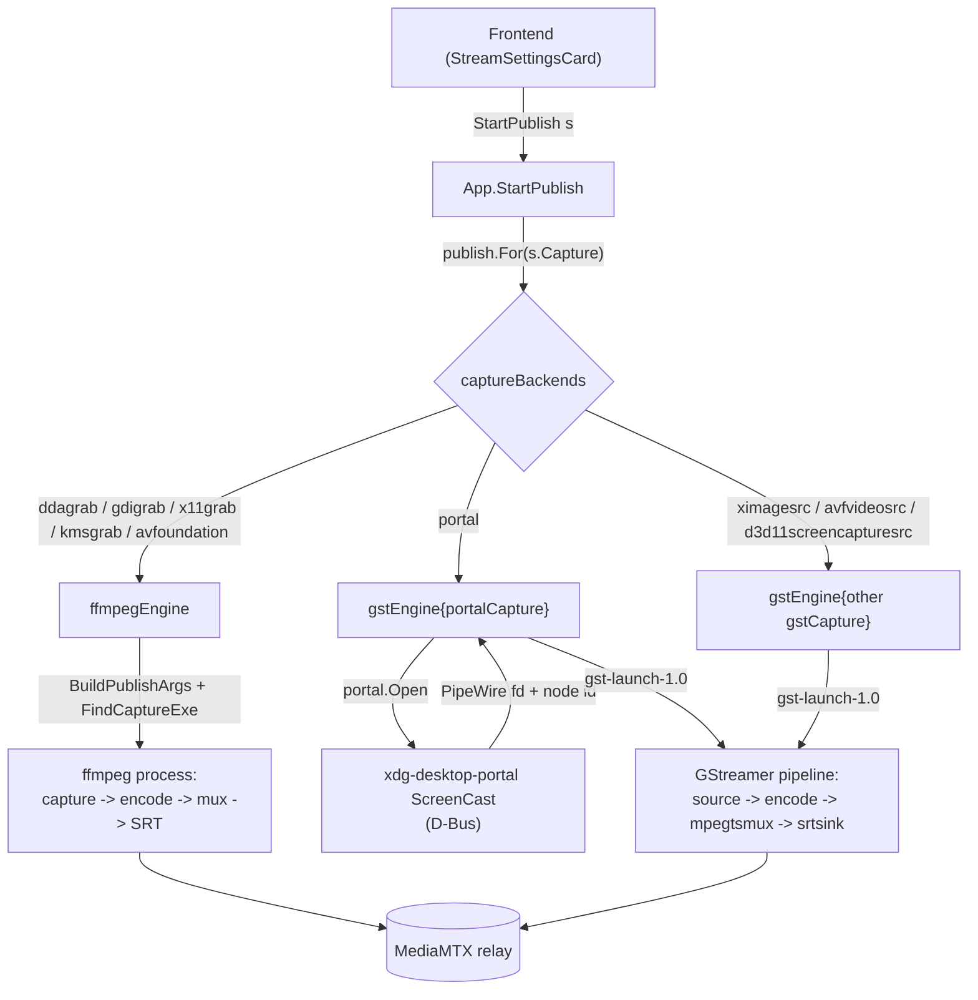

# Capture and publish architecture

Publishing a stream means capturing the screen, encoding it, and pushing it to the relay.
Different capture methods need different machinery: a screen grabber that feeds one ffmpeg process, or a desktop portal whose frames arrive over PipeWire and run through a separate media framework.
The architecture hides that difference behind one contract, so the code that starts, supervises and stops a stream never names ffmpeg or GStreamer.

## The seam

The seam is the `publish.Publisher` interface.
A capture backend owns its whole pipeline behind that contract: capture, encode, mux and transport.
Drawing the seam here, rather than at "ffmpeg input arguments", is what lets a backend bring its own engine.
A screen grabber and a portal session are both just "a supervised process that pushes to the relay".

Both engines return a `publish.Handle`, and the app supervises every backend through the same handle.

## Where responsibilities lie

The **app layer** (`app_publish.go`) is engine-agnostic.
It selects a `Publisher` for the settings, holds the running `Handle`, forwards progress and exit to the frontend as events, and rejects a second concurrent publish.
It has no knowledge of how any backend captures or encodes.

A **Publisher** owns the full pipeline for one family of capture backends.

- `ffmpegEngine` covers the screen grabbers (ddagrab, gdigrab, x11grab, kmsgrab, avfoundation).
  They differ only in ffmpeg input arguments, so one engine builds the whole `ffmpeg` command from `ffmpeg.BuildPublishArgs` and runs it as a single process.
- `gstEngine` covers the GStreamer backends, one instance per screen source.
  The source is a `gstCapture` field, not a branch inside the engine, so the engine builds, supervises and tears down a pipeline without naming a source.

Capture backend and publish engine are two axes.
`captureBackends` is the table pairing them, and which engine a row names follows from which framework has an element or an input device for that source, not from a property of the engine.
A screen both frameworks read is two rows, one per engine, each named as its own framework names the source: the macOS screen is `avfoundation` under ffmpeg and `avfvideosrc` under GStreamer, the Windows desktop `ddagrab` or `gdigrab` under ffmpeg and `d3d11screencapturesrc` under GStreamer.
A source only one framework reads is one row, and each framework has some: ffmpeg has no PipeWire input device, so the portal is GStreamer's, and GStreamer ships a `kmssink` and no capture element for DRM/KMS scanout buffers at all, so kmsgrab is ffmpeg's.
Both engines therefore have a row on Linux, Windows and macOS, and no platform decides the publish engine on the user's behalf.

A `gstCapture` produces raw frames up to and including the capsfilter that pins the encoder input, which is the point after which every backend is identical.
`portalCapture` performs the ScreenCast handshake and hands the child a descriptor; `ximageCapture` reads the X screen and acquires nothing.
The engine validates the settings before it calls `Open`, so a combination the tables forbid never pops the compositor's picker.

The **gpupath** package declares which capture backend and encoder family pairs hand frames to the encoder without a trip through system memory.
It sits below both engines because the fact is shared and the vocabulary is not: a row states that a path exists, and each engine builds it with its own elements or filters.

The **portal** package (`portal.Open`) performs the ScreenCast D-Bus handshake and returns the PipeWire remote fd and node id.
It knows nothing about encoding.

The **transport** package holds the destination, and each engine's serialization lives with the transport that knows its dialect.
A registry entry is one protocol, not one leg: the same entry serializes the publish leg for an encoder and the watch leg for a viewer, and the two legs of a stream need not use the same one (see `viewer-architecture.md`, "Two legs, two protocols").
Everything on this page is the publish leg unless it names the watch one.
The base `transport.Transport` is engine-neutral: it names itself and states what it carries per leg and per engine.
Each publish or watch engine has a peer capability interface a transport may implement: `FFmpegPublisher` (ffmpeg output args), `GstPublisher` (GStreamer muxer and sink), `Watcher` (a viewer URL), `GstWatcher` (receiving pipeline source).
No engine is privileged in the base contract; an engine asks for its own serialization through the matching package helper, and a transport that cannot supply it is simply unusable with that engine.
The carriage and the capability are two statements of one fact, so `transport.Register` asserts each against the other: an engine that states what it carries on a leg implements that leg's interface, and one that implements it says what it carries.
The serializations are not interchangeable: ffmpeg's SRT protocol takes a query-string URL with latency in microseconds, while GStreamer's `srtsink` uses libsrt properties with latency in milliseconds.
A transport carrying several engines implements several capabilities; keeping each dialect on the transport is what stops one engine's serialization from leaking into another.

The **watch** package mirrors this seam from the viewer side.
`watch.Select` picks the viewer engine for the chosen watch leg (ffplay by default, mpv via `SCREENSHARE_VIEWER`), and each engine builds its own command line from the transport's `Watcher` URL.
The leg is passed in by name rather than read off `settings.Stream.Transport`, which is what keeps a viewer free to receive over a protocol the stream was not published with.
A transport without a URL watch form (WebRTC, whose playback is the WHEP exchange rather than an address) is reachable by the native grid's `GstWatcher` and by no viewer program here; an engine keyed on a capability of its own would touch only the watch package.

The **capabilities** package holds the codec facts both engines and the UI share.
Each engine maps those facts to its own vocabulary: `ffmpeg/args.go` to ffmpeg encoder flags, `publish/gstreamer.go` to GStreamer elements.

## Frame memory

A capture backend that produces GPU frames and an encoder that reads GPU surfaces can be linked directly: the conversion to the encoder's layout runs on the device and no frame crosses the bus.
Where either end speaks system memory, every frame is downloaded, converted on the CPU, and uploaded again for a surface encoder.
The difference is a full round trip per frame at capture resolution, which is why the pair decides the shape of the whole capture chain rather than one filter in it.

`gpupath.Paths` is the pair table, and the `captureMemory` setting is how a run asks for one of the two.
`auto` takes the direct path where the pair has one and the copy where it does not, `gpu` refuses a pair with no row, and `system` is the copy every pair can run.
Auto is the value every pair satisfies, which is what makes it the default a settings file with no frame memory migrates to.

Each engine states the direct path its own way, and both replace more than one element.

- The GStreamer engine pins `pipewiresrc` to `video/x-raw(memory:DMABuf)`, converts with the encoder family's own post-processor instead of `videoconvert`, and carries the family's caps feature on every capsfilter downstream of it, the framerate one `imagefreeze` paces to included.
  Plain `video/x-raw` means system memory, so a capsfilter that omits the feature pins the frames back into the round trip and the negotiation fails against a source offering only device memory.
  `gstGpuMemories` is the engine's half of the table: the caps feature a family's surfaces carry and the element that converts into them.
- The ffmpeg engine drops `hwdownload` from the grabber's chain, drops the `hwupload` and the device option a surface encode ends in, and maps the captured frames with `hwmap=derive_device=` onto the encoder's device.
  The conversion is the family's own device-side scaler, which also states the colour description, since there is no software stage left for a `setparams` tag.
  `gpuConverts` is the engine's half of the table.

The colour contract is what keeps a family out of the table rather than the absence of a filter.
ffmpeg's nvenc encoder reads CUDA frames, and `scale_cuda` is the only CUDA filter that converts a captured BGRA texture to the encoder's semi-planar layout: it states no output matrix, primaries, transfer or range.
A conversion that cannot say what it produced makes the stream's colour a property of the filter's internals, so the family stays on the system-memory path, where swscale converts by `-color_range` and `setparams` tags what it wrote.
`scale_vaapi` and `vpp_qsv` carry all four `out_` options, which is why their families do have rows.

### Capture GPU and encode GPU

Sharing memory needs one device holding both ends, and which check establishes that differs per row.

The two ffmpeg rows map the captured frames onto a device derived from the frames themselves, so the encoder runs on the GPU the capture came off by construction and there is nothing to check.
The portal names no device at all: the compositor renders where it renders, the PipeWire node carries frames without saying which GPU allocated them, and the va elements open their own.
The two are the same GPU exactly when the machine has one render node, so that is the condition `portalCapture.HoldsOneDevice` holds, and a machine with several is refused with them named.

The refusal binds under `auto` as well.
Auto answers whether the pair has a direct path, which this one has; a second GPU is a property of the machine, and demoting for it would hand back the round trip the setting was meant to avoid without saying so.
The way out is `system`, which the refusal names.
It runs before anything is acquired and before the rendered command is produced, so the command the form displays is one the button beside it can actually run.

## Audio

The audio setting adds a second track to the same mux; nothing changes on the viewer side, players pick the second track out of the stream on their own (an MPEG-TS elementary stream over SRT, an RTP track of its own over RTSP).

Two settings describe that track.
The source (`Audio`) says where it comes from: both engines capture the monitor of the default sink through the PulseAudio protocol, which PipeWire also serves.
The codec (`AudioCodec`) says how it is coded, and the row in `capabilities.AudioCodecs` carries the element each engine uses, the sample rate the branch resamples to and the bitrate it targets.
`ffmpeg/args.go` builds a `-f pulse` input and a `-c:a` from the row's ffmpeg encoder; `publish/gstreamer.go` builds a `pulsesrc` branch ending in the row's element and its parser, since a muxer pad needs framed caps to negotiate.
The branch attaches by element name, which is why `GstPublisher` sinks name their muxer `transport.GstMuxName`.
Which legs carry which codec is the `Carriage.Audio` half of the transport table, so both engines refuse a codec they cannot code (`capabilities.ValidateAudio`) and one the publish leg does not carry (`transport.ValidatePublishAudio`).

Desktop audio is Linux's alone, and each of the other platforms refuses it for its own reason.
ffmpeg has no WASAPI loopback, so the Windows grabbers reach no monitor source, and AVFoundation enumerates input devices only, so what a Mac plays is not a source the macOS grabber can open.

## Colour

A desktop is full-range RGB.
Every YUV chroma the encoders take is a smaller container, so the publish leg has to say which one it filled: the range setting picks it, and the bitstream carries it to the viewer.

Each engine states it its own way.
`ffmpeg/args.go` passes `-color_range`, which swscale converts by, and tags the frames with the colour description through a `setparams` filter (`colourFilter`), which is what puts that description in the bitstream: the output options reach only part of it, and the range stays off the tag because tagging it ahead of the conversion makes swscale write limited range whatever `-color_range` says.
`publish/gstpipeline.go` pins a colorimetry on the encoder input, and pins all four of its components.
A colorimetry with the range set and matrix, transfer and primaries left unknown is not partially applied: `videoconvert` drops the range along with them and converts to limited range whatever the range said, so the setting would reach the caps and change nothing about the frames.
The three named components are BT.709, the colour space of every HD and larger picture, which is every screen this captures.

What the pipeline pins is only half of it: the bitstream is the only place a viewer reads the colour from, since RTP and MPEG-TS carry no colour description of their own.
A stream that signals none is watched in the viewer's own default, limited-range BT.709 off the picture size, whatever it holds.
Full range is therefore declared as a colour-range `Gap` wherever the stream would not carry it, and the gap's reason names what fails: an encoder that writes no colour description (the va elements and `av1enc` on the GStreamer engine), an encoder that writes limited range whatever it is told (the AMF and Vulkan AV1 encoders), or a format with no colour range field at all (VP8, on both engines).
Limited range is what an unsignalled stream is watched as, so it is the range that arrives as it was encoded, and where the other engine's encoder states the range the reason says so.
`publish.TestPublishedColorimetryReachesTheDecoder` and `ffmpeg.TestPublishedColorimetryIsSignalledInTheBitstream` encode and decode a real stream to hold both engines to it, for every codec the table publishes rather than for the two H.26x formats.
Both hand the decoder the bitstream and its framing alone, since a container that frames a stream records a colour description of its own and a round trip through one would assert what the muxer wrote.
An Annex B or OBU stream needs no framing at all; where a format does, it travels in IVF, whose header carries a fourcc, the picture size, the frame rate and the frame count, and nothing about colour.

Limited range is lossy by construction and viewers disagree about the expansion.
The native grid's `videoconvert` lands about two code values below what ffplay and mpv land on for the same limited-range frame.
Full range has no expansion step, so both agree.

## Progress

Both engines feed the publish insights the same `Stats` sample, and each measures it with what its pipeline offers.
ffmpeg writes a `-progress` stream on stdout that `ffmpeg/proc.go` parses.
GStreamer has no equivalent, so `publish/gststats.go` splices two elements between the parser and the muxer: a `progressreport` printing the encoded frame count and the pipeline running time once a second, and a `tee` handing a second copy of the encoded video to an `fdsink` on a pipe the app weighs, since no element reports byte throughput.

A figure neither pipeline exposes is marked in the sample's `Missing` set and crosses the wire as null, because a zero is the reading that marks a stalled encoder and an unmeasured figure must not borrow it.
The zero value of the set means measured, so an engine flags only what it could not measure.

Falling behind and running ahead are two events with two counters.
`Dup` counts frames the encoder repeated to hold the output rate, which is what rises when capture or encode cannot keep up.
`Drop` counts frames discarded before the encoder for arriving faster than the output rate, which a pipeline that sets no output rate never does.
Naming one after the other is how a health column ends up structurally unable to move.
The instrumentation belongs to a run, not to the pipeline, so `Command` renders neither, the same way `-progress` stays out of the displayed ffmpeg line.

### Capture rate against encoded rate

How often the encoder emitted a frame and how often the screen produced a new one are two figures, and on a damage-driven backend they are far apart.
`imagefreeze` repeats the newest damage frame at the configured framerate, so the encoded rate equals the target whatever the screen does: a capture delivering three new pictures a second still encodes sixty.
A counter downstream of it therefore hands the target back as if it were a measurement, and the one figure a viewer actually experiences is missing.

So a capture backend places a second `progressreport` at the last point where one buffer is one new picture, ahead of anything that repeats or paces frames, and the sample carries both rates.
The capture rate falls below the target both when the shared screen is static and when the capture path is too slow to keep up, which are the two things worth telling apart from a healthy stream that merely encodes at its target.
It is a run's instrumentation like the rest, so a pipeline built without progress carries no probe and the rate reads unmeasured rather than zero.

The two engines' figures are not exactly comparable.
The GStreamer bytes are the video elementary stream, so its bitrate reads below the ffmpeg figure, which counts the muxed stream with its audio track and container overhead.

## Interfaces

- `publish.Publisher`: `Command(s)` renders the pipeline for display; `Start(s, tag, Callbacks)` launches and supervises it.
- `publish.Handle`: `Running()` and `Stop()`, the lifecycle the app drives.
- `publish.Callbacks`: `OnStats` (best-effort progress) and `OnExit` (terminal result with the stderr tail and log path).
- `transport.Transport` (engine-neutral identity and carriage) plus the peer capability interfaces `FFmpegPublisher`, `GstPublisher`, `Watcher` and `GstWatcher`: each engine's serialization of one leg.
- `portal.Open(Options) (*Session, error)`: the ScreenCast handshake; `Session` carries `NodeID`, the remote `Fd`, a `Restore` token, and `Close`.

## The portal handshake

Every ScreenCast method is asynchronous: the call returns a Request object path and the result arrives on that object's `Response` signal.
`portal.Open` makes each Request path predictable through a `handle_token`, installs the signal match before invoking the method, and blocks for the response.
The sequence is `CreateSession`, `SelectSources`, `Start` (which pops the compositor picker unless a restore token is supplied), then `OpenPipeWireRemote` for the fd.
The fd is inherited by the GStreamer child as descriptor 3, and `pipewiresrc fd=3 path=<node>` reads the stream from it.

`SelectSources` names both monitor and window as source kinds, and which one is shared is the picker's answer rather than a setting here.
The compositor owns that choice and is the only side that knows which windows exist, which is also why the monitor index is inapplicable on this backend.

`Start` returns a restore token for the consent it granted, and `SelectSources` takes one back to skip the picker.
The token is machine- and consent-local, so it is stored on its own (`settings.PortalToken`) rather than as a field of the stream: a preset carries what the user chose about a stream, and one copied to another machine would carry a token no compositor there issued.
What the compositor returned is stored as it stands, an empty token included, since an empty one means the consent was not persisted and the token already on disk is spent.
`App.ForgetPortalConsent` drops it, which is how a share aimed at the wrong window is corrected.
Storing it is best effort: a failure costs a picker on the next publish and nothing else, so it is reported and the running stream is not failed over it.

## Adding a capture backend

A backend is a row in `captureBackends` pointing at the engine that runs it.
Under the ffmpeg engine that is an entry in `ffmpeg.captureBackends` building the input arguments; under the GStreamer engine it is a `gstCapture` implementation and the engine instantiated with it.
A backend that produces GPU frames adds a row per encoder family it can hand them to in `gpupath.Paths`, plus the engine's own half of that row: a caps feature and post-processor in `gstGpuMemories`, or a device and scaler in `gpuConverts`.
A row without its engine half is asserted rather than approximated, since the alternative is picking a memory the elements do not negotiate, so a backend whose engine states no half for any family it could pair with carries no row and captures into system memory.
An ffmpeg backend refuses settings naming something it cannot capture, a monitor this machine has no output for or a DRM download strategy no table row carries, rather than capturing whatever it can: a command that captures a different source than the form shows selected is the one failure no field can state.
An engine is one type satisfying `publish.Publisher`, and a new one is needed only for a framework neither covers.
The backend's platform applicability (which OS and session it runs on) is a row in `CAPTURE_NEEDS`, with the other capture-gating facts in `frontend/src/util/deps.ts`, and its label and tooltip a row in `CAPTURES`.
