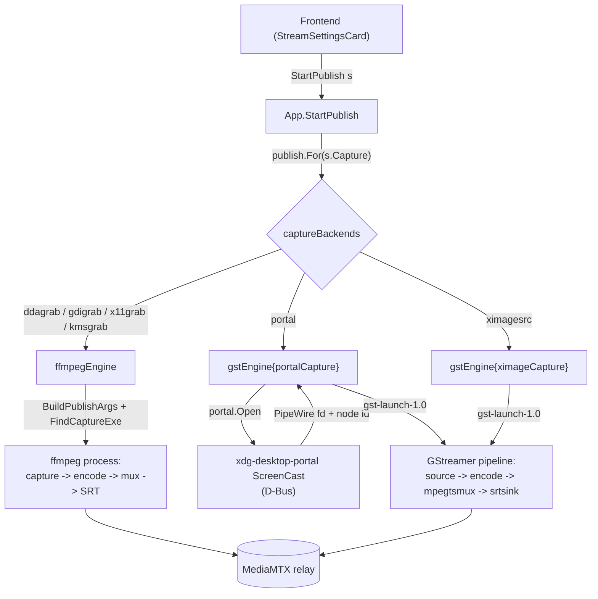

# Capture and publish architecture

Publishing a stream means capturing the screen, encoding it, and pushing it to the relay.
Different capture methods need different machinery: a screen grabber that feeds one ffmpeg process, or a Wayland portal whose frames arrive over PipeWire and run through a separate media framework.
The architecture hides that difference behind one contract, so the code that starts, supervises and stops a stream never names ffmpeg or GStreamer.

## The seam

The seam is the `publish.Publisher` interface.
A capture backend owns its whole pipeline behind that contract: capture, encode, mux and transport.
Drawing the seam here, rather than at "ffmpeg input arguments", is what lets a backend bring its own engine.
A screen grabber and a portal session are both just "a supervised process that pushes to the relay".

Both engines return a `publish.Handle`, and the app supervises every backend through the same handle.

## Where responsibilities lie

The **app layer** (`app_publish.go`) is engine-agnostic.
It selects a `Publisher` for the settings, holds the running `Handle`, forwards progress and exit to the frontend as events, and rejects a second concurrent publish.
It has no knowledge of how any backend captures or encodes.

A **Publisher** owns the full pipeline for one family of capture backends.

- `ffmpegEngine` covers the screen grabbers (ddagrab, gdigrab, x11grab, kmsgrab).
  They differ only in ffmpeg input arguments, so one engine builds the whole `ffmpeg` command from `ffmpeg.BuildPublishArgs` and runs it as a single process.
- `gstEngine` covers the GStreamer backends, one instance per screen source.
  The source is a `gstCapture` field, not a branch inside the engine, so the engine builds, supervises and tears down a pipeline without naming a source.

Capture backend and publish engine are two axes.
`captureBackends` is the table pairing them, and which engine a row names follows from which framework has an element or an input device for that source, not from a property of the engine.
The pairing happens to be one-to-one, because no source has both: ffmpeg has the four screen grabbers and no PipeWire input device, GStreamer has `pipewiresrc` and `ximagesrc`.
DRM/KMS is the asymmetry worth naming: GStreamer ships a `kmssink` and no capture element for scanout buffers at all, so kmsgrab exists once, under ffmpeg.
A source both frameworks could read would be two rows and nothing else.

A `gstCapture` produces raw frames up to and including the capsfilter that pins the encoder input, which is the point after which every backend is identical.
`portalCapture` performs the ScreenCast handshake and hands the child a descriptor; `ximageCapture` reads the X screen and acquires nothing.
The engine validates the settings before it calls `Open`, so a combination the tables forbid never pops the compositor's picker.

The **portal** package (`portal.Open`) performs the ScreenCast D-Bus handshake and returns the PipeWire remote fd and node id.
It knows nothing about encoding.

The **transport** package holds the destination, and each engine's serialization lives with the transport that knows its dialect.
A registry entry is one protocol, not one leg: the same entry serializes the publish leg for an encoder and the watch leg for a viewer, and the two legs of a stream need not use the same one (see `viewer-architecture.md`, "Two legs, two protocols").
Everything on this page is the publish leg unless it names the watch one.
The base `transport.Transport` is engine-neutral: it names itself and the bitstream formats it carries per leg.
Each publish or watch engine has a peer capability interface a transport may implement: `FFmpegPublisher` (ffmpeg output args), `GstPublisher` (GStreamer muxer and sink), `Watcher` (a viewer URL), `GstWatcher` (receiving pipeline source).
No engine is privileged in the base contract; an engine asks for its own serialization through the matching package helper, and a transport that cannot supply it is simply unusable with that engine.
The serializations are not interchangeable: ffmpeg's SRT protocol takes a query-string URL with latency in microseconds, while GStreamer's `srtsink` uses libsrt properties with latency in milliseconds.
A transport carrying several engines implements several capabilities; keeping each dialect on the transport is what stops one engine's serialization from leaking into another.

The **watch** package mirrors this seam from the viewer side.
`watch.Select` picks the viewer engine for the chosen watch leg (ffplay by default, mpv via `SCREENSHARE_VIEWER`), and each engine builds its own command line from the transport's `Watcher` URL.
The leg is passed in by name rather than read off `settings.Stream.Transport`, which is what keeps a viewer free to receive over a protocol the stream was not published with.
A transport without a URL watch form (WebRTC, whose playback is the WHEP exchange rather than an address) is reachable by the native grid's `GstWatcher` and by no viewer program here; an engine keyed on a capability of its own would touch only the watch package.

The **capabilities** package holds the codec facts both engines and the UI share.
Each engine maps those facts to its own vocabulary: `ffmpeg/args.go` to ffmpeg encoder flags, `publish/gstreamer.go` to GStreamer elements.

## Audio

The audio setting adds a second track to the same mux; nothing changes on the viewer side, players pick the second track out of the stream on their own (an MPEG-TS elementary stream over SRT, an RTP track of its own over RTSP).
Both engines capture the monitor of the default sink through the PulseAudio protocol (which PipeWire also serves) and encode it as Opus: `ffmpeg/args.go` adds a `-f pulse` input and `-c:a libopus`, `publish/gstreamer.go` adds a `pulsesrc ! opusenc` branch into the muxer.
The branch attaches by element name, which is why `GstPublisher` sinks name their muxer `transport.GstMuxName`.
Desktop audio exists only on Linux: ffmpeg has no WASAPI loopback, so the Windows grabbers reject the option and the UI greys it there.

## Colour

A desktop is full-range RGB.
Every YUV chroma the encoders take is a smaller container, so the publish leg has to say which one it filled: the range setting picks it, and the bitstream carries it to the viewer.

Each engine states it its own way.
`ffmpeg/args.go` passes `-color_range`, which swscale converts by and libx264 writes into the VUI.
`publish/gstpipeline.go` pins a colorimetry on the encoder input, and pins all four of its components.
A colorimetry with the range set and matrix, transfer and primaries left unknown is not partially applied: `videoconvert` drops the range along with them and converts to limited range whatever the range said, so the setting would reach the caps and change nothing about the frames.
The three named components are BT.709, the colour space of every HD and larger picture, which is every screen this captures.

Limited range is lossy by construction and viewers disagree about the expansion.
The native grid's `videoconvert` lands about two code values below what ffplay and mpv land on for the same limited-range frame.
Full range has no expansion step, so both agree.

## Progress

Both engines feed the publish insights the same `Stats` sample, and each measures it with what its pipeline offers.
ffmpeg writes a `-progress` stream on stdout that `ffmpeg/proc.go` parses.
GStreamer has no equivalent, so `publish/gststats.go` splices two elements between the parser and the muxer: a `progressreport` printing the encoded frame count and the pipeline running time once a second, and a `tee` handing a second copy of the encoded video to an `fdsink` on a pipe the app weighs, since no element reports byte throughput.

A figure neither pipeline exposes is marked in the sample's `Missing` set and crosses the wire as null, because a zero is the reading that marks a stalled encoder and an unmeasured figure must not borrow it.
The zero value of the set means measured, so an engine flags only what it could not measure.

Falling behind and running ahead are two events with two counters.
`Dup` counts frames the encoder repeated to hold the output rate, which is what rises when capture or encode cannot keep up.
`Drop` counts frames discarded before the encoder for arriving faster than the output rate, which a pipeline that sets no output rate never does.
Naming one after the other is how a health column ends up structurally unable to move.
The instrumentation belongs to a run, not to the pipeline, so `Command` renders neither, the same way `-progress` stays out of the displayed ffmpeg line.

### Capture rate against encoded rate

How often the encoder emitted a frame and how often the screen produced a new one are two figures, and on a damage-driven backend they are far apart.
`imagefreeze` repeats the newest damage frame at the configured framerate, so the encoded rate equals the target whatever the screen does: a capture delivering three new pictures a second still encodes sixty.
A counter downstream of it therefore hands the target back as if it were a measurement, and the one figure a viewer actually experiences is missing.

So a capture backend places a second `progressreport` at the last point where one buffer is one new picture, ahead of anything that repeats or paces frames, and the sample carries both rates.
The capture rate falls below the target both when the shared screen is static and when the capture path is too slow to keep up, which are the two things worth telling apart from a healthy stream that merely encodes at its target.
It is a run's instrumentation like the rest, so a pipeline built without progress carries no probe and the rate reads unmeasured rather than zero.

The two engines' figures are not exactly comparable.
The GStreamer bytes are the video elementary stream, so its bitrate reads below the ffmpeg figure, which counts the muxed stream with its audio track and container overhead.

## Interfaces

- `publish.Publisher`: `Command(s)` renders the pipeline for display; `Start(s, tag, Callbacks)` launches and supervises it.
- `publish.Handle`: `Running()` and `Stop()`, the lifecycle the app drives.
- `publish.Callbacks`: `OnStats` (best-effort progress) and `OnExit` (terminal result with the stderr tail and log path).
- `transport.Transport` (engine-neutral identity) plus the peer capability interfaces `FFmpegPublisher`, `GstPublisher` and `Watcher`: each engine's serialization of the destination.
- `portal.Open(Options) (*Session, error)`: the ScreenCast handshake; `Session` carries `NodeID`, the remote `Fd`, a `Restore` token, and `Close`.

## The portal handshake

Every ScreenCast method is asynchronous: the call returns a Request object path and the result arrives on that object's `Response` signal.
`portal.Open` makes each Request path predictable through a `handle_token`, installs the signal match before invoking the method, and blocks for the response.
The sequence is `CreateSession`, `SelectSources`, `Start` (which pops the compositor picker unless a restore token is supplied), then `OpenPipeWireRemote` for the fd.
The fd is inherited by the GStreamer child as descriptor 3, and `pipewiresrc fd=3 path=<node>` reads the stream from it.

## Adding a capture backend

A backend is a row in `captureBackends` pointing at the engine that runs it.
Under the ffmpeg engine that is an entry in `ffmpeg.captureBackends` building the input arguments; under the GStreamer engine it is a `gstCapture` implementation and the engine instantiated with it.
An engine is one type satisfying `publish.Publisher`, and a new one is needed only for a framework neither covers.
The backend's platform applicability (which OS and session it runs on) is a row in `CAPTURE_NEEDS`, with the other capture-gating facts in `frontend/src/util/deps.ts`, and its label and tooltip a row in `CAPTURES`.
