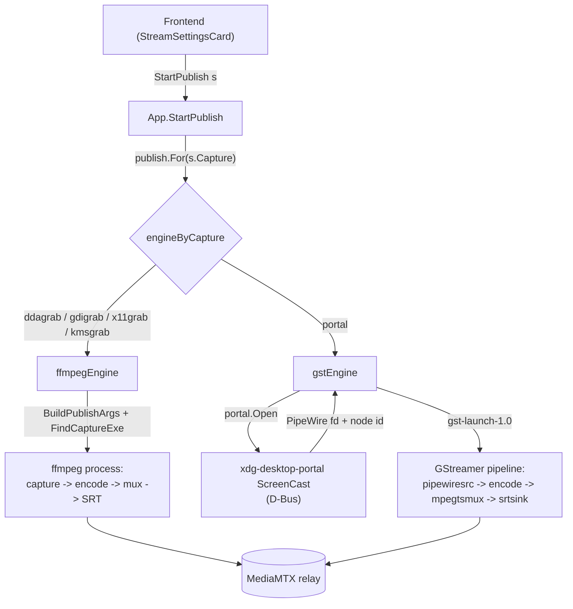

# Capture and publish architecture

Publishing a stream means capturing the screen, encoding it, and pushing it to the relay.
Different capture methods need different machinery: a screen grabber that feeds one ffmpeg process, or a Wayland portal whose frames arrive over PipeWire and run through a separate media framework.
The architecture hides that difference behind one contract, so the code that starts, supervises and stops a stream never names ffmpeg or GStreamer.

## The seam

The seam is the `publish.Publisher` interface.
A capture backend owns its whole pipeline behind that contract: capture, encode, mux and transport.
Drawing the seam here, rather than at "ffmpeg input arguments", is what lets a backend bring its own engine.
A screen grabber and a portal session are both just "a supervised process that pushes to the relay".

Both engines return a `publish.Handle`, and the app supervises every backend through the same handle.

## Where responsibilities lie

The **app layer** (`app_publish.go`) is engine-agnostic.
It selects a `Publisher` for the settings, holds the running `Handle`, forwards progress and exit to the frontend as events, and rejects a second concurrent publish.
It has no knowledge of how any backend captures or encodes.

A **Publisher** owns the full pipeline for one family of capture backends.

- `ffmpegEngine` covers the screen grabbers (ddagrab, gdigrab, x11grab, kmsgrab).
  They differ only in ffmpeg input arguments, so one engine builds the whole `ffmpeg` command from `ffmpeg.BuildPublishArgs` and runs it as a single process.
- `gstEngine` covers the portal path.
  It opens a ScreenCast session, feeds the PipeWire node into a GStreamer graph that encodes and ships, and closes the session when the process exits.

The **portal** package (`portal.Open`) performs the ScreenCast D-Bus handshake and returns the PipeWire remote fd and node id.
It knows nothing about encoding.

The **transport** package is the single source of the destination.
`transport.Transport` returns ffmpeg output arguments; the optional `transport.URLPublisher` returns the same destination as a plain URL for an engine that takes one (GStreamer's `srtsink`).
The SRT URL is built in exactly one place and reused by both engines.

The **capabilities** package holds the codec facts both engines and the UI share.
Each engine maps those facts to its own vocabulary: `ffmpeg/args.go` to ffmpeg encoder flags, `publish/gstreamer.go` to GStreamer elements.

## Interfaces

- `publish.Publisher`: `Command(s)` renders the pipeline for display; `Start(s, tag, Callbacks)` launches and supervises it.
- `publish.Handle`: `Running()` and `Stop()`, the lifecycle the app drives.
- `publish.Callbacks`: `OnStats` (best-effort progress) and `OnExit` (terminal result with the stderr tail and log path).
- `transport.Transport` and the optional `transport.URLPublisher`: the destination as ffmpeg args and as a plain URL.
- `portal.Open(Options) (*Session, error)`: the ScreenCast handshake; `Session` carries `NodeID`, the remote `Fd`, a `Restore` token, and `Close`.

## The portal handshake

Every ScreenCast method is asynchronous: the call returns a Request object path and the result arrives on that object's `Response` signal.
`portal.Open` makes each Request path predictable through a `handle_token`, installs the signal match before invoking the method, and blocks for the response.
The sequence is `CreateSession`, `SelectSources`, `Start` (which pops the compositor picker unless a restore token is supplied), then `OpenPipeWireRemote` for the fd.
The fd is inherited by the GStreamer child as descriptor 3, and `pipewiresrc fd=3 path=<node>` reads the stream from it.

## Adding a capture backend

A backend is a name in `engineByCapture` pointing at the engine that runs it, plus that engine if it is new.
An engine is one type satisfying `publish.Publisher`.
Its platform applicability (which OS and session it runs on) lives with the other capture-gating facts in `frontend/src/util/deps.ts`.
