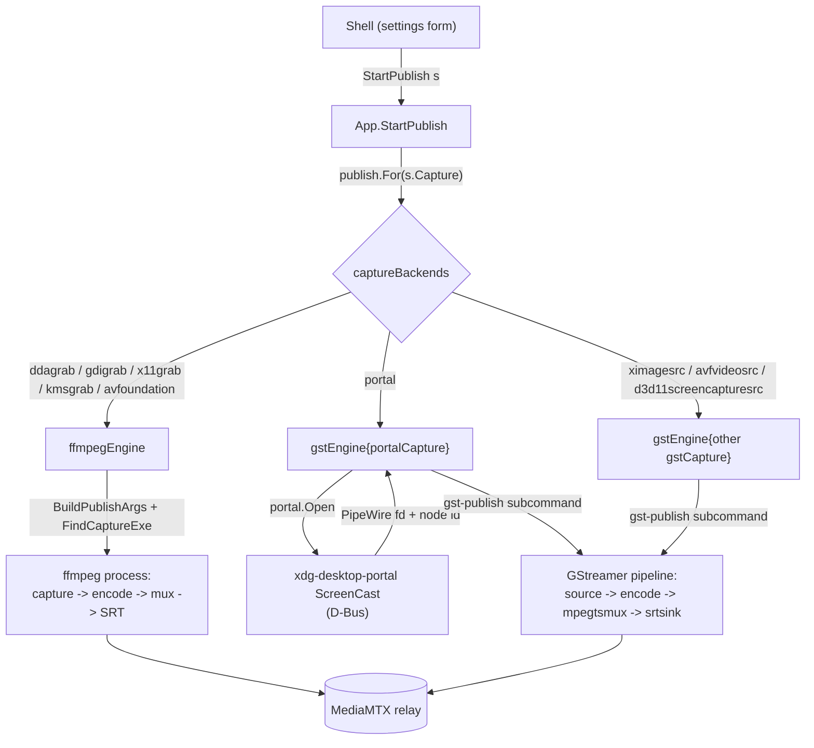

# Capture and publish architecture

Publishing means capturing the screen, encoding it, pushing it to the relay.
Capture methods need different machinery: a screen grabber feeding one ffmpeg process, or a desktop portal whose frames arrive over PipeWire and run through a separate media framework.
One contract hides that, so the code that starts, supervises and stops a stream never names ffmpeg or GStreamer.

## The seam

Seam: `publish.Publisher`.
A capture backend owns its whole pipeline behind it: capture, encode, mux, transport.
Drawn there rather than at "ffmpeg input arguments", so a backend brings its own engine.

Both engines return a `publish.Handle`, and the app supervises every backend through it.

## Where responsibilities lie

| Package | Owns |
| --- | --- |
| `publish.go` (app layer) | selects a `Publisher`, holds the running `Handle`, forwards progress and exit as events, refuses a second concurrent publish |
| `ffmpegEngine` | the screen grabbers (ddagrab, gdigrab, x11grab, kmsgrab, avfoundation), differing only in input arguments |
| `gstEngine` | the GStreamer backends, one instance per screen source, the source a `gstCapture` field rather than a branch |
| `screensrc` | the element reading one of this machine's outputs, and the properties singling it out |
| `gpupath` | which capture backend and encoder family pairs hand frames over without a trip through system memory |
| `portal` | the ScreenCast D-Bus handshake, returning the PipeWire remote fd and node id |
| `transport` | the destination, and each engine's serialization of it |
| `watch` | the viewer side of the same seam |
| `capabilities` | the codec facts both engines and the UI share |

The app layer knows nothing about how any backend captures or encodes.

**Capture backend and publish engine are two axes.**
`captureBackends` pairs them, and which engine a row names follows from which framework has an element or input device for that source.
A screen both frameworks read is two rows, one per engine, each named as its own framework names the source.
A source only one framework reads is one row, and each framework has some.

| Source | ffmpeg | GStreamer |
| --- | --- | --- |
| macOS screen | `avfoundation` | `avfvideosrc` |
| Windows desktop | `ddagrab`, `gdigrab` | `d3d11screencapturesrc` |
| portal | no PipeWire input device | `portal` |
| DRM/KMS scanout buffers | `kmsgrab` | no capture element, `kmssink` only |

Both engines have a row on Linux, Windows and macOS, so no platform decides the engine on the user's behalf.

A `gstCapture` produces raw frames up to and including the capsfilter pinning the encoder input, the point after which every backend is identical.
`portalCapture` performs the ScreenCast handshake and hands the child a descriptor.
`ximageCapture` reads the X screen and acquires nothing.
The engine validates settings before it calls `Open`, so a combination the tables forbid never pops the compositor's picker.

**`screensrc` sits below the engines because two consumers need the same rectangle**: `ximagesrc` cropped to the monitor's rectangle on X11, `d3d11screencapturesrc` on its `monitor-index` under Windows.
The GStreamer capture heads build from it, and so does the wizard's monitor preview, reading a screen into the frame channel before anything is published (`viewer-architecture.md`, "What the screen picker draws").
A preview cropped differently from the stream would be a picture that lies about what is shared.
The same package answers which sessions can read one output apart from another at all.
A Wayland session reaches a screen through the portal alone, and AVFoundation's screen source chooses its own display.

**`gpupath` sits below both engines because the fact is shared and the vocabulary is not.**
A row states that a path exists.
Each engine builds it with its own elements or filters.

**A transport registry entry is one protocol, not one leg.**
The same entry serializes the publish leg for an encoder and the watch leg for a viewer, and the two legs need not use the same one (`viewer-architecture.md`, "Two legs, two protocols").
Everything here is the publish leg unless it names the watch one.
The base `transport.Transport` is engine-neutral: it names itself and states what it carries per leg and per engine.
Each engine has a peer capability interface a transport may implement: `FFmpegPublisher` (ffmpeg output args), `GstPublisher` (GStreamer muxer and sink), `Watcher` (a viewer URL), `GstWatcher` (receiving pipeline source).
No engine is privileged in the base contract, and a transport that cannot supply a serialization is unusable with that engine.
Carriage and capability are two statements of one fact, so `transport.Register` asserts each against the other.
The serializations are not interchangeable: ffmpeg's SRT protocol takes a query-string URL with latency in microseconds, GStreamer's `srtsink` uses libsrt properties with latency in milliseconds.
Keeping each dialect on the transport stops one engine's serialization leaking into another.

**`watch.Select`** picks the viewer engine for the chosen watch leg (ffplay by default, mpv via `SCREENSHARE_VIEWER`), each building its command line from the transport's `Watcher` URL.
The leg is passed by name rather than read off `settings.Publish.Transport`, keeping a viewer free to receive over a protocol the stream was not published with.
A transport without a URL watch form (WebRTC, whose playback is the WHEP exchange rather than an address) is reachable by a receive pipeline's `GstWatcher` and by no viewer program here.

**`capabilities`** holds the codec facts, and each engine maps them to its own vocabulary: `ffmpeg/args.go` to ffmpeg encoder flags, `publish/gstencoders.go` to GStreamer elements.

## Changing settings on a live stream

A publish engine runs a child built from a command line, and `ffmpeg` takes no value back once running.
The GStreamer runner does: it is this application spawned with a subcommand (`backend/internal/gstrun`), and the engine gives each run a control socket to converge on whole states.
A stream carrying other settings is another pipeline wherever the change is not one of those values, and reaching it means relaunching the child.
`App.Republish` takes the cheaper half first: where the running child accepts the change it is written to the socket and every viewer keeps watching.
Where it does not the pipeline is torn down and rebuilt.
Viewers reconnect across a rebuild, so the form asks for it rather than making it on every edit.
The form stays editable while a stream is live, and a bar appears once what it shows is no longer what is publishing.

**Which changes the child takes is one table.**
`publish/live.go` names each field a running pipeline accepts a new value for, what has to hold for it, and how the child is told.
`publish.LiveFields` answers it for a configuration.
`publish.LiveOnly` asks whether a change stays inside it, by putting the running settings' live values back onto the proposal and comparing the rendered commands.
The same rows register into the rule evaluator, so a form marking a control live (`field-availability.md`) and an apply that skips the relaunch are one statement.
The bitrate carries it: every encoder element here has a rate property, and the socket's state is proved against `x264enc` taking a new one while it plays.
A write the child refuses falls back to the relaunch, a socket that cannot be reached being a child that cannot be told anything, and reporting the apply as done would leave the stream on values nobody chose.

**The rendered command decides whether a relaunch is needed.**
`publish.SamePipeline` renders both settings objects and compares the strings.
The command is the whole of what an engine hands its child, so a field no builder reads cannot change it and a field a builder reads always does.
A table of which fields matter would be a second statement of one fact, falling behind the builders the first time one read a field the table did not name.
It is also what leaves the watch leg, the uplink figure and the relay's API port free to move under a running stream: no pipeline is built from them.

**A run is replaced whole, except where the child never restarted.**
`App.run` is the publish in force and carries the settings its pipeline was built from.
Those are what the pending state is measured against and what the form reverts to, so the value shown as live is the one the child was started on rather than a copy kept beside it.
A relaunch kills a child whose last progress sample and exit arrive after the replacement is running, so both callbacks check the run they were created for.
A write to the running child moves those settings in place instead: handle, start time and attempts belong to a process still playing, and replacing the run would leave its callbacks pointing at nothing.
The `publish:exit` event reports the run the app still holds, the run nobody asked to end.

**The order is refuse, tear down, launch.**
The new settings are rendered before anything is stopped, so a combination no engine can build refuses the relaunch and leaves the stream running.
The outgoing child is killed and not waited for: MediaMTX closes the publisher it holds when a new one connects to the same path, so the successor need not arrive after the old socket is gone.
A launch that fails after the teardown leaves nothing publishing, the pipeline being gone by then.
The reason is the failed launch's own error, or the new child's exit where it started and then died.

A relaunch reads the screen source the stream already holds, so nothing between the two puts the compositor's picker back on screen ("The portal handshake").

## A pipeline that dies on its own

An encoder child can die unasked: the relay restarts, a capture source goes away, a driver takes the GPU down under it.
`App.publishEnded` meets that with a bounded relaunch on the settings the dead pipeline ran, over `publishBackoff`.
Only an unrequested exit reaches it, a stop and a relaunch both replacing what the app holds before their child's exit arrives.

**How long the pipeline ran is what the budget turns on.**
The exit alone cannot say whether another attempt would end differently: a relay not up yet and an encoder that hangs the GPU both leave a child dead within seconds under the same signal and status.
A pipeline that reaches `publishHealthy` and dies later met something that moved underneath it, so its failure starts from a full budget however many attempts an earlier outage cost.
One that never reaches it is failing at launch, and the backoff is the whole of what the app will try before reporting the failure and stopping.
The bound keeps a combination this machine cannot run from being retried forever, which for a VAAPI encoder that wedges the video engine would mean a driver reset per attempt.

**A publish between attempts is still a publish.**
`App.retry` holds the pending relaunch and `App.run` is nil while it does.
Never both.
The screen source is held across that wait ("One consent per stream").
`GetPublishState` answers `publishing` across that wait, with `retrying` and the attempt count separating a stream carrying frames from one waiting to come back.
The form keeps showing the settings the stream will return on rather than reverting, the button keeps offering the stop, and a start is refused as against a running stream.
`publish:exit` fires once the app stops retrying, so the reason reaches the user when publishing has actually ended rather than once per attempt.

## Frame memory

A backend producing GPU frames and an encoder reading GPU surfaces can be linked directly: the conversion to the encoder's layout runs on the device and no frame crosses the bus.
Where either end speaks system memory, every frame is downloaded, converted on the CPU, and uploaded again for a surface encoder.
A full round trip per frame at capture resolution, so the pair decides the shape of the whole capture chain rather than one filter in it.

`gpupath.Paths` is the pair table, and `captureMemory` is how a run asks for one:

| Value | Takes |
| --- | --- |
| `auto` | the direct path where the pair has one whose colour is the form's, the copy otherwise |
| `gpu` | refuses a pair with no row |
| `gpu-encoder-color` | a direct path whose colour is the encoder's |
| `system` | the copy every pair can run |

Auto is the value every pair satisfies, so it is the default a settings file with no frame memory migrates to.

Each engine states the direct path its own way, and both replace more than one element.

- The GStreamer engine pins `pipewiresrc` to `video/x-raw(memory:DMABuf)`, converts with the encoder family's own post-processor instead of `videoconvert`, and carries the family's caps feature on every capsfilter downstream, the framerate one `imagefreeze` paces to included.
  Plain `video/x-raw` means system memory, so a capsfilter omitting the feature pins the frames back into the round trip and negotiation fails against a source offering only device memory.
  `gstGpuMemories` is the engine's half: the caps feature a family's surfaces carry and the element converting into them.
- The ffmpeg engine drops `hwdownload` from the grabber's chain, drops the `hwupload` and device option a surface encode ends in, and maps the frames with `hwmap=derive_device=` onto the encoder's device.
  The conversion is the family's own device-side scaler, which also states the colour description, no software stage being left for a `setparams` tag.
  `gpuConverts` is the engine's half.

Who converts is the second fact a row carries, deciding whose colour the stream ends up in.
`ColourExact` where a device-side filter is told matrix, primaries, transfer and range and states them on what it wrote: `scale_vaapi` and `vpp_qsv` carry all four `out_` options, and `d3d11convert` is told the same four as a colorimetry on its output caps.
`ColourEncoder` where the platform offers no such filter and the encoder converts the captured RGB itself.

The ffmpeg nvenc row on Windows is the one of those.
Nothing can stand between `ddagrab` and that encoder.
`hwmap` derives neither a CUDA nor a Vulkan device from a Direct3D11 frame, answering `ENOSYS`, so `scale_cuda` and `libplacebo` are unreachable however they state their colour.
`scale_d3d11` is reachable and cannot create the encoder's layout from the captured BGRA.
So nvenc reads the texture on its own device and converts it, at BT.601 limited range in 8-bit 4:2:0, and signals exactly that.
Complete and true, and not what the form shows: `-color_range` and `-pix_fmt` are discarded, so the command drops them rather than displaying an option the run ignores.

A trade the publisher is entitled to make once stated, so the row is offered rather than withheld, under a frame memory of its own.
`gpu` asks to keep frames on the device *and* keep the colour the form shows, and is refused on such a row with the cost named.
`gpu-encoder-color` asks for the device path at the encoder's colour.
`auto` never picks it, a setting the user never touched not being allowed to change what the stream looks like.
The two fields the encoder overrides grey with the row's `Cost`, and the repair moves them onto what it signals.

### Capture GPU and encode GPU

Sharing memory needs one device holding both ends, and which check establishes that differs per row.

Some rows need no check.
The ffmpeg ones map the frames onto a device derived from the frames themselves, and the Windows GStreamer one names the nvcodec auto-GPU encoder, which takes its adapter from the frames it is handed.
On all of them the encoder runs on the GPU the capture came off, by construction.
The portal names no device at all: the compositor renders where it renders, the PipeWire node carries frames without saying which GPU allocated them, and the va elements open their own.
The two are the same GPU exactly when the machine has one render node, the condition `portalCapture.HoldsOneDevice` holds.
A machine with several is refused with them named.

The refusal binds under `auto` as well.
Auto answers whether the pair has a direct path, which this one has.
A second GPU is a property of the machine, and demoting for it would hand back the round trip the setting was meant to avoid without saying so.
The way out is `system`, which the refusal names.
The check runs before anything is acquired and before the rendered command is produced, so the command the form displays is one the button beside it can run.

## Audio

The audio setting adds a second track to the same mux.
Nothing changes on the viewer side, players picking the second track out of the stream themselves.

A stream states what the track is mixed from and how it is coded, against two tables.
`settings.Publish.AudioSources` is the list, one `{source, device, gain, mute}` entry per thing recorded, over the kinds `platform.AudioSources` declares (`domain-model.md`, "The second-track capture sources" and "The second track is a list").
A settings file written before the list carries one `audio` value, migrated onto a one-entry list (`settings.Publish.LegacyAudio`).
`AudioCodec` says how the mixed track is coded, and the row in `capabilities.AudioCodecs` carries the element each engine uses, the sample rate the branch resamples to and the bitrate it targets.

Each engine mixes that list with what its own framework mixes with.
`ffmpeg/args.go` opens a `-f pulse` input per entry, puts a `volume` filter stage on each and joins them with `amix=inputs=n:normalize=0`, the mixer's own normalization halving the first source the moment a second is added.
`publish/gstpipeline.go` builds a chain per entry into an `audiomixer`, each ending in a `volume` element named after the entry's place in the list, and takes the mix through the row's encoder and its parser, a muxer pad needing framed caps to negotiate.
One kind opens through a different element: an application is a PipeWire node rather than a sound device, so it takes `pipewiresrc target-object=` where the others take `pulsesrc device=`, and is served on the GStreamer engine alone (`publish.AudioAvailable`).
The branch attaches by element name, so `GstPublisher` sinks name their muxer `transport.GstMuxName`.
Which legs carry which codec is the `Carriage.Audio` half of the transport table, so both engines refuse a codec they cannot code (`capabilities.ValidateAudio`) and one the publish leg does not carry (`transport.ValidatePublishAudio`).

Every recording source is Linux's, and each other platform is refused with what it is missing rather than with one sentence about Linux.
ffmpeg has no WASAPI loopback and AVFoundation enumerates input devices only, so what a Windows or macOS machine plays is not a source either grabber can open.
Recording one program takes WASAPI process loopback on Windows and a ScreenCaptureKit or CoreAudio tap on macOS, and neither is written.

## The pointer

`Cursor` says what the mouse pointer does in the captured frames.
Three values, because there are three answers rather than two.

| Value | Pointer |
| --- | --- |
| `embedded` | drawn into the picture |
| `hidden` | left out |
| `metadata` | position reported out of band, for the drawing side to place |

The third is not more or less of the first two.
An embedded pointer costs bitrate, the encoder redrawing the area it moves through, and it blurs with everything else the picture spends bits on.
A metadata pointer stays sharp at any scale and reaches only a viewer that draws one.

What each backend can do is a table of its own (`publish/cursor.go`), keyed by capture backend.
Its rows are written as rules rather than converted into them: the fact is about the backend and has nothing to do with the encoder, the shape a codec-scoped `Gap` could never carry.
Every backend serves `embedded` and `hidden` through a property of its own.

| Backend | Property |
| --- | --- |
| the ffmpeg grabbers | `draw_mouse` |
| `ximagesrc` | `show-pointer` |
| `d3d11screencapturesrc` | `show-cursor` |
| `avfvideosrc` | `capture-screen-cursor` |
| the portal | `cursor_mode` |

Two facts are the reason the table exists.
kmsgrab reads the scanout's primary plane and the pointer is a hardware plane the display composes over it, so that path cannot draw one at all and `hidden` is the only mode describing what it does.
`metadata` needs a position something on the machine can read, which two rows have.
X11 draws the pointer into the image and answers any client asking where it is, which the mode reads on `ximagesrc` (`internal/pointer`).
The portal's `cursor_mode` reports the position instead of drawing it.
`x11grab` reads that same X screen and does not serve the mode: the position leaves on the publish child's own standard output, and the ffmpeg engine's child is ffmpeg.

The portal's row is the one `metadata` is refused on (`TEXT_CODE_CURSOR_METADATA_NOT_CARRIED`).
The position rides in the cursor metadata PipeWire carries beside each frame, which the publish child would have to take off the stream itself rather than through `pipewiresrc`.

Where the mode is offered it carries a note rather than a refusal (`TEXT_CODE_CURSOR_METADATA_LOCAL_ONLY`), saying how far the position travels.
It leaves the capture on the child's standard output (`gstrun/pointer.go`), crosses the control contract on a stream of its own (`SubscribePointer`) in the captured picture's own pixels (`App.Pointer`), and reaches this machine's screens, which is what the broadcast preview draws.
No leg carries it over the relay, so somebody watching from another machine sees no pointer.
A note because the mode does what it says on the machine that picks it, and what it does not do is a fact about what viewers receive rather than about this capture.

A monitor preview draws the pointer whatever the setting holds.
A preview answers what a screen looks like so a reader can tell one from another, and two desktops often differ by nothing else.

## Colour

A desktop is full-range RGB.
Every YUV chroma the encoders take is a smaller container, so the publish leg has to say which one it filled.
The range setting picks it, and the bitstream carries it to the viewer.

Each engine states it its own way.
`ffmpeg/args.go` passes `-color_range`, which swscale converts by, and tags the frames with the colour description through a `setparams` filter (`colourFilter`).
The tag is what puts that description in the bitstream, the output options reaching only part of it.
The range stays off the tag, tagging it ahead of the conversion making swscale write limited range whatever `-color_range` says.
`publish/gstpipeline.go` pins a colorimetry on the encoder input, all four components.
A colorimetry with the range set and matrix, transfer and primaries unknown is not partially applied: `videoconvert` drops the range along with them and converts to limited range whatever the range said.
The setting would reach the caps and change nothing about the frames.
The three named components are BT.709 for a standard-range surface, which is every screen this captures until one of them is not.

The encoder input therefore states more than one colour where the pixel format can hold more than one.
`gstColorimetries` lists a structure per colour the publish accepts at the configured range: BT.709, and the two BT.2100 curves where the format carries ten bits.
The child narrows them to the one whose transfer the capture is producing, on a probe taken before the pipeline plays, so the surface's own colour negotiates and nothing converts it (`gstrun/surface.go`).
A value list would not do: `videoconvert` fixates one to its first entry whatever the frames carry, a conversion wearing negotiation's clothes.
The order answers anything that does not narrow (a rendered command pasted into `gst-launch`, the encode probe) and leads with the standard-range row, which is what a capture stating no transfer at all is.
Mastering display metadata and the content light level ride through untouched, the encoder input naming neither and every field it does not name surviving the intersection.

What the pipeline pins is half of it: the bitstream is the only place a viewer reads the colour from, RTP and MPEG-TS carrying none of their own.
A stream that signals none is watched in the viewer's default, limited-range BT.709 off the picture size, whatever it holds.
So full range is declared as a colour-range `Gap` wherever the stream would not carry it, and the reason names what fails.

| What fails | Where |
| --- | --- |
| an encoder that writes no colour description | the va elements and `av1enc`, on GStreamer |
| an encoder that writes limited range whatever it is told | the AMF and Vulkan AV1 encoders |
| a format with no colour range field at all | VP8, both engines |

Limited range is what an unsignalled stream is watched as, so it arrives as it was encoded, and where the other engine's encoder states the range the reason says so.
`publish.TestPublishedColorimetryReachesTheDecoder` and `ffmpeg.TestPublishedColorimetryIsSignalledInTheBitstream` encode and decode a real stream to hold both engines to it, for every codec the table publishes rather than for the two H.26x formats.
Both hand the decoder the bitstream and its framing alone, a container that frames a stream recording a colour description of its own and a round trip through one asserting what the muxer wrote.
An Annex B or OBU stream needs no framing.
Where a format does, it travels in IVF, whose header carries a fourcc, the picture size, the frame rate and the frame count, and nothing about colour.

Limited range is lossy by construction and viewers disagree about the expansion.
A receive pipeline's `videoconvert` lands about two code values below what ffplay and mpv land on for the same limited-range frame.
Full range has no expansion step, so both agree.

On Windows and NVIDIA the two engines differ in whose colour the stream carries, measured rather than argued.
The GStreamer device path is exact: `d3d11convert` is told a colorimetry on its output caps and converts to it, so a white patch published at full range stores Y=255 and at limited range Y=235, all four components signalled.
The ffmpeg device path into the same encoder has no filter to tell anything, so the same patch arrives as BT.601 limited-range 4:2:0 whatever the form said.
GStreamer negotiates colour in caps and ffmpeg states it in filter options, so the contract holds by construction on one engine and is traded away on the other.

## Progress

Both engines feed the publish insights the same `Stats` sample, each measuring with what its pipeline offers.
ffmpeg writes a `-progress` stream on stdout that `ffmpeg/proc.go` parses.
GStreamer has no equivalent, so `publish/gststats.go` splices two elements between parser and muxer: a `progressreport` printing the encoded frame count and the pipeline running time once a second, and a `tee` handing a second copy of the encoded video to a `tcpclientsink` on a loopback socket the app weighs, no element reporting byte throughput.

The byte branch reaches the app over a socket rather than an inherited descriptor because Windows inherits none: `os/exec` supports `ExtraFiles` on Unix alone, and a child handed one fails to start with `fork/exec ...: not supported by windows`.
The meter opens its listener on an ephemeral loopback port before the pipeline is built, so the port is what the branch is pointed at and the child always finds a peer.
The listener closes on the first connection, a run making exactly one.
The portal descriptor is unaffected: `ExtraFiles` carries it on the one platform with both a portal and descriptor inheritance.

A figure neither pipeline exposes is marked in the sample's `Missing` set and crosses as null, a zero being the reading that marks a stalled encoder and an unmeasured figure not being allowed to borrow it.
The zero value of the set means measured, so an engine flags only what it could not measure.

### What the leg costs a frame

The GStreamer child times its own pipeline and reports on the same standard output the caps and pointer positions use, under a prefix of its own (`gstrun/delay.go`).
A parent cannot take that reading: a subtraction against the pipeline's clock and a read of the transport sink's own link counters, both living where the pipeline does.
Three figures cross: the wall clock a frame spent between the capture stamping it and the encoded stream leaving, the delivery window the leg settled on with the relay, and the round trip to it.
Each is absent where nothing measured it, which is every figure on the ffmpeg engine and the last two on a transport keeping no link counters.

The measuring point is the encoded-frame counter, named by the parent on the command line rather than found by the child.
Measuring at whatever happens to be last would measure the meter's own sink on a run that carries one.
The delay rides with the meter for the reason the frame count does: a run's instrumentation, so a pipeline built without progress times nothing and `Command` renders neither.
`viewer-architecture.md`, "What the path costs a frame", carries the receiving half and what the two are added into.

Falling behind and running ahead are two events with two counters.
`Dup` counts frames the encoder repeated to hold the output rate, which rises when capture or encode cannot keep up.
`Drop` counts frames discarded before the encoder for arriving faster than the output rate, which a pipeline setting no output rate never does.
Naming one after the other is how a health column ends up structurally unable to move.

## The second sink

A run has one more branch than a rendered command shows, and it is not instrumentation: the broadcast preview draws its local route from a copy the child sends to a loopback port.
On GStreamer it is a second branch off the meter's own `tee`, a payloader and a `udpsink` behind a leaky queue so a slow preview can never backpressure the encode path.
On ffmpeg it is a second slave of the `tee` **muxer**, the one shape that writes the packets of one encoder to two muxers.
Two ordinary outputs would be two encoders on one capture.
That slave carries `onfail=ignore`, so a preview that cannot open leaves the stream alone.
The tee's own rule that automatic stream selection does not apply is what adds the `-map` arguments a tapped command has and a plain one does not.
The port is allocated per run, like the meter's, and `Command` renders neither for the same reason.
Whether two settings build one pipeline is decided by comparing the rendered string (`publish.SamePipeline`), and a per-run port would make every render differ.
`viewer-architecture.md`, "What the broadcast preview draws", holds the carriage and the receiving half.

### Capture rate against encoded rate

How often the encoder emitted a frame and how often the screen produced a new one are two figures, and on a damage-driven backend they are far apart.
`imagefreeze` repeats the newest damage frame at the configured framerate, so the encoded rate equals the target whatever the screen does: a capture delivering three new pictures a second still encodes sixty.
A counter downstream of it hands the target back as if it were a measurement, and the one figure a viewer experiences is missing.

So a capture backend places a second `progressreport` at the last point where one buffer is one new picture, ahead of anything that repeats or paces frames, and the sample carries both rates.
The capture rate falls below the target both when the shared screen is static and when the capture path cannot keep up, the two things worth telling apart from a healthy stream encoding at its target.
A run's instrumentation like the rest, so a pipeline built without progress carries no probe and the rate reads unmeasured rather than zero.

The two engines' figures are not exactly comparable.
The GStreamer bytes are the video elementary stream, so its bitrate reads below the ffmpeg figure, which counts the muxed stream with its audio track and container overhead.

### Encode capacity

The counters above report a target the encoder could not reach only once frames are already being discarded.
`encoderate` measures the same limit before a publish: it runs the configured encoder on generated frames of the captured monitor's size and times them, so the form can hold the target rate against what the machine does with it.
Nothing derives that figure, it being the product of the CPU or fixed-function block, the picture size, the chroma and the rate-control mode together, and no table holding it.

The answer is a range, for the reason the bitrate estimate is one: encode cost depends on content.
The two ends are measured on the extremes an encoder can be handed, uncorrelated noise and a moving object over a flat field, and a screen sits between them.
A target under the low end is one no content can push the encoder off.
One over the high end is one none can reach.

Each engine builds the probe out of what it would publish with, so encoder, rate-control properties and the conversion into its input are the run's own, and only frame acquisition and delivery are replaced.
The generator runs on a thread of its own, a probe that serialises it pricing the instrument into the figure.
A second run generates the same frames and encodes none, bounding what the first could have measured: an encoder faster than the frames reaching it is timed against the generator, and the two readings together say so.
Each end carries that flag separately: a floor at the high end is what a target above the range would otherwise be refused on, and refusing a rate the probe never reached is the one verdict the measurement cannot support.

The figure is not persisted, unlike the uplink one beside it in the form.
A line's capacity is a property of the line and survives a restart.
An encode rate is a property of one settings combination on one machine, so it lives as long as the settings it was taken under and is marked stale the moment they move.

## Interfaces

- `publish.Publisher`: `Command(s)` renders the pipeline for display.
  `Start(s, tag, PreviewLeg, Callbacks)` launches and supervises it, the `PreviewLeg` being the loopback port the child copies its encoded video to ("The second sink") and its zero value a run with no preview.
- `publish.Handle`: `Running()` and `Stop()`, the lifecycle the app drives.
- `publish.Callbacks`: `OnStats` (best-effort progress) and `OnExit` (terminal result with the stderr tail and log path).
- `transport.Transport` (engine-neutral identity and carriage) plus the peer capability interfaces `FFmpegPublisher`, `GstPublisher`, `Watcher` and `GstWatcher`: each engine's serialization of one leg.
- `portal.Open(Options) (*Session, error)`: the ScreenCast handshake.
  `Session` carries `NodeID`, a `Restore` token, `Remote` for a descriptor to read frames on, and `Close`.
  `portal.Hold` keeps one session across the launches of one stream.
- `publish.ReleaseSources()`: drops what a backend holds between those launches, called where no publish is in force.

## The portal handshake

Every ScreenCast method is asynchronous: the call returns a Request object path and the result arrives on that object's `Response` signal.
`portal.Open` makes each Request path predictable through a `handle_token`, installs the signal match before invoking the method, and blocks for the response.
The sequence is `CreateSession`, `SelectSources` and `Start`, which pops the compositor picker unless a restore token is supplied.
`Session.Remote` then calls `OpenPipeWireRemote` for a descriptor, the GStreamer child inherits it as descriptor 3, and `pipewiresrc fd=3 path=<node>` reads the stream from it.

`SelectSources` names both monitor and window as source kinds, and which one is shared is the picker's answer rather than a setting here.
The compositor owns that choice and is the only side knowing which windows exist, so the monitor index is inapplicable on this backend.

### One consent per stream

A consent outlives the child that reads it.
`portal.Hold` keeps the session, `portalCapture.Open` asks the hold for one instead of opening its own, and each launch takes a PipeWire remote of its own on whatever session comes back.
A remote per child rather than one handed on: the descriptor carries the PipeWire protocol, and a child writing a hello into a conversation an exited one already had is not a client the daemon can serve.

The alternative is a picker per launch.
Answering it in advance is what a restore token is for, and only the compositor issues one: where `Start` answers an empty token, as xdg-desktop-portal-hyprland does, the next `SelectSources` prompts again whatever the app stored.
A publish a relay refuses walks `publishBackoff`, and without the hold each attempt would put the picker back on screen.

The hold lasts exactly as long as a publish is in force.
`App.releaseSourcesLocked` is the one place it ends, guarded by the same `livePublishLocked` that answers what is publishing: a retry and a settings relaunch keep the session.
A stop, a spent budget or a launch that never came up give it back.
Held past the last child it would leave the compositor sharing a screen nobody receives, with whatever indicator it shows for that lit.

Options naming a different source reopen instead of reusing, the source kinds and cursor mode being fixed at `SelectSources` with no method to move them.
A cursor-mode edit therefore pops the picker where a bitrate edit does not.

`Start` returns a restore token for the consent it granted, and `SelectSources` takes one back to skip the picker.
The token is machine- and consent-local, so it is stored on its own (`settings.PortalToken`) rather than as a field of the stream.
A preset carries what the user chose about a stream, and one copied elsewhere would carry a token no compositor there issued.
What the compositor returned is stored as it stands, an empty token included, an empty one meaning the consent was not persisted and the token on disk is spent.
`App.ForgetPortalConsent` drops it, which is how a share aimed at the wrong window is corrected, and it takes effect on the next stream: the running one captures on a session held until it ends.
Storing it is best effort: a failure costs a picker on the next publish and nothing else, so it is reported and the running stream is not failed over it.

## Adding a capture backend

A backend is a row in `captureBackends` pointing at the engine that runs it.
Under ffmpeg that is an entry in `ffmpeg.captureBackends` building the input arguments.
Under GStreamer that is a `gstCapture` implementation and the engine instantiated with it.
A backend producing GPU frames adds a row per encoder family it can hand them to in `gpupath.Paths`, plus the engine's half: a caps feature and post-processor in `gstGpuMemories`, or a device and scaler in `gpuConverts`.
A row without its engine half is asserted rather than approximated, the alternative being a memory the elements do not negotiate.
A backend whose engine states no half for any family it could pair with carries no row and captures into system memory.
An ffmpeg backend refuses settings naming something it cannot capture, a monitor this machine has no output for or a DRM download strategy no row carries, rather than capturing whatever it can.
A command capturing a different source than the form shows selected is the one failure no field can state.
A GStreamer backend taking a monitor index builds its head from `screensrc` rather than spelling the element itself, keeping the wizard's picture of a screen and the stream of that screen one rectangle.
A backend acquiring something a child cannot reacquire cheaply implements `Release`, which `publish.ReleaseSources` finds and the app calls where no publish is in force.
One that opens its source from the element alone implements nothing and holds nothing.
An engine is one type satisfying `publish.Publisher`, and a new one is needed only for a framework neither covers.
Platform applicability is its column in `publish.captureNeeds`, with the other capture-gating facts beside it in `form/availability.go`.
Label and tooltip are the shell's, keyed by the identifier the row carries (`ipc-api.md`).
It also states what it does with the pointer, in `publish.cursorServes`, asserted against the registry: a backend that forgot the row would offer every mode and pass a flag nothing reads.
