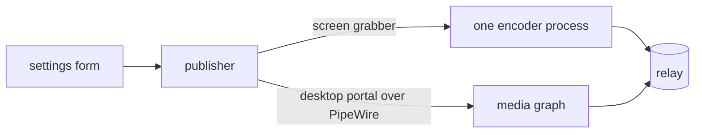

# Capture and publish architecture

How a screen becomes a stream on the relay, and what the publisher decides on the way.
Two capture routes need different machinery, and one contract hides which is running.

A capture backend owns its whole pipeline: capture, encode, mux, transport.
The lifecycle above it never names either framework.
What each stage does to the picture is `video-stack.md`; what it costs is `delay-measurement.md`.

## Capture source and engine

Which framework runs a source follows from which one can read it.
A screen both read is two rows.

| Source | ffmpeg | GStreamer |
| --- | --- | --- |
| macOS screen | `avfoundation` | `avfvideosrc` |
| Windows desktop | `ddagrab`, `gdigrab` | `d3d11screencapturesrc` |
| portal | no PipeWire input device | `pipewiresrc` |
| DRM/KMS scanout | `kmsgrab` | no capture element |

Both frameworks have a row on every platform, so no platform decides the engine for the user.
The stream and the wizard's monitor preview take one rectangle, a preview cropped differently being a picture that lies about what is shared.

## Changing settings on a live stream

A running encoder takes some settings and refuses the rest.
Where it takes one the child converges on the whole state and viewers keep watching; otherwise the pipeline is rebuilt and viewers reconnect, so the form asks first.

Which changes are live is one table, and the form's greying reads it.
A write the child refuses falls back to the rebuild, reporting the apply as done leaving the stream on values nobody chose.

A rebuild is decided by rendering both configurations and comparing them, so a setting no pipeline is built from moves under a running stream.

The order is refuse, tear down, launch.
A rebuild reuses the screen source already held, so nothing puts the picker back on screen.

## A pipeline that dies on its own

Relaunch is bounded, on the settings the dead pipeline ran.
How long it ran decides the budget: one that reached a healthy state starts from a full one, one that never did is failing at launch.
Unbounded, a combination this machine cannot run means a driver reset per attempt.

Across the wait the stream reads as publishing, with a retrying flag and an attempt count.
The exit reason reaches the user once retrying ends.

## Frame memory

A frame stays on the device or makes the round trip through system memory according to the capture and encoder pair (`video-stack.md`, "Frame memory").
What the publisher decides is which pairs it will accept.

| Value | Takes |
| --- | --- |
| `auto` | the direct path where the pair has one whose colour is the form's, the copy otherwise |
| `gpu` | refuses a pair with no row |
| `gpu-encoder-color` | a direct path whose colour is the encoder's |
| `system` | the copy every pair can run |

Auto is what every pair satisfies, so a settings file naming no frame memory migrates to it.

A pair also carries whose colour the stream ends up in: exact where a device-side filter states all four components, the encoder's where the platform offers none.
Windows with NVIDIA under ffmpeg is the second case, and the encoder converts at BT.601 limited range in 8-bit 4:2:0 and signals that.
The row is offered rather than withheld, under a frame memory of its own, with the two overridden fields greyed and the cost named.
Auto never picks it, a setting nobody touched not being allowed to change what the stream looks like.

## Capture GPU and encode GPU

Sharing memory needs one device at both ends, which most pairs establish by construction.

The portal names no device, so the two are the same exactly when the machine has one render node.
Several is refused with them named, under auto as well, demoting for a second GPU handing back the round trip the setting exists to avoid.
The check runs before anything is acquired, so the command the form displays is one the button beside it can run.

## Audio

The second track rides the same mux and players pick it out themselves.
What the track is mixed from is a list of sources, each with a gain and a mute (`domain-model.md`, "The second track is a list").
One source kind is a media-session node rather than a sound device, so it is served on GStreamer alone.

Every recording source is Linux's, and each other platform is refused with what it lacks.
Windows offers no loopback capture to either grabber and macOS enumerates input devices only.

## The pointer

| Value | Pointer |
| --- | --- |
| `embedded` | drawn into the picture |
| `hidden` | left out |
| `metadata` | position reported out of band, for the drawing side to place |

The third is not more or less of the first two.
An embedded pointer costs bitrate and blurs with what else the picture spends bits on; a metadata pointer stays sharp at any scale and reaches only a viewer that draws one.

What each backend serves is its own table, the fact being about the backend and unrelated to the encoder.
The scanout capture reads the primary plane while the pointer is a hardware plane over it, so hidden is the only mode describing what it does.
Metadata needs a readable position, which two backends have, both on GStreamer.
Which modes the portal serves is the compositor's answer, read before a mode is offered.

The position takes two legs from one reading, held as a fraction of the captured picture, the one space both sources answer in.

| Leg | Carriage | Rate |
| --- | --- | --- |
| this machine's screens | the child's own output | the source's own |
| every viewer | the encoded frames | the frame rate |

The relay re-muxes per listener, so nothing beside the picture survives the hop.
The position rides an unregistered message in the bitstream, one per coded picture, arriving with the frame it was read over.
H.264 and HEVC carry that message and the other formats have none, so metadata is refused against the format rather than the capture, the two sending a reader to different places.

A monitor preview draws the pointer whatever the setting holds, two desktops often differing by nothing else.

## The colour the stream can carry

A colour description reaches the viewer only through the bitstream, and a stream signalling none is watched as limited-range BT.709 off the picture size (`video-stack.md`, "Colour, in full").
So full range is refused wherever the stream would not carry it.

| What fails | Where |
| --- | --- |
| an encoder writing no colour description | the VA-API elements and the AV1 software encoder, on GStreamer |
| an encoder writing limited range whatever it is told | the AMF and Vulkan AV1 encoders |
| a format with no colour range field | VP8, both engines |

A range reaches the frames only as part of a fully named description, the conversion dropping it along with any unknown component.
The encoder input offers every colour the pixel format holds and the child narrows them to the transfer the capture produces, so the surface's own colour negotiates and nothing converts it.

## The portal handshake

The screen-cast methods are asynchronous, each result arriving on a signal.
The sequence creates a session, selects sources and starts, and the start pops the compositor's picker unless a restore token is supplied.

Both monitor and window are offered, and which is shared is the picker's answer, so a monitor index is inapplicable here.
Kinds are narrowed to what the portal advertises first, an unadvertised kind failing the whole call.

### One consent per stream

A consent outlives the child that reads it.
The session is held and each launch takes a fresh descriptor on it, the descriptor carrying a protocol a second client cannot join mid-conversation.

Only the compositor issues a restore token, and where it answers an empty one the next selection prompts again.
Without the hold a publish walking its backoff would put the picker on screen once per attempt.

The hold lasts exactly as long as a publish is in force: a retry and a settings rebuild keep the session, a stop, a spent budget or a launch that never came up give it back.
Held longer it would leave the compositor sharing a screen nobody receives.

Source kinds and cursor mode are fixed when sources are selected, so a cursor-mode edit pops the picker where a bitrate edit does not.

The restore token is stored on its own rather than as part of a stream, being machine- and consent-local, so a preset copied elsewhere would carry a token no compositor there issued.
Forgetting the consent takes effect on the next stream.
Storing it is best effort, a failure costing a picker and nothing else.
