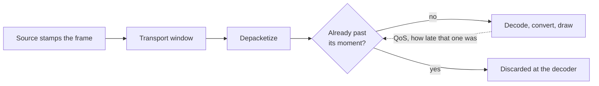

# Decode timing

A live decode has one job besides decoding: stay on the clock.
Every frame carries a moment, and the pipeline either draws it at that moment or throws it away.
Falling behind is the one outcome closed to it, because a live leg has nothing to catch up with.

## A frame's moment

The moment: the running time the frame was stamped with, plus the latency the pipeline configured.

The transport's buffering window sits inside that latency rather than beside it.
A frame arriving on schedule is on time under a 51 ms jitterbuffer and under a two-second one alike, so no buffering setting makes frames late.
What makes them late is a stage running longer than it declared: a decode or a conversion overrunning.

The dotted edge is the whole control loop.
The sink measures the overrun and sends it back as a proportion, and the decoder discards in step with it.

## Shedding

A chain that cannot hold the rate its source sends has two ways to be short, and only one of them is survivable.

| | short with QoS off | short with QoS on |
|---|---|---|
| Frames | all kept | the late ones discarded |
| Delay | grows for as long as the stream runs | holds on the clock |
| Looks like | slow motion, minutes behind | stutter, current |
| Recovers | never | every frame |

The sink measures every frame against its moment.
With `qos` off it keeps that reading to itself, and the queue backpressures rather than leaking.
The transport's flow control turns the shortfall into a backlog that only grows.

With `qos` on it sends the overrun upstream as a proportion, and the decoder discards what is already late in `gst_video_decoder_clip_and_push_buf`.
That is the whole mechanism.
It has to act there because the backlog sits upstream.
Discarding at the end of the chain drains nothing: a leg with QoS off falls behind at the same rate while the sink throws frames away.

Shedding upstream is also the cheap place.
A discarded frame costs a decode and no more, so `glupload` and the colour converters run only on frames that will be drawn.

`max-lateness` stays at GstBaseSink's own -1, which hands on every frame however late.
On top of a working QoS loop, a cutoff there takes only frames the proportion had already judged worth drawing.

The receiving pipeline holds this, each property carrying why it is set.

## Reading it off the tile

The three rates are one funnel, in the order the panel prints them.
The rows below them carry the whole path a frame took, which `delay-measurement.md` covers.

| Panel row | What it is |
|---|---|
| Frames arriving | encoded frames reaching the decoder each second |
| Discarded to keep up | frames the decoder threw away each second rather than hand on |
| Drawn | frames leaving the sink each second |
| Decode | mean time a frame spent between arriving and being ready to draw, over the interval between two samples |
| Decode, worst | the longest any single frame ever spent, which only rises |
| Dropped at the last step | frames thrown away after the whole chain had been spent on them |

Arriving less discarded is drawn, so the middle row is where a shortfall goes and it is the row to read first.

The mean holds steady while single frames run long, which is why the worst is beside it.
The last-step count is the wasteful loss and stays at zero: nothing on this leg spends a conversion on a frame and then throws it away.

| Panel reads | State |
|---|---|
| discarded at zero, worst well under the latency window | headroom |
| discarded steady, worst at the latency window | shedding, chain short of the rate it is sent |
| arriving far under the declared rate, discarded at zero, delay climbing every sample | falling behind, which is a leg with no QoS actor |

Discarded is a rate and has no running total, because a decoder holds a constant few frames at any moment.
That depth stands in both readings a rate is taken across and cancels, where a total would carry it forever as frames nobody discarded.

## When shedding will not stop

The deadline bounds the delay.
It creates no capacity.

A decode shedding steadily is being sent more frames per second than the machine draws, and the cure is at the sending end: fewer frames per second, fewer pixels, or a cheaper codec (`video-stack.md`).
Encode and decode of one stream on one machine share a GPU, so watching a stream this machine also publishes asks that GPU for both.
