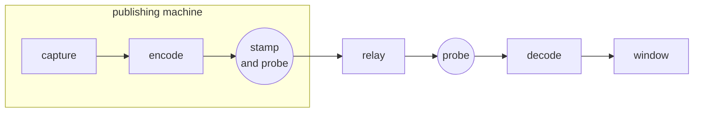

# Measuring the delay

Every stage between a screen and a window is measured, or named and left without a figure.
Nothing is derived from a setting: a window a transport asked for is not what a packet took.

Two measuring points do the work, one per pipeline, and a clock inside the picture joins them.

## Where the readings are taken

Both points sit on the encoded stream.
On the publishing side that is the encoded-frame counter's source pad, past the parser.
On the receiving side it is the decoder's sink pad.
So no measurement maps a video surface, and the frames a capture or a decoder leaves on the GPU stay there.

## What each row is

| Row | Measured at | By |
| --- | --- | --- |
| Capture and encode | publish pipeline, encoded-frame counter | its own clock, less the frame's running time |
| Publisher to relay | publish sink | the transport's stated window |
| both of those, on another machine's stream | the pictures themselves | the publisher's own readings, stamped into each one |
| Through the relay | derived | the timed way here, less both windows |
| Relay to here | watch leg's elements | the transport's stated window |
| Decode | receive pipeline, sink pad | its own clock, less the frame's running time |
| Held for play time | derived | the latency query, less the decode |
| At least, end to end | derived | the measured stages, added |

The way between the two machines is timed as a whole and drawn on no row of its own.
The relay's row is derived from it, and the total counts it in place of the two windows it covers, so a row of its own would repeat them.
It crosses the contract as `path_ms` all the same, this side stating what it measured and the panel deciding what to draw.

The total therefore stands above what the rows above it add up to, by whatever the windows did not account for.
On a pair of legs stating no window at all, that gap is the whole way between the machines and the rows above carry none of it.

The budget is assembled once, on this side.
Which stage a figure belongs to and which figures may be added is a decision, so no shell makes it again.

Every figure is a mean over the interval between two samples, carried as a sum and a count so the interval stays the reader's.
The exception is the decode's worst single frame, a high-water mark over the whole run.
A mean holds steady while single frames run long, and the long one is what a sink's deadline is judged against.

## The clock in the picture

A relay terminates one protocol and re-muxes for each listener, so no leg's counters cross it and it reports no delay of its own.
What crosses unchanged is the coded picture, a re-mux being no re-encode.

So the publisher writes what only it can know into an unregistered SEI message ahead of each picture.
The viewer reads it at the decoder's input.

Two things ride there.
The wall clock the picture left the encoder at, which the viewer subtracts.
That reading spans both legs and the relay as one figure, over any transport.
It is the only figure between the two machines that is measured rather than stated by a transport, so the relay's share and the total both come off it.
The publishing pipeline's own running totals beside it.
Those put capture and encode, and the window that leg settled on, in front of a viewer of somebody else's stream.

Those totals cross as a sum and a count, so the viewer divides them over its own sampling interval exactly as it divides its own counters.
Where this machine is the publisher too it reads its own run instead.
That is the same figure at full precision, and it is there for a codec that carries no stamp at all.

The message goes behind the parameter sets and in front of the first picture unit.
Put ahead of them it is dropped by the parser that meets the stream there.
That costs the first frame of every stream and of every mid-stream join.

Its identifying bytes hold no zero, so the emulation-prevention rule never rewrites them.
A reader searches for them rather than parsing a bitstream it did not frame.

The message costs sixty bytes a frame, and one more packet per frame on the legs that payload into RTP, the payloader giving each unit its own.
Around thirty kilobits a second at 60 fps: a third of one percent of an eight megabit stream, and proportionally more of a thinner one.
Being a fixed size on every picture, it scales with frame rate.

## What keeps the publishing reading bounded

Two things stop the capture-and-encode figure growing without limit.

The trunk sheds ahead of the encoder, holding the newest frame and dropping the rest, so an encoder or a leg short of the capture rate costs frames instead of ageing every frame behind it.
What it dropped is counted and crosses on the same line, the two being one reading: what the shed threw away is what the delay did not grow by.

The software encoders run with their lookahead pinned off, frames an element holds leaving at whatever rate the transport takes.
Fifty held frames on a leg draining three a second is seventeen seconds of picture nobody has seen.

Frames the encoder repeated to hold the output rate and frames discarded before it are two counters.
Naming one after the other is how a health column ends up unable to move.

## Capture rate against encoded rate

How often the encoder emitted a frame and how often the screen produced a new one are two figures, and on a damage-driven capture they are far apart.
The pacer repeats the newest frame to hold the target, so the encoded rate follows the target whatever the screen does, and a counter downstream of it hands the target back as if it were a measurement.

So the capture rate is taken at the last point where one buffer is still one new picture.
It falls below the target both when the shared screen is static and when the capture path cannot keep up, which are the two things worth telling apart from a healthy stream.
It is a run's instrumentation, so a pipeline built without it reads unmeasured rather than zero.

The two engines' byte figures are not comparable: one counts the video elementary stream, the other the muxed stream with its audio track and container overhead.

## What is left unmeasured

| Absent | Because |
| --- | --- |
| everything the message carries | a codec with no unit for it, a publisher that is not this app, or the ffmpeg engine, which exposes no point to write at |
| the relay's own share | the timing of the way here missing, or either leg stating no window of its own |
| capture and encode | a publish that measured none of its own stages, on a stream this machine does not publish either |
| a leg's window | a transport that states none, its buffering falling under the decode instead |

Each is still a row, drawn without its figure.
A total presented as the whole journey would be wrong by exactly what is missing, so it is stated as a floor.

Across two machines the subtraction is against two clocks and is worth what their synchronisation is worth.
A stamp from ahead of the reader's clock is dropped rather than shown as a path of no length.
A viewer of its own stream reads one clock and is exact.

The publishing figures stand apart, being one pipeline's readings of itself, carried rather than subtracted.
A pair of clocks too far apart to time the way here still leaves a viewer the stages ahead of it.
