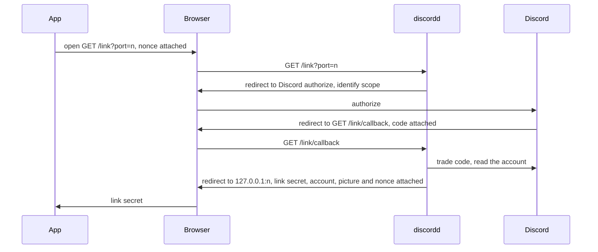
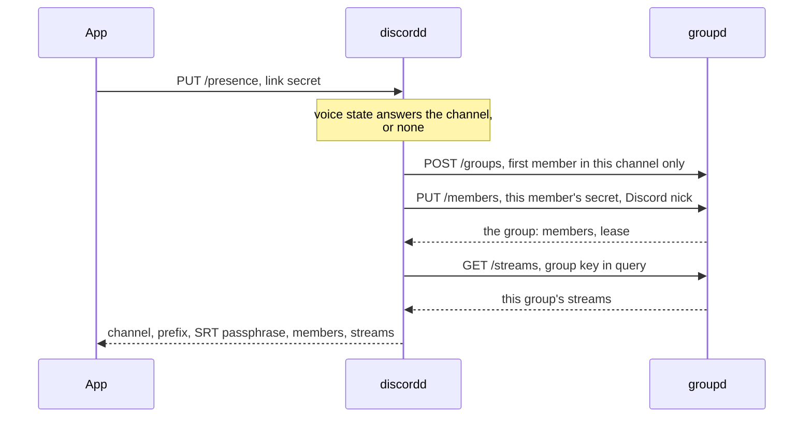
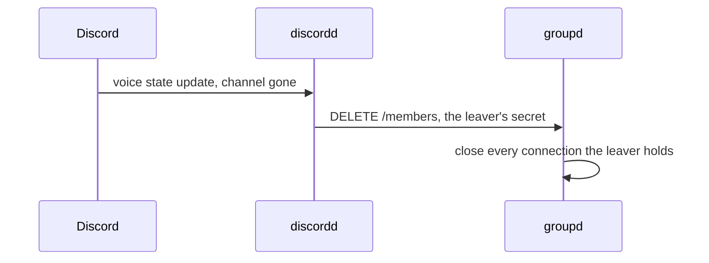

# Discord mode

A voice channel is a group.
`discordd` holds that true continuously:
whoever sits in the channel can watch, whoever leaves is cut within seconds,
and no key changes hands to make it so.

A group comes from one of two places, and the settings name which: a key somebody handed over, or this channel.
The choice is one control, so the manual key and the name under it are read by nobody while the channel is the source,
and the stored key waits where it is for the choice to come back.

The app never holds the group key in this mode.
`discordd` draws the group, keeps the key and every member secret,
and answers the app with the derived facts alone: prefix, SRT passphrase, members, tokens.
Leaving needs nothing revoked, since nothing worth revoking was ever handed out.

## The manager

`discordd` runs beside `groupd` and speaks to it as any member's app does,
over `POST /groups`, `PUT /members`, `DELETE /members`, `POST /tokens` and `GET /streams`.
`groupd` does not know it exists.

Discord's side is a bot over the gateway with the `GUILD_VOICE_STATES` intent,
which answers who sits in which voice channel of every guild the bot is invited to.
Every voice channel the bot can see counts, with nothing to configure per guild.

## Linking, once per install

The secret lands on a loopback port, which any page open in the browser reaches by guessing it.
So the app draws a nonce with the start and takes the one landing carrying it back.
The manager holds that nonce for the length of the flow and reads none of it.

The link secret is 32 bytes naming this install as that Discord user.
It sits in the settings the way a group key does and carries the same trust:
whoever reads the file watches this user's channels.
It stays on the backend: the flow above is its one writer, the control contract carries it in neither direction,
and every draft arriving from a shell gets it put back (`ipc-api.md`).
The account that consented rides back with the secret and is stored beside it, a label on the link.
Its picture rides with it as an address on Discord's CDN.
The backend reads that address and a shell draws the bytes, the app being the side that reaches the network.
A link holding no picture takes one off this install's own row on the next pass, and stores it there,
so a link drawn before the manager answered pictures needs no second consent.
The pass that would answer it runs in Discord mode alone, and a link stands in either mode,
so the label is what names the account on screen.
A rename on Discord reaches the app on the next link.
What a shell learns is `DiscordState.linked`, `DiscordState.account_name` and `DiscordState.avatar`.

Holding a link and the manager resolving it are two facts, and `DiscordState.link_refused` carries the second.
A refused link stays stored and stays linked, so the mode moves neither field:
folded into one, the source would decide whether this install is linked at all.
A refusal is cleared by a link drawn again or dropped, and by no number of passes.
The channel is the one half the mode drops, no pass following one while the group comes from a key,
so the app states the link in one sentence wherever it states it.
Links survive a restart; they are the one thing `discordd` stores,
a handful per account with the oldest aging out on every draw past the cap.

Unlinking drops the secret and the account label from the settings, and reaches nobody.
The manager keeps its row until that row ages out.
Presence stops on the next pass, so the lease lapses as a leaver's does.
No other setting moves: where the group comes from is a control of its own,
and Discord mode with no link refuses what it refuses on any unlinked install.

## One pass of the poll

`PUT /presence` is idempotent as `PUT /members` is:
it names the state the app wants true and the answer is the whole of it.
Presence reaches `groupd` only on a pass the bot confirms,
so a lease means in the channel and the app running, both.
A member outside any channel gets an empty answer and states nothing.

Every member's row carries the picture that member is drawn under in the channel.
The manager holds a member id and the Discord account it was drawn for, so the two meet there and nowhere else.

Tokens ride the same trust: `POST /tokens` at `discordd` takes the link secret,
checks the voice state, and brokers the trade `groupd` answers.

## What a share states on Discord

A share states itself on the Discord client running beside the app.
The activity says that this machine is sharing, names the voice channel,
and counts the channel's members watching against everybody sitting in it, which Discord draws as "1 of 4".
Its timer runs from the start of the child carrying the stream.

Every figure is the pass that landed it:
the channel from the manager, the audience from the group's index and the channel's occupancy,
and the timer from the publish in force.
A machine sharing nothing states no activity.

The connection is the app's own, on the socket a running Discord serves (`internal/discordrpc`).
It belongs on the machine the app runs on, that socket granting the profile of whoever is signed in there.
The application it is drawn under is the manager's own, answered beside the channel on every pass,
so one deployment's id reaches every app following it.

Discord closes a connection stating more than five activities in twenty seconds.
An activity naming what the connection already carries sends nothing,
so the passes between two changes spend none of the five.
Type 3 is what Discord draws as "Watching".
The purple streaming badge is type 1, which Discord grants a Twitch or YouTube address alone.

The channel and the audience are this mode's answers,
so the setting asking for the activity moves the group onto the channel with it (`internal/app`, `SaveSettings`).
Switching it off closes the connection, which is what takes the activity off the profile.

One button rides under the activity, "Watch stream", which Discord opens in a browser.

It lands on `GET /watch/<group id>/<stream>` at the manager, which serves a page whose one press hands `mirrorme://watch/<group id>/<stream>` to the desktop.
A browser passes a link to an application on a gesture, so the press is what the page is for, the redirect it also fires being dropped without one.
The app opens the stream the way a press inside it does, and answers a reader standing outside that group with the way in.

The page takes no credential and states no secret: the group id is the public digest every path already carries,
and an app holding no seat in that group refuses what the link names.

Discord opens an https address, so a manager reached on its own port over plain HTTP carries no button at all.
The button is drawn on the profiles other people look at, the sharer's own card carrying the activity alone.

## Leaving

The leave event lands the release, so the cut is seconds behind the channel.
Where the event is missed, the lease lapses on its own within `groupd`'s sweep,
the fallback costing nothing extra.
A leaver's own app learns the same fact on its next pass and empties its group state.
A gateway that was down carried no event at all,
so a guild's next seeding states its whole occupancy and leaves whoever it does not name.

A channel empty for a minute retires its mapping.
The next occupancy draws a fresh group, so a prefix outlives no session.

## What is where

| Fact | Owner |
| --- | --- |
| who is in which channel, and the picture each is drawn under | the bot's voice state |
| channel to group, keys, member secrets | `discordd`, in memory |
| link secret to Discord user | `discordd`, on disk |
| the Discord application every app draws an activity under | `discordd`, from the credentials it links through |
| leases, tokens, enforcement | `groupd`, as ever |
| where the group comes from, the link secret, the account it was drawn for and its picture | the app's settings |

A `discordd` restart forgets every session:
leases lapse, streams close, and the next pass rebuilds fresh groups.
Links persist, so nobody relinks over a deploy.

## Bounds

One Discord user on two machines is two links and two members;
a nickname both claim gets a suffix on the second.
Watching happens in the app alone, with no browser hand-off in this mode.
A channel the bot cannot see spawns no group,
so a private voice channel wants the bot's role added.
