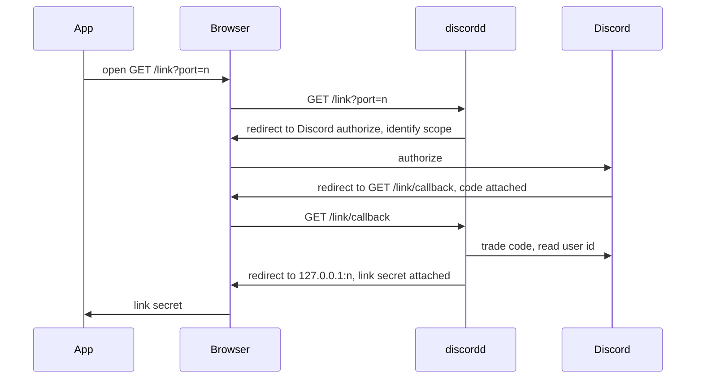
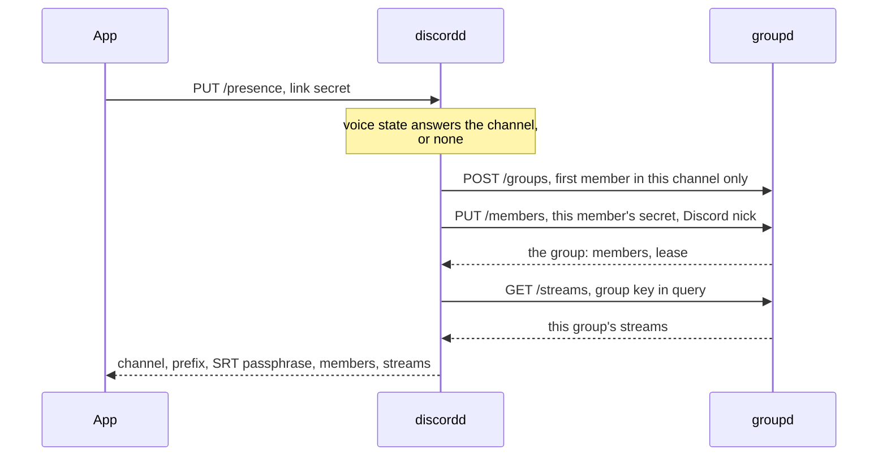
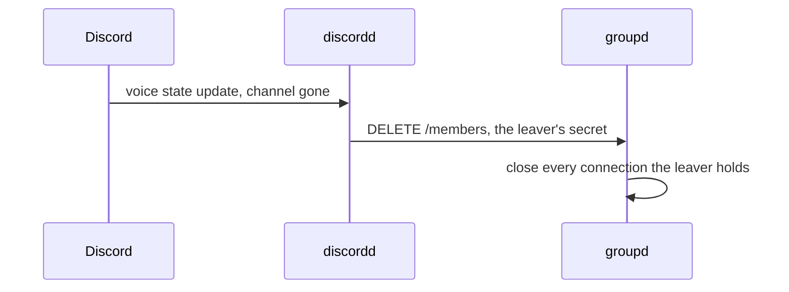

# Discord mode

A voice channel is a group.
`discordd` holds that true continuously:
whoever sits in the channel can watch, whoever leaves is cut within seconds,
and no key changes hands to make it so.

The app never holds the group key in this mode.
`discordd` draws the group, keeps the key and every member secret,
and answers the app with the derived facts alone: prefix, SRT passphrase, members, tokens.
Leaving needs nothing revoked, since nothing worth revoking was ever handed out.

## The manager

`discordd` runs beside `groupd` and speaks to it as any member's app does,
over `POST /groups`, `PUT /members`, `DELETE /members`, `POST /tokens` and `GET /streams`.
`groupd` does not know it exists.

Discord's side is a bot over the gateway with the `GUILD_VOICE_STATES` intent,
which answers who sits in which voice channel of every guild the bot is invited to.
Every voice channel the bot can see counts, with nothing to configure per guild.

## Linking, once per install

The link secret is 32 bytes naming this install as that Discord user.
It sits in the settings the way a group key does and carries the same trust:
whoever reads the file watches this user's channels.
Links survive a restart; they are the one thing `discordd` stores,
a handful per account with the oldest aging out on every draw past the cap.

## One pass of the poll

`PUT /presence` is idempotent as `PUT /members` is:
it names the state the app wants true and the answer is the whole of it.
Presence reaches `groupd` only on a pass the bot confirms,
so a lease means in the channel and the app running, both.
A member outside any channel gets an empty answer and states nothing.

Tokens ride the same trust: `POST /tokens` at `discordd` takes the link secret,
checks the voice state, and brokers the trade `groupd` answers.

## What a share states on Discord

A share states itself on the Discord client running beside the app.
The activity says that this machine is sharing, names the voice channel,
and counts the channel's members watching against the members in it, which Discord draws as "1 of 4".
Its timer runs from the start of the child carrying the stream.

Every figure is the pass that landed it:
the channel from the manager, the audience from the group's index and its members,
and the timer from the publish in force.
A machine sharing nothing states no activity.

The connection is the app's own, on the socket a running Discord serves (`internal/discordrpc`).
It belongs on the machine the app runs on, that socket granting the profile of whoever is signed in there.
The application it is drawn under is the manager's own, answered beside the channel on every pass,
so one deployment's id reaches every app following it.

Discord closes a connection stating more than five activities in twenty seconds.
An activity naming what the connection already carries sends nothing,
so the passes between two changes spend none of the five.
Type 3 is what Discord draws as "Watching".
The purple streaming badge is type 1, which Discord grants a Twitch or YouTube address alone.

The channel and the audience are this mode's answers,
so the setting asking for the activity turns the mode on with it (`internal/app`, `SaveSettings`).
Switching it off closes the connection, which is what takes the activity off the profile.
The activity carries no address, so nothing on it opens a browser.

## Leaving

The leave event lands the release, so the cut is seconds behind the channel.
Where the event is missed, the lease lapses on its own within `groupd`'s sweep,
the fallback costing nothing extra.
A leaver's own app learns the same fact on its next pass and empties its group state.

A channel empty for a minute retires its mapping.
The next occupancy draws a fresh group, so a prefix outlives no session.

## What is where

| Fact | Owner |
| --- | --- |
| who is in which channel | the bot's voice state |
| channel to group, keys, member secrets | `discordd`, in memory |
| link secret to Discord user | `discordd`, on disk |
| the Discord application every app draws an activity under | `discordd`, from the credentials it links through |
| leases, tokens, enforcement | `groupd`, as ever |
| mode toggle, link secret | the app's settings |

A `discordd` restart forgets every session:
leases lapse, streams close, and the next pass rebuilds fresh groups.
Links persist, so nobody relinks over a deploy.

## Bounds

One Discord user on two machines is two links and two members;
a nickname both claim gets a suffix on the second.
Watching happens in the app alone, with no browser hand-off in this mode.
A channel the bot cannot see spawns no group,
so a private voice channel wants the bot's role added.
