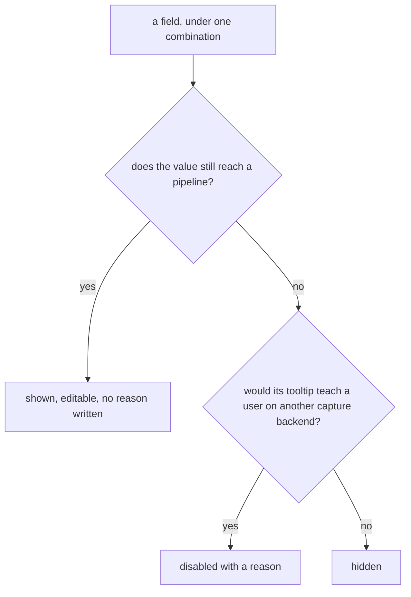

# Field availability: hide vs disable

A settings field can become inapplicable to the current combination of capture backend, codec, publish transport and mode.
Two treatments express that, and the choice between them is a fixed rule.
A third form covers the neighbouring case, a field that stays applicable but means something else.

**Every "reason" on this page is a fact that crosses as a code.**
Which fact greys a control is decided in Go, and the code names the identifiers it is about.
The wording is the shell's, written where the column width and the tone are visible (`ipc-api.md`, `api/proto/screenshare/v1/text.proto`).
The quoted sentences below are one shell's rendering of the rule beside them.
The rule is what this page is about: a reason names the limit and names which side has it.

**Where several facts block one field, every one of them crosses.**
The backend states each reason that bound.
It does not rank them or pick one to send.
A control blocked by two facts is blocked by two facts,
and a backend choosing which to mention would be deciding what the screen says about a limit it can only describe.
Which of them a shell shows, and in what order, is the shell's: it holds the column width and knows whether one line or three fit.

The rules themselves never cross.
A shell that evaluated them would be a second place deciding what is legal,
and the first combination the two disagreed on would grey a control the publish accepts (`ipc-api.md`, "The rule").

## The treatments

**Hidden.**
Not in the form at all: `Form` marks it not visible for this combination, and the shell has nothing to draw.
The DRM download field is present only when the capture backend is `kmsgrab`.

**Disabled with a reason.**
Arrives disabled, carrying the code that says why it is inert.
The code comes from the availability pass:
the effort ladder greys under a VAAPI encoder with "h264_vaapi has no such setting: how hard it works is that encoder's own to decide".

**One option disabled with a reason.**
The control keeps the option and greys that entry, and the entry carries its own reason.
Covers a value the current combination rules out while a neighbouring combination allows it.
Planar RGB is greyed on the portal capture backend, because no GStreamer encoder element takes it,
and selectable on the capture backends that run ffmpeg, which codes it.
The reason then tells the user what to change rather than only that the option is gone.
The audio codec is greyed from two tables at once, and the reason names which one:
the publish leg carries no such track (AAC under WebRTC, Opus under RTMP), or the capture backend's engine has no encoder for it.

The encode's two controls split the same way, each greying for what it can be changed to fix.
A format greys where nothing here produces it, or where the publish leg has no mapping for it, which is one statement covering however many encoders reach it.
An encoder greys where the pair names no row at all, naming the formats that encoder does produce,
and where this machine cannot run the row: what the probe found, the engine's own gap, the roadmap.

**Live with a note.**
Stays editable, and gains a note the shell renders beside its own text.
For a combination where the value still reaches the encoder but does something the field's own text does not describe,
such as the bitrate becoming a burst ceiling in constant-quality mode on NVENC.
A note keeps a knob the builder does forward out of the greyed set, since greying it would leave the encoder using a number the form refused to show.

A built-in preset is ruled out the same way, for the same kind of reason.
The promise is one no encoder or capture backend on this machine delivers,
so the entry keeps its place and carries the publish leg the search worked within, and nothing is applied (`presets.md`).

The pixel-format control carries a note of the second kind: what the choice costs a viewer to decode, from the decode table.
It is a note rather than a greying because the limit is the viewer's.
Every format has a software decoder, so a pixel format no GPU takes is a viewer spending cores, a trade the publisher is entitled to make once it is stated.

## Three facts decide a rate-control field

A quantizer target, bitrate bound, rate buffer, B-frame count or effort step is live only when all three agree.

- The **mode's concept** uses the knob: the mode table says which controls each rate-control mode needs.
- The **codec's encoder** takes the knob: the family table flags the families whose encoders read the B-frame count.
  That field greys for a family that carries no flag, whatever its hardware could do with it, and the reason lists the families that do from the same table.
  The effort step is asked of the codec's own row instead, since the steps are the encoder's identifiers rather than a family's.
  A row that declares no ladder greys the control naming itself, and a row that pins the step in a mode greys it there and names the step in force.
- The capture backend's **publish engine** forwards the value: the engine rules record where a builder drops a knob the mode uses.
  The rate buffer greys for the NVENC and QSV codecs on the GStreamer engine, whose elements expose no such property.
  Both ladders are absent from those rules, because every element that codes a laddered codec takes its steps.

When two of them block the same field, both reasons cross and the shell decides what to show.
B-frames under software x264 in VBR carry the family fact, "only the NVIDIA NVENC encoders take a B-frame count", beside the mode fact.
A shell with room for one line shows the family one: it is the fact that survives changing the mode.

## Three facts decide the frame memory

The frame-memory control is the one field neither the capture backend nor the codec decides alone.
Its direct value needs both ends to share device memory, a pair rather than a property of either:
the portal capture shares memory with a VAAPI encoder and not with an x264 one,
and a VAAPI encoder shares it with the portal capture and not with ximagesrc.
The pair table declares them, the catalog carries them,
and the availability pass greys the direct value for a selection matching no row, naming both ends so either one is a way to reach it.

The third fact is who converts, and it splits the direct value in two.
A row whose device-side filter is told the colour, and states it, reaches `gpu`.
A row where the platform has no such filter, and the encoder converts the captured RGB itself, reaches `gpu-encoder-color` instead.
Two of the four values can therefore be greyed, and each greying names the other as the way across.

| Pair | Greyed | Reason names |
| --- | --- | --- |
| no row | both direct values | both ends |
| device-side filter states the colour | `gpu-encoder-color` | nothing to trade |
| the encoder converts | `gpu` | what the conversion costs, and the capture backend that reaches both |

That last reason is the useful one, since the same screen is often reachable on the other engine where the conversion does state its colour.

Auto and the system copy are never greyed.
Auto answers with whichever path the pair has, and the system copy is the path every pair has, so a combination with no row leaves a working control rather than a dead one.
Auto also never answers with the encoder-colour path: it is the value nobody chose, so it may not change what the stream looks like.

Where the pair does have a row, the DRM download strategy is hidden's neighbour: it stays rendered under kmsgrab and greys, because a run that downloads nothing chooses no mapping device.
It is greyed rather than hidden because the field is already gated on the capture backend,
and a second gate would make it appear and vanish while the user changes codecs.

## The rule

The first question is whether the field is inapplicable at all.
Both treatments are answers about a control that does nothing in this combination,
so a value that still reaches a pipeline gets neither: it is shown, editable, and no reason is written about it.
A hidden control holding a value in force is the worst state on this page, because the setting acts and nobody can reach it.
The watch group is where a setting names one leg and another is the one opened.
The SRT retransmit window and the RTP lower transport belong to the link rather than to one reader,
and a player is opened per press on whichever leg the reader picked, so no stored player leg decides which players run.
Gated on one, the lower-transport setting is read by a player opened over RTSP while the control holding it sits on no screen.
Applicability is therefore asked against what can be opened, wherever that differs from what a setting names.
The player and the browser both store nothing, so every leg either of them opens counts as openable.
That is the whole of what keeps the MoQ port on screen: no setting names that leg, and a browser still dials the number.

The second question sorts the two treatments.

- A **backend implementation knob** that has no meaning outside one backend is **hidden** when that backend is not selected.
  Its tooltip describes a mechanism that a user on any other backend has no reason to read.
  DRM download is a knob of the kmsgrab scanout path and nothing else.

- A **general encoding or quality concept** that the current combination happens to block stays **disabled with a reason**.
  The concept is part of the model every user is expected to understand, so the greyed field plus its reason teaches why the concept does not apply here.
  Effort step, quantizer target, bitrate bound, B-frames, color range and chroma are all general concepts,
  disabled when the codec, the mode or the capture backend's engine rules them out.

## Where a greyed entry sits

A greyed entry stays on the list and sinks to the bottom of it.

The option pass partitions a control's entries into the ones this combination allows and the ones it rules out,
and the partition is stable, so each half keeps the order its builder gave it.
The chroma ladder still runs from most colour detail to least and the encoder list still offers the implemented families before the roadmap ones.
What moves is only that everything reachable is reachable from the top.
A Windows machine therefore meets Desktop Duplication before it meets a capture backend only macOS runs.

Sinking and hiding claim different things.
An entry a neighbouring combination allows is still an entry, and its reason is what names the thing to change:
a greyed WebRTC saying which engine has no sink for it tells the user to change the capture backend.
Removing it would take that sentence away.
Ordering it last only says it is not the answer here.

A shell may keep that lower half folded, and the reference shell does.
A choice control lists the entries this combination allows and closes with a disclosure counting the rest,
so a reader picking something reads only what can be picked, and a reader hunting for why something is missing opens one control and finds it beside its reason.
A folded entry is one press away, in the order Go partitioned them, still carrying the sentence that names the thing to change,
and the disclosure states how many are behind it rather than leaving the reader to guess whether anything is.
What a shell decides is whether a refused entry is on screen at this moment.

It is decided in Go with everything else, because the enabled flag is decided there.
A shell that re-sorted on it would be a second place deciding what the list looks like,
and one the repair walking a stranded value to the first legal entry cannot see (`ipc-api.md`, "The rule").

## A figure with no measurement

Everything above is about a *setting* the current combination rules out.
A *figure* has the neighbouring problem and takes the same answer: a measurement that was not taken is shown as absent.

A zero is a measurement.
`0.00 % loss` says the relay watched this viewer and saw nothing go missing.
`…` says nobody looked.
A screen that printed the second as the first would certify every link it had never measured, the failure this rule exists to prevent.
So the rule is that presence decides (`design-language.md`, "Wording").

**The row stays.**
A figure a reader is looking for reads as unmeasured.
A row that is gone reads as nothing to measure, and those are different facts about the app.
The congestion band, the round trip and the loss stayed on the broadcast screen through the whole time nothing filled them.

**Where the measurement is per-something, the label names the something.**
The relay measures round trip and loss per reader, so there is no such figure for a stream.
The header promotes the worst reader's and says `worst` in the unit, because a bare `ms rtt` beside a viewer count reads as the stream's, a number nobody took.
An average would be worse than either: it is a figure no viewer is experiencing,
and one struggling viewer among five is the case the screen exists for and the case an average erases.

### What is measured, and by whom

| Figure | Source | Absent when |
| --- | --- | --- |
| egress bitrate, fps, encoder clock | the running encoder's own samples | nothing publishes, or no packet is muxed yet |
| viewers | the relay's reader count for the path | no snapshot, or no path by that name yet |
| a viewer's address, join time, bytes | the relay's per-protocol connection list | the relay named a reader it then described nowhere |
| a viewer's round trip and loss | the relay, **SRT legs only** | the viewer is on any other leg |
| a viewer's dropped packets and discarded frames | the relay, per leg | the leg counts neither |
| a viewer's buffer fill, and its decoder | none | always: they are the viewer's own facts and nothing carries them back to a publisher |
| a congestion window | none | always: the relay states figures as they stand and marks no interval |

The last two rows are the ones worth reading twice.
A figure with no source at all does not get invented from the ones that have one.
Deriving a congestion window from a series of readings would be this app performing a detection and attributing it to the relay,
and the honest rendering is the band that is never drawn.
Where a column would otherwise print an ellipsis in every row forever (buffer fill, the decoder),
the column carries a figure the relay does measure at that width instead, and the change is written down where it happens.

## A live stream blocks no field

Every field stays editable while a stream is publishing, and what reaches the stream is asked for separately (`capture-architecture.md`, "Changing settings on a live stream").
What a change costs the people watching is a separate answer again, and the form states it per field.
A field is live where the value is written to the pipeline that is already running,
and false where applying it replaces the encoder child and every viewer reconnects across the gap.
It is not one of the treatments above, because it takes nothing away.
A live field is drawn, editable and offered exactly as it would be otherwise.
The flag is what lets a shell say the cost before the edit rather than after the picture has blinked.

Which fields carry it moves with the settings, so the backend answers it rather than a shell holding a list.
The engine behind the capture backend decides whether anything is live at all,
and the codec and the rate-control mode decide whether the encoder is being sent that value in the first place.
The list is registered into the rule evaluator as a live verdict,
so the flag a form carries and the decision an apply makes are one statement rather than two.

The two controls a live stream does block are measurements rather than settings.
The uplink speed test and the encode-capacity probe both run the real thing,
so one would compete with the stream for the line and the other with the encoder for the silicon.
Neither is a value the user chose, so the reason sits on the button that takes the measurement instead of greying the figure beside it.

The button greys with it, in the state the backend refuses the call.
A shell reads whether a pipeline is in force to decide what its commit does anyway,
so the same reading greys the button and puts the sentence under it,
and the refusal is something to read before the press rather than an answer to one.
It is one of the few sentences a shell composes about a state rather than repeating the backend's.
What the button would have asked for is refused for as long as the stream runs, so nothing is lost by saying so early.

## Why the split exists

The form teaches the encoding model as it is configured,
so a greyed field with a reason participates in that teaching where a blank would not.
A hidden field removes noise that would teach nothing.

## Where the rules live

The availability pass produces the greyings and the notes from the capability table, the domain tables and the engine rules,
which is the same source the repair works from, so a disabled option and its replacement cannot disagree.
Where a dimension has nothing legal left, the repair picks nothing and the field stays disabled with its reason,
rather than holding a value the same evaluation greys.
See `domain-model.md` for the capability and domain tables, and `ipc-api.md` for why the reason crosses as a code and the sentence is the shell's.
