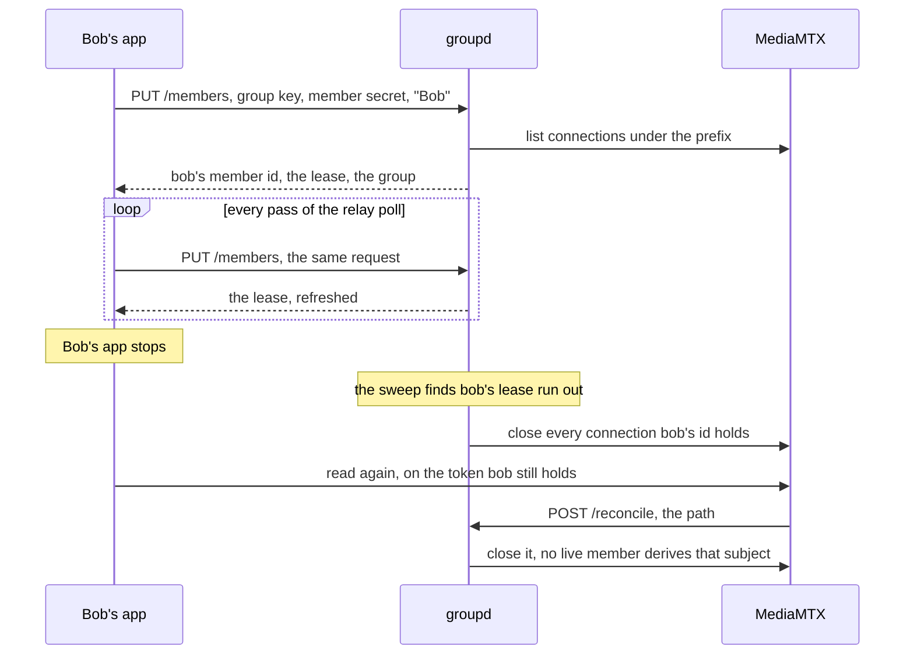

# Membership

Who is in a group, and what the relay does about anybody else.

Membership is a presence lease a member's own app holds.
It exists while refreshed and lapses when refreshing stops.
A member's own machine is therefore the one thing that has to run for them to be in a group.
`groupd` serves it beside the group keys, the tokens and the stream index, so one process answers all of it.

## What a member is

| Word | What it is |
| --- | --- |
| group key | 32 bytes friends share once, and the invite. Held in the settings. It never expires. |
| group id | Public digest of the group key. Every path of the group is `<group id>/<name>`. |
| member secret | 32 bytes the app draws for itself the first time it joins a group. Issued by nobody. |
| member id | Digest of the member secret under the group key. Subject of every relay access token, and what presence is stated over. |
| display name | Label a member claimed in this group. The first claim holds. |
| relay access token | Short-lived JWT the relay checks at the handshake. |

Holding the group key is what lets somebody join.
It buys relay access tokens and carries every statement of presence, so whoever holds one is a member from the moment their app says so.

A display name cannot be taken over.
A member id derives from a secret nobody else holds.
An app claiming another member's name derives its own id and meets a 409 rather than their membership.
The secret is drawn once per group and kept, a second one being a second member with the first one's connections still open.

## Join, refresh, lapse, close

`PUT /members` is the claim and the refresh at once, which is what makes it idempotent.
The request names the state it wants true: this member is here under this name.
A name another live member holds is refused with 409 and stores nothing, two members under one name being two people nobody can tell apart.

The app sends it on the loop that already polls the relay, so presence needs no timer of its own.
The lease is twenty seconds, which covers many passes.
A network blip is not a member dropping out of their own group, and an app that stopped is out of it inside a moment a person would call immediate.

The answer is the whole group: every live member, what they are called, and which of them is publishing.
Publishing is read off the relay's connection list on every answer rather than stated by anybody.
A publish that dropped therefore stops showing without a second call.
Who is watching what stays out of the answer, which is the line the stream index draws too.

## Closing connections

A token cannot be taken back.
The relay reads one at the handshake and not again, so a connection outlives its token and a client that is closed opens another with the same one (`docs/plan.md` carries the measurements).

Enforcement therefore closes connections.
A sweep lists every connection under the group's prefix and closes each one whose subject no live member id matches.
That takes what a lapsed member was watching and what they were sharing.
It runs on every statement of presence in that group, on every release, on the sweep, and on every read the relay announces (`deploy/reconcile-on-read.sh`), so a lapse lands at the first of the four.
The sweep is what bounds the wait where a group's remaining members are all idle, and it is the service's only timer.

The read hook is what covers the window a token leaves open.
A member whose lease lapsed comes back on a token that has not expired, the read announces itself, and the run answering it closes the connection.

## What a run leaves alone

A group with no live member is not enforced.
Membership nobody stated is not the same as a group nobody is in, and enforcing the empty case would close the connections of an app that has not stated its presence.

Streams under `public/` are outside all of it.
No group key derives that prefix, so no member can hold a lease there, and a run against it is refused: anybody may watch, so there is nobody to remove.

A run that could not read one of the relay's lists says so in `unread`, and a close the relay refused lands in `failed`.
Both are a member possibly still watching, so neither is folded into the count of what was closed.

## Leaving

`DELETE /members` releases the lease and reconciles, which closes what the leaver held.
The app drops the identity file with it, so the secret goes and rejoining is a new member rather than the one that left.
Both halves are idempotent: a member holding no lease answers `"released": false`, and a group with no identity file is already the state the call names.
`LeaveGroup` on the control contract is that pair, and `JoinGroup` draws the identity and states the first presence over it.

Nothing removes another member.
A group is left by its own member, by a lease that stopped being refreshed, or by drawing a new group key.
A new key moves every remaining member's streams to a new prefix and leaves every live connection alone.

## Tokens name a member

`POST /tokens` signs the member id where the request names a member secret, and the relay lists and logs a connection under that subject.
The grant does not move with it: membership decides who may connect, and the token's prefix decides what they reach.

A request naming no member secret is answered with the group's own id where the group has no live member.
Where it has one the request is refused: `this group states its members, and this request names none`.
The group id is a subject no member matches, so a token on it is closed the moment anybody states presence.
It is the first app in an empty group bootstrapping itself, and nothing else.

## Stating presence for somebody else

A statement of presence names its member by secret and its sender not at all.
So a bot serving a voice channel, holding what a member holds, states presence for them over `PUT /members`, the route that member's own app uses.

## What is reachable from where

| Route | Reached at | Takes |
| --- | --- | --- |
| `POST /tokens` | the deployment's name, through the proxy | group key, and the member secret where the caller holds one |
| `PUT /members`, `DELETE /members` | the deployment's name, through the proxy | group key and member secret, in the body |
| `GET /members` | the deployment's name, through the proxy | group key, in the query |
| `POST /reconcile` | loopback | a relay path, and it grants nothing |

A member's app reaches the group service at the relay's own name, one certificate covering both (`settings.Relay.GroupService`).
`/reconcile` is the one route the proxy leaves out (`deploy/Caddyfile`).
It takes no credential at all, being the relay's own read hook reporting a path beside it, and a route to it from outside would let anybody spend the host's relay API on demand.
Sent to the deployment's name it reaches the HLS listener instead, which answers `authentication error` for a path it carries no stream at.
Reaching it from another machine is the tunnel `task relay:tunnel` opens.

The service holds the leases and closes what no member holds, walking the per-protocol reader lists the relay keeps.
