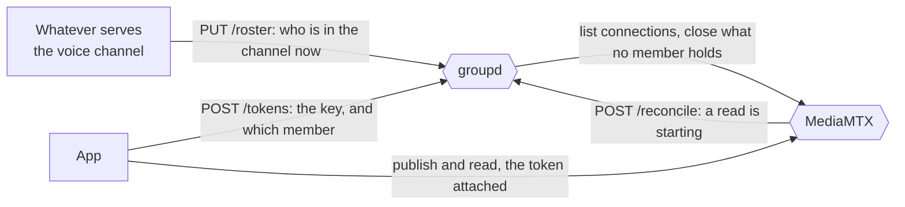
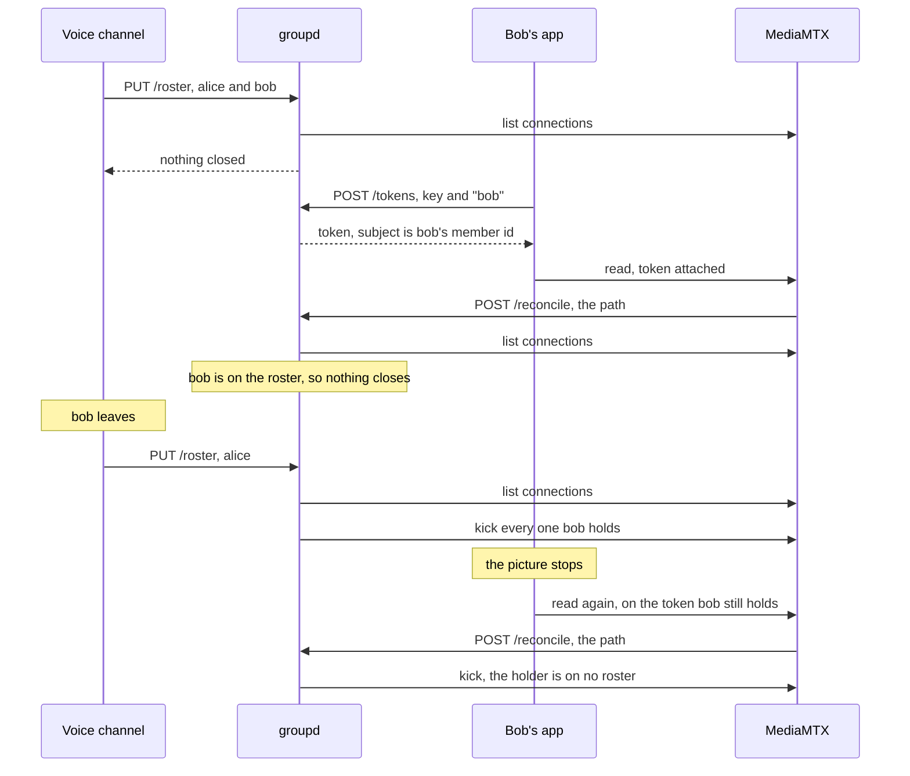

# Membership

Who is in a group, and what happens to somebody who is not.

One process answers all of it. `groupd` serves keys, tokens, the stream index and the roster, so there is no membership service beside it and nothing to keep in step (`backend/cmd/groupd`).
A roster is stated by whatever serves the voice channel, and by hand from `bruno/roster`.

## The parts

A group key is membership and a member name is who inside it.
The relay is where both are enforced, since it is the only thing every connection passes through.

`roster` here is who may be in a group.
The one in `viewer-architecture.md` is a viewer's list of streams, and the two share nothing but the word.

## A member joins, watches and leaves

A member's token names that member.
`POST /tokens` takes a `member` beside the key, and the subject becomes a keyed digest of that name under the group's key.
The relay lists and logs a connection under its subject, so a roster tells one member's connections from another's, and the name never reaches the relay.
The grant does not move with the subject: membership decides who connects, never what they reach.

## Why closing and not expiry

A token cannot be taken back.
The relay reads one at the handshake and not again, so a connection outlives its token and a client that is closed opens another with the same one (`docs/plan.md` carries the measurements).

That splits removal in two.
Closing what a member already holds is this service's, and it takes both what they were watching and what they were sharing.
Keeping them out afterwards belongs to whatever issues tokens, and the window between the two is what the relay's read hook covers by running the roster again on every read (`deploy/reconcile-on-read.sh`).

## What a run may believe

A roster is stated whole and never as a departure, since two callers racing on "who left" can leave a member the last one did not name.
Stating the same roster twice closes nothing, which is what makes it safe on every membership change and on every read.

A group nobody stated a roster for is not enforced, which is not the same as a group whose roster is empty.
The first is membership this service was never told, the second a channel nobody is in.

Streams under `public/` are outside all of it.
No key derives that prefix, so no roster can name one, and a run there is refused: anybody may watch, so there is nobody to remove.

A run that could not read one of the relay's lists says so in `unread`, and a kick the relay refused lands in `failed`.
Both are a member possibly still watching, which is why neither is folded into the count of what was closed.

## Where the answers come from

A roster is the only fact this service keeps beside the key it signs with, and it is kept because nobody else knows it.
Everything else is read through on the call: which connections exist is the relay's answer, and which streams exist is the relay's too.

`GET /roster` and `GET /streams` ask different things of it.
The index is what a member may open, the roster is who is connected, and both name a stream by its name inside the group so the two join without deriving the prefix rule again.
Neither answers the relay's own session ids or the addresses connections came from: a group key is membership, not an operator's credential.

## What is reachable from where

| Route | Answers on | Takes |
| --- | --- | --- |
| `POST /tokens` | the deployment's name, through the proxy | key, and a member name where one is wanted |
| `PUT /roster`, `GET /roster`, `DELETE /roster` | loopback | key |
| `POST /reconcile` | loopback | nothing, and grants nothing |

The proxy fronts neither `/roster` nor `/reconcile` (`deploy/Caddyfile`).
Sent to the deployment's name they reach the HLS listener instead, which answers `authentication error` for a path it carries no stream at.
Reaching them from another machine is the tunnel `task relay:tunnel` opens.

`backend/internal/roster` holds the rosters and `backend/internal/relay` sweeps and kicks, `readerKinds` naming the per-protocol lists that take one.
