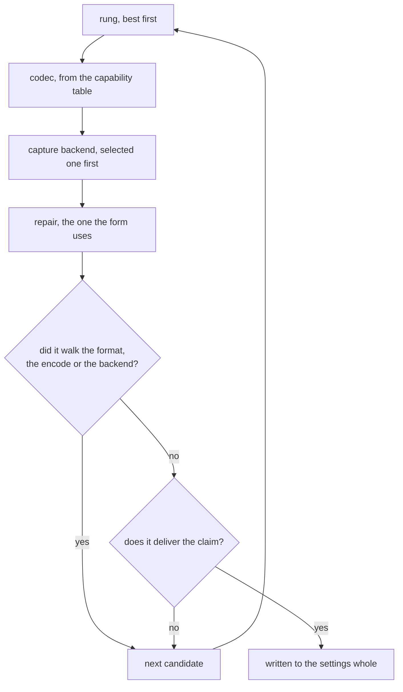

# Presets

A preset is a promise about the picture, not a snapshot of the form.

Which encoder, pixel format and capture backend deliver a promise is the machine's answer.
An NVIDIA desktop on X11 codes lossless planar RGB.
The same desktop on Wayland reaches 4:4:4 and no RGB.
A machine with no GPU encoder reaches neither at 60 fps.
A stored set of field values can only be right on the machine it was written on.
So the table states the goal, and a search finds a configuration for it here.

`balanced`, `lossless`, `gaming` and `readability` are declared beside the capability table the search walks and the repair it holds every candidate to (`ipc-api.md`).
A fresh installation follows `balanced`: H.264, the one bitstream every transport carries and every viewer decodes, quarter-resolution chroma, a hardware encoder where one runs and x264 behind it.
Its target spends a share of the measured line and takes a conservative figure while none is recorded, since the stated uplink is a guess until a measurement stands behind it (`settings.Publish.UplinkMeasuredUnix`).

They reach a surface on the resolved form, one entry per preset: the settings applying it would produce here, or the reason nothing here reaches it, and whether the draft follows it (`form.proto`, `BuiltinPreset`).
They belong there rather than on a method of their own: each of those answers changes with the draft exactly as a greying does.
A surface that asked for them separately would hold a preset verdict older than the settings beside it.

**A preset is a `PublishSettings` and nothing else.**
Relay coordinates are per-site, and the viewer's own fields are per-driver: a render chain this machine registers is one the machine it is copied to may not.
So neither travels in a preset, and a preset that carried either would be the thing that breaks on the machine it was copied to.

## The two halves of a preset

**The claim** is a region of the settings space, declared per axis: which rate-control modes, which pixel formats, which quantization ranges, which frame rates, how many B-frames, how much SRT retransmit window.
Every settings object inside the region delivers what the preset promises, and every object outside it does not.
The claim decides whether a preset is still the selected one.

The retransmit window on it is the publish leg's alone.
A viewer pays that window and the watch hop's together, but the watch hop belongs to the machine doing the watching and a preset carries no viewer settings.
The claim speaks for the half a preset can move.

Colour range is one preset's axis and not a shared one.
Coding the desktop into the narrower studio swing throws away code values before the encoder sees them, so `lossless` claims full range and would not be itself without it.
The other two promise nothing about the range and leave the settings' own where it is.
A base that wrote a value the claim does not mention would strand the preset on every machine that refuses that value, for a promise the preset never made.
The GStreamer VA elements signal no colour description, which is exactly such a machine.

**The ladder** is an ordered list of rungs, each a picture the preset would accept, best first.
The order is where the preset states what it gives up first.
Lossless gives up the encoder before the format while both run on silicon, and the format before the encoder once neither does.
A CPU codes lossless 4:4:4 an order of magnitude faster than it codes lossless RGB, and an encode that cannot keep up delivers no format at all.

A rung can trade motion and close itself by height.
Balanced admits a software encode at full motion only up to desktop sizes,
and its last rung halves the frame rate,
so the figure shown is one the machine delivers rather than one it aims at.
A preset can also pin the bitstreams the search tries:
balanced searches H.264 alone, reach being its promise, where the efficiency order would spend that compatibility on a better codec.

The rest of a preset is its `base`: the rate-control recipe, frame rate and retransmit window every candidate carries.
That part is the preset's identity rather than something to search for.
It writes those fields and leaves the others standing, so a field the preset promises nothing about keeps what the settings hold.
A bitrate target means nothing to a lossless encode, and zeroing it would spend a figure the user chose on a field the preset never reads.

## Applying searches for a configuration

The walk runs one candidate at a time, and every candidate meets the same repair the form uses.
An axis the search wrote whose entry is ruled out on this machine, by the probe, an engine gap or the leg's carriage, rejects the candidate outright.
The repair's walk alone is too narrow a test:
it keeps a value whose every alternative is also ruled out,
which would hand the search a candidate that dies at launch on a machine whose probe refused a whole format.
A repair that walks the pixel format, either half of the encode or the capture backend has answered a different question than the one the search asked.
That candidate is rejected and the next one tried.
So is one the repair walks outside the publish group, which is what a preset cannot carry.
The first candidate that survives and delivers the claim is written to the settings whole,
carrying its preset's key, so applying the find is what makes the draft follow the preset.

Every other field arrived holding what the settings held rather than something the preset chose, so the repair's answer for it is the machine's.
The GStreamer VA elements signal no colour description, and a draft on full range therefore leaves that range behind when it lands on one of them.
A preset that promised nothing about the range is still itself afterwards.
Gating on the field instead would put every VA encoder out of reach and land a 60 fps desktop on a software encode.
What the promise does cover, the claim decides on the repaired settings.
A rate-control mode walked to another one the promise names is still the preset, and one walked past it is not.

The settings a search runs against are the repaired ones, which makes rejecting a repaired candidate sound rather than merely strict.
A draft still holding a stranded value would have every candidate moved by the repair, and every preset would then be unreachable for a fault none of them has.
The resolve repairs first and everything after it describes what that reached, so the only thing left for a repair to move is what the preset itself put there.

A candidate whose own pixel format, encoder or capture backend the repair would already walk is dropped before the repair runs.
That is the same question asked of the same function, one field at a time instead of a fixed point over the whole table.
It decides nothing new, and it keeps a machine that reaches no preset from paying for a full repair per candidate on every keystroke.

## What a search varies

- **Pixel format**, from the ladder.
- **Codec**, from the capability table: the encoders that come with a device before the ones that come with a build, and coding efficiency inside each half in opposite directions.
  A format spends fewer bits by searching more for them.
  On dedicated silicon that search is free, so the most efficient format wins.
  On a CPU it is the frame rate, so the cheapest one wins.
- **Capture backend**, over the capture backends this platform runs, with the selected one first, so a configuration reachable without switching backend is the one taken.
  A backend behind a privilege nothing can check in advance is not in that set: `kmsgrab` needs CAP_SYS_ADMIN, so it stays selectable by hand and is never picked on the user's behalf.

The publish transport is not searched.
It is how viewers are reached rather than a property of the picture, so a preset never moves it.
The leg stays put while the engine under it moves with the capture backend, and a leg carries different formats on the two engines.
So which codecs a rung can reach changes as the search walks the backends.

Applying twice equals applying once: the settings a search returns are themselves the candidate the next search reaches first.

## Unreachable presets

A preset no candidate satisfies carries the reason instead of settings.
A surface draws it ruled out with that reason beside it, the same treatment `field-availability.md` gives an option the tables rule out.
Nothing is applied and nothing is approximated: a candidate whose own rung, encoder or backend the repair moved would be a configuration the user did not ask for, carrying the name of one they did.
A machine whose only encoders are VAAPI has no lossless preset, because no VA profile codes bit-exact.

The reason names the publish transport, the one dimension the search worked within rather than varied, so what it hands the reader is something they can change.

A draft that follows a preset nothing here reaches keeps its seed on screen and cannot start.
The form blocks the publish with the same verdict the preset row carries,
and a start asked for anyway is refused with it:
the fields shown are the seed,
so publishing them under the preset's name would put a stream on the air nobody asked for.

## Following a preset

The settings name the preset they follow (`settings.Publish.Preset`), and the empty key is a draft the user owns.
While a preset is followed, every form resolve and every start searches the promise out again against the machine as it stands,
so a GPU that left since the form was drawn is never asked for,
and the concrete fields seed the search rather than decide what runs.

The stored key answers the selection rather than a reading off the values.
Two promises may cover one configuration, balanced and gaming meeting at 60 fps VBR,
and the key says which one was asked for.
The table is held to unique keys at load, so one name addresses one promise.

Editing any publish field detaches.
The shell clears the key with the edit, and the resolved values it was showing become the draft,
so what was on screen is what the user now owns.
A claim edited past is not what ends the following;
the following ends where the user takes a value into their own hands.

A key no row carries reads as detached.
The settings file is the user's to edit, so a stranger there is an Umgebungsfehler,
and the form shows no selection with every verdict beside it.

## The relaunch walks the transports

A stream following a preset that dies at launch spends two attempts per transport rung,
then relaunches on the walk's next leg with a fresh budget: SRT first for its retransmit window,
RTSP behind it interleaving over the one TCP connection the session already made,
which crosses a path that blocks UDP.
The exit alone cannot tell a blocked path from a dead relay, so the walk tries the path question last.

The walk is named as the retry's cause (`TEXT_CODE_TRANSPORT_FALLING_BACK`),
so every shell says which leg is being tried and why.
It belongs to the relaunch alone: the stored settings keep their leg and the next start begins the walk over.
A detached draft never walks.
The transport is the user's own word, and trading it away would be a substitution nobody declared.
The search never moves the transport either, the walk being the relaunch's answer to a dead path rather than part of any promise.

## Saved presets

A user's own preset is the other thing entirely: a snapshot of every field, stored by the Go `settings` package and applied whole.
It goes through the repair on the way in and nothing else, since it was written on some machine and may name a codec or a capture backend this one lacks.
Where a built-in preset rejects a repaired candidate and tries the next, a snapshot has no next to try.

It carries no claim, so it is marked only while the settings equal it field for field.
The two kinds are two lists rather than one, so a draft that equals a snapshot and delivers a promise marks a row in each.
Neither has to win: they are two true statements about one draft, made about different things.

A snapshot follows no built-in.
The key is cleared on save and on load, so applying one never re-engages a search:
the values shown at save time are what the name promises.

## Adding a preset

Add the entry.
Its key must be one no other row carries, which the load-time check enforces.
The claim must cover every configuration the base and the ladder can produce, which is what makes it a safe verdict on the search's find.
The ladder holds only the pixel formats the preset would accept, each rung free to trade the frame rate or close itself by height.
The codec and capture backend follow from the tables and need no listing, and a preset whose promise is reach pins its formats instead.
The base writes only what the claim speaks for: a field written past the claim can strand the preset on a machine that refuses that value.

A surface then owes that key a name, as it owes every identifier one (`ipc-api.md`).
