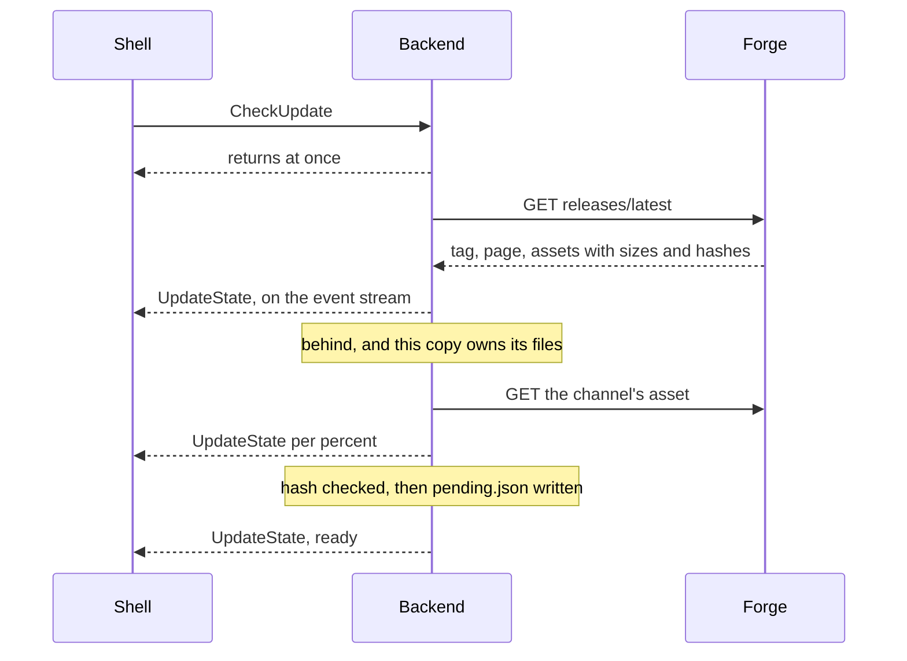

# Updates

Version in the status band is the control.
Pressing it reads the project's published release, and downloads it where this copy owns its own files.

Nothing is asked without a press.
No timer, no start-up fetch, and the check reaches the forge and nothing else.

## Channel decides what a copy may do

Channel is stamped at link time by the recipe that packaged the binary, `-X main.channel=...`.
Empty on every build outside the release pipeline.

| Channel | Owns the files | Asset it installs |
| --- | --- | --- |
| `windows-setup` | the app | `mirrorme-<v>-windows-x86_64-setup.exe`, run silently |
| `windows-zip` | the app | `mirrorme-<v>-windows-x86_64.zip`, swapped in |
| `portable` | the app | `mirrorme-<v>-linux-x86_64-portable.tar.gz`, swapped in |
| `pacman`, `dnf`, `flatpak`, `nix` | a package manager | none |
| unstamped | nobody | none |

`backend/internal/update/channel.go` is that table.
A stamp it does not declare fails at the first check.

Two stamps do not answer themselves, and a fact about the machine settles each.
`windows` covers the installer and the archive, which carry identical binaries: the uninstaller Inno writes beside an installed copy separates them.
The Flatpak bundle is assembled out of the portable tarball and carries that stamp: `FLATPAK_ID`, set inside a sandbox and nowhere else, corrects it.

A copy a package manager owns still names the published release, and points at the manager rather than at a restart.

## `MIRRORME_UPDATE_CHECK=0`

Switches the whole thing off for an install: no press, no start-up log line, no request.
Absence and every other value leave it on.

The Nix package sets it, a flake input being updated by updating the flake.
Set as a default, so a checkout can turn it back on.

## What a press does

Every step is a whole `UpdateState` on the event stream, so a second window shows a staged release without having asked for one.

A download lands under `<config>/mirrorme/update/`, one release at a time.
It is written under a partial name and renamed once its length and its SHA-256 match what the release records.
A release publishing no hash is refused: what arrived cannot be told from what was published.

## What a restart does

`InstallUpdate` starts an applier and answers while the app is still up.

The applier is a copy of the backend binary, in the staging directory, so the tree it replaces holds nothing it is reading from.
Windows refuses to replace a running executable, and a swap that deleted the running applier would be the same bug on Linux.

It waits for the backend to exit, then installs, then starts the app again.
The setup channel runs the downloaded installer silently.
The two archive channels extract beside the install and swap through renames, so a copy that stopped half way is not a possible outcome.

The shell closes itself once the call is accepted, which is what lets the wait finish.
A wait that runs out leaves the running install untouched and the release still staged.

## Where the pieces are

| Piece | File |
| --- | --- |
| Channel table, the environment gate | `backend/internal/update/channel.go` |
| State, check, download, install | `backend/internal/update/update.go` |
| Staging directory and `pending.json` | `backend/internal/update/stage.go` |
| Applier subcommand | `backend/internal/update/apply.go` |
| Tree swap and archive extraction | `backend/internal/update/swap.go` |
| Contract | `UpdateState` in `session.proto`, `CheckUpdate` and `InstallUpdate` in `control.proto` |
| Band and dialog | `avalonia/ScreenShare.App/Features/Shell/Update` |
| Wording | `avalonia/ScreenShare.App/Copy/Updates.cs` |
