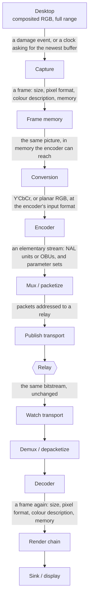
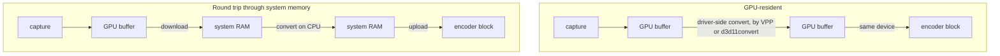
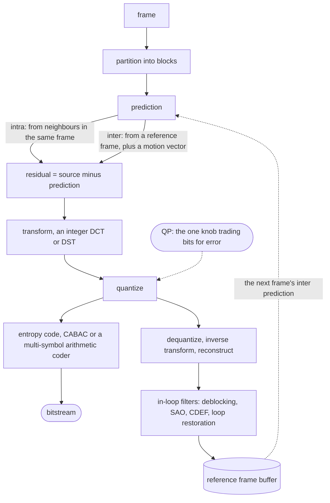
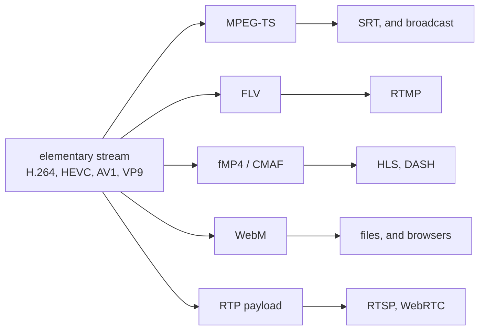
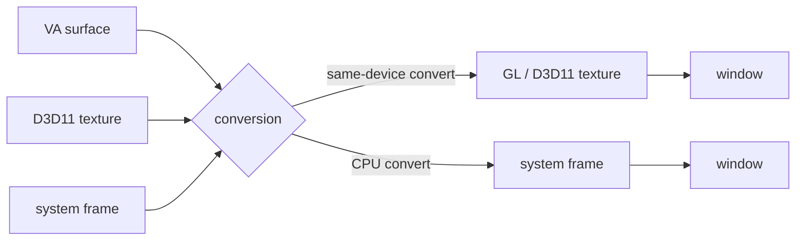
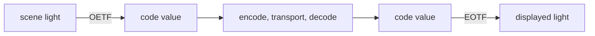
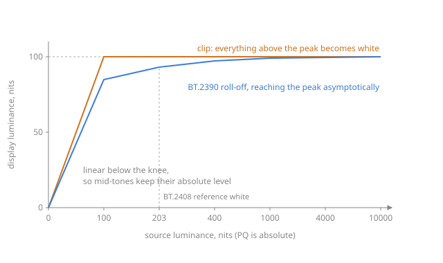
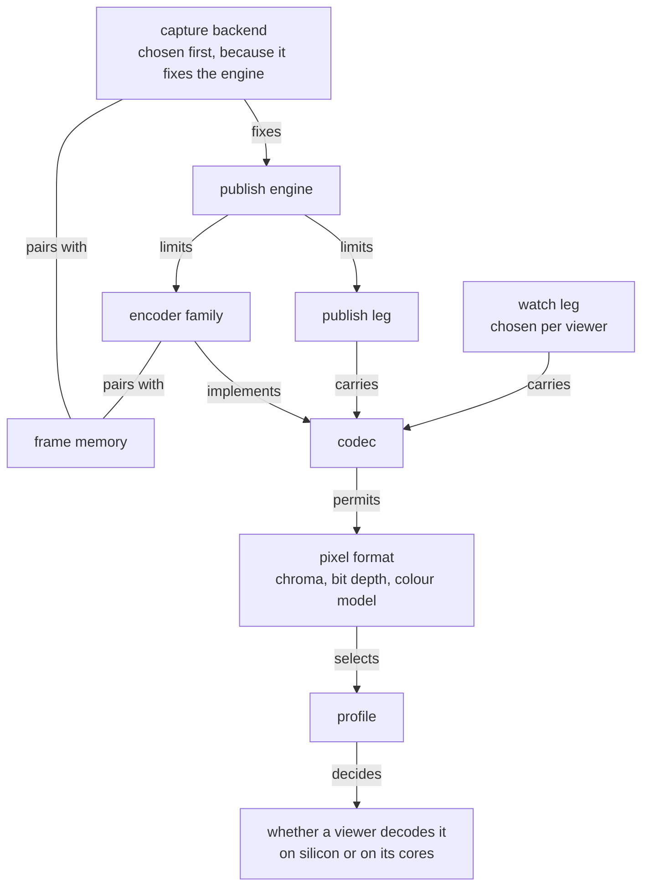

# The video stack

A screen share crosses every layer of the video field: a compositor's buffer, a colour transform, an encoder's rate control, a bitstream, a container, a network protocol, a decoder, a render chain, a monitor.
Each stage sits between two others, constrains both, costs something, and breaks the picture in its own way when it disagrees with a neighbour.
The subject is the field rather than this repository.
Where the app takes a position, the section says so and names the page holding it.

`glossary.md` expands a term.
`domain-model.md` says which combinations this app offers, and where the rule saying so is written.

## The path

Every stage takes a frame or a bitstream, changes one property, hands it on.

| Stage | Decides |
| --- | --- |
| Capture | geometry, capture rate, which display or window |
| Frame memory | device memory or system memory, and who copies |
| Conversion | colour model, subsampling, bit depth, range |
| Encoder | codec, profile, rate control, GOP, effort, tune |
| Mux / packetize | container or RTP payload format, timestamps |
| Publish transport | loss handling, latency window, encryption, NAT traversal |
| Relay | fan-out, and re-serving on every other protocol |
| Watch transport | chosen per viewer, independent of the publish leg |
| Demux / depacketize | reassembly, jitter buffer, frame boundaries |
| Decoder | which silicon or which cores, and in what surface |
| Render chain | tone mapping, conversion to what the sink takes |
| Sink / display | present time, vsync, the monitor's own transform |

Geometry and colour description travel end to end, and are the viewer's business.
Frame memory does not: what the publisher captured into says nothing about what the viewer decodes into.

## What a frame is

Every stage reads and rewrites one state vector.
Most colour bugs are one component disagreeing while the others match, so the components are named apart.

| Component | Values | Set by | Read by |
| --- | --- | --- | --- |
| Geometry | width, height, frame rate, aspect | capture | encoder, viewer's layout |
| Colour model | RGB, Y'CbCr | conversion | encoder's coding matrix |
| Subsampling | 4:4:4, 4:2:2, 4:2:0 | conversion | encoder profile |
| Bit depth | 8, 10, 12 | conversion | encoder profile |
| Plane layout | planar, semi-planar, packed | conversion | encoder input, sink input |
| Primaries | BT.709, BT.2020, DCI-P3 | the source, preserved | display's gamut mapping |
| Transfer | sRGB, BT.709, PQ, HLG, linear | the source, preserved | display's EOTF |
| Matrix | BT.709, BT.601, BT.2020, identity | conversion | decoder's inverse matrix |
| Range | full, limited | conversion | decoder's expansion |
| Chroma siting | co-sited, interstitial | conversion | upsampler |
| Memory | system, VA, D3D11, CUDA, GL, Vulkan, dmabuf | capture and conversion | whatever reads next |

The middle five are the *colour description*.
On the transports here it rides in the bitstream and nowhere else, so a stream that signals nothing is watched under the viewer's own guess (`capture-architecture.md`, "Colour").

`yuv420p`, `p010le` and `NV12` name a *combination* of colour model, subsampling, bit depth and plane layout, and say nothing about primaries, transfer, matrix or range.
Two frames both labelled `yuv420p` can be a limited-range BT.601 camera picture and a full-range BT.709 desktop.

## Capture

A capture backend fixes three things: which display server it talks to, whether frames arrive on damage or on a clock, and what memory they land in.

| Backend | Platform | Source | Produces |
| --- | --- | --- | --- |
| `x11grab`, `ximagesrc` | X11 | X server, through the SHM extension | system memory RGB |
| Portal + PipeWire | Wayland and X11 | xdg-desktop-portal ScreenCast | dmabuf, or system memory |
| `kmsgrab` | Linux, no compositor needed | the scanout buffer through DRM/KMS | dmabuf |
| DDA (`ddagrab`, `d3d11screencapturesrc`) | Windows | DXGI Desktop Duplication | D3D11 texture |
| `gdigrab` | Windows | GDI | system memory RGB |
| AVFoundation | macOS | the window server | IOSurface |

**Damage against clock.**
A compositor-driven backend emits a frame when a region changed, and nothing while the screen is still.
A scanout or duplication backend answers at any rate.
Hence two rates per publish: the capture rate is how often the screen produced a picture, the encoded rate how often the encoder emitted one.
On a static screen the first falls to zero and the second holds, the encoder repeating the newest frame.
Those repeats are *duplicated* frames.
Frames thrown away for arriving faster than the output rate are *dropped* frames.

A backend emitting nothing while nothing moves also stalls a clock derived from its buffers (`capture-architecture.md`).

**Permission.**
X11 and KMS grant capture by access to the server or the device node.
Wayland grants it per session through a portal, which returns a PipeWire node identifier the capture then opens, on a protocol separate from the media path.
A second run skips the picker where the session is still held, and where a compositor issued a restore token for the consent that ended (`capture-architecture.md`).

**What comes out.**
A desktop is composited in full-range RGB.
Every YUV format below holds less, so conversion is where a screen share first loses something.
It is lossless only at 4:4:4 full range.

## Frame memory

A frame staying in device memory from capture to encoder crosses the bus not at all.
One that does not crosses it twice, at the picture's full uncompressed size times the frame rate.

The pairing decides which happens.
A portal capture shares device memory with a VAAPI encoder and not with a software one, and that VAAPI encoder shares none with an X11 grab.
The fact is therefore a table of pairs (`gpupath`), for the reason `domain-model.md` gives.

| Handle | Platform | What it is |
| --- | --- | --- |
| DMA-BUF | Linux | a kernel buffer shared between processes and devices by file descriptor |
| PRIME | Linux | the DRM framework those descriptors are imported and exported through |
| EGLImage | Linux | how a dmabuf becomes a texture a GL context can sample |
| VA surface | Linux | the buffer a VAAPI encoder or decoder takes |
| D3D11 texture | Windows | shared across processes by an NT handle, synchronized by a keyed mutex |
| IOSurface | macOS | the shareable framebuffer VideoToolbox decodes into |
| CUDA array | any NVIDIA | what NVENC takes after a registration step |
| Vulkan image | any | what a Vulkan Video encode operation takes |

**VPP** is the driver's fixed-function scale, format and colour conversion block, reached as `vapostproc`, `scale_vaapi`, `vpp_qsv` or `d3d11convert`.
Where a GPU path exists the next section's conversion runs there, and the picture never leaves the device.

A discrete card holds capture and encode on one device only if the capture came from that device, which on a laptop with an integrated display controller it often did not.

## Conversion

Each component conversion rewrites is a separate decision with a separate cost.

**Colour model.**
Codecs code Y'CbCr because luma carries almost all the detail the eye resolves and the two colour-difference channels can be coded coarsely.
The conversion is a 3x3 matrix, and *which* matrix is a coefficient set named by a standard: BT.601, BT.709, BT.2020.
The wrong one at either end tilts hues without changing brightness much, the most common cross-standard mistake because the pixel format label does not carry the matrix.

The *identity* matrix is the escape hatch: coding G, B and R into the three channels unchanged keeps RGB as RGB, which is what `gbrp` is, and it takes a codec profile permitting it.

**Subsampling.**

| Sampling | Chroma horizontally | Chroma vertically | Chroma resolution | Samples per pixel |
| --- | --- | --- | --- | --- |
| 4:4:4 | every luma column | every luma row | full | 3 |
| 4:2:2 | every second column | every row | half | 2 |
| 4:2:0 | every second column | every second row | a quarter | 1.5 |

For camera content the loss is close to invisible.
For a desktop it is not: text is a high-frequency edge between two saturated colours, and 4:2:0 gives red-on-black or blue-on-white text visible fringing at the stroke.
Screen content is why 4:4:4 is worth its rate here.

**Chroma siting** says where a subsampled chroma sample sits relative to its luma samples: co-sited with the left luma column, or halfway between.
Mismatched siting shifts colour by half a pixel, seen as a coloured edge on one side of high-contrast text.

**Bit depth.** 8, 10 or 12 bits per component ("Bit depth").

**Range.**
Full range spends every code value on picture: 0 to 255 at 8 bits.
Limited range keeps headroom and footroom for the analog era's overshoot: luma 16 to 235, chroma 16 to 240, and 64 to 940 at 10 bits.
A desktop is authored full range.
Coding it limited throws away roughly 14% of the code values before the quantizer runs, and expanding it back is where decoders disagree by a code value or two.

Range is the component most often *lost* rather than converted, riding in the colour description that several encoders never write.
An unsignalled stream is watched as limited range, so full range needs the signalling to work and limited range survives its absence.

## The encoder

Three things get conflated under one word, and the rest of the stack depends on keeping them apart.

| Term | Is | Examples |
| --- | --- | --- |
| Codec | a *format*, a bitstream syntax defined by a standard | H.264, HEVC, AV1, VP9, VP8 |
| Encoder | one *implementation* that produces that format | `libx264`, `hevc_nvenc`, `svtav1enc` |
| Encoder family | the *silicon and API* an encoder runs on | software, NVENC, VAAPI, QSV, AMF, V4L2 M2M, MPP, Vulkan Video |

The viewer must understand the codec.
Two encoders of one codec produce different pictures at the same bitrate while remaining equally decodable.
The family is a property of the machine, and the axis a capability probe answers.

### Families

| Family | Vendor | Reaches | Notes |
| --- | --- | --- | --- |
| Software | any CPU | every format and profile | the only path to some profiles at all |
| NVENC / NVDEC | NVIDIA | fixed-function block, separate from the shader cores | the hardware path that reaches 4:4:4 and direct RGB |
| VAAPI | Linux, Intel and AMD | whatever the driver exposes as entrypoints | one API over two vendors' silicon |
| QSV, through oneVPL | Intel | the same media block VAAPI reaches on Linux | Intel's own API, and the Windows path |
| AMF | AMD | AMD's media block | the alternative to VAAPI on AMD |
| V4L2 M2M | Linux SoCs | a kernel device that transforms buffers | how embedded codecs appear |
| Rockchip MPP | Rockchip SoCs | that vendor's media block | |
| Vulkan Video | any conformant GPU | encode and decode as Vulkan operations | vendor-neutral, takes Vulkan images |
| VideoToolbox | Apple | Apple's media block | |
| Media Foundation, DXVA2, D3D11VA, D3D12 Video | Windows | whatever the driver exposes | the OS-level wrappers |

One physical encoder block is reachable through more than one API, so "VAAPI against QSV" on an Intel machine is a choice of API and not of hardware.
A fixed-function block implements its profiles in silicon, so no driver update adds 4:2:2 to a block with no entrypoint for it.

### Inside the encoder

Every block-based codec here runs one loop, differing in block sizes, transform set and filters.

The reconstruction path exists because prediction has to run on exactly what the decoder will have, which quantization has already changed.
An encoder therefore contains a decoder, and a filter-chain bug desynchronizes the two into drifting artifacts rather than a clean failure.

| Codec | Block unit | Entropy coder | Loop filters |
| --- | --- | --- | --- |
| H.264 | 16x16 macroblock | CAVLC or CABAC | deblocking |
| HEVC | up to 64x64 CTU | CABAC | deblocking, SAO |
| VP9 | up to 64x64 superblock | boolean arithmetic | deblocking |
| AV1 | up to 128x128 superblock | multi-symbol arithmetic | deblocking, CDEF, loop restoration |

### Frame types and the GOP

| Order | Sequence |
| --- | --- |
| Display | I0, B1, B2, P3, B4, B5, P6, I7 |
| Decode | I0, **P3**, B1, B2, **P6**, B4, B5, I7 |

B1 references both I0 and P3, so P3 decodes first.
Decode order therefore runs ahead of display order, and the decoder holds frames back to reorder them.

An **I-frame** codes without reference to any other frame.
An **IDR** is an I-frame that also clears the reference buffers, which is what lets a viewer joining mid-stream start decoding.
A **P-frame** predicts from earlier frames.
A **B-frame** predicts from earlier and later ones.

The **GOP** is the repeating pattern between keyframes, set by the keyframe interval.
Short GOP: a mid-stream joiner waits less, the stream costs more bits.
Long GOP: the opposite, plus a longer recovery from a lost packet.

B-frames buy roughly 10 to 20% bitrate at fixed quality and cost latency unconditionally, decode order running ahead of display order by at least the reorder depth.
A live screen share usually refuses that trade, which is what the "low latency" and "zero latency" tunes mean.

### Profiles, levels and tiers

A **profile** is a subset of the codec's tools, and it gates chroma and bit depth.
A chroma choice is therefore not a free parameter.
4:4:4 in H.264 exists only in High 4:4:4 Predictive, which almost no fixed-function decoder implements.
Lossless H.264 lives in that same profile.

| Codec | 4:2:0 8-bit | 10-bit | 4:2:2 | 4:4:4 |
| --- | --- | --- | --- | --- |
| H.264 | Baseline, Main, High | High 10 | High 4:2:2 | High 4:4:4 Predictive |
| HEVC | Main | Main 10 | Main 4:2:2 10 | Main 4:4:4, through RExt |
| VP9 | profile 0 | profile 2 | profiles 1, 3 | profiles 1, 3 |
| AV1 | Main (0) | Main (0) | Professional (2) | High (1) |
| VP8 | the only thing it has | none | none | none |

A **level** bounds resolution, frame rate, bitrate and buffer size together, so a decoder advertises one number instead of a matrix.
HEVC and AV1 add a **tier**, a higher bitrate ceiling at the same level.

Profile support is asymmetric between encode and decode, and between vendors.
Full chroma reaches fixed-function decode in HEVC alone, through the Range Extensions profiles some vendors carry and others do not (`viewer-architecture.md`, "What each path decodes").

### Rate control

Rate control decides the QP per block, the only mechanism turning a quality target into a bit count.

| Mode | Holds fixed | Lets vary | Fits |
| --- | --- | --- | --- |
| CQP | the quantizer | bitrate, quality | measurement |
| CRF, CQ | perceived quality | bitrate, up to a ceiling where one is set | files, and links with headroom |
| ABR | average bitrate over the stream | short-term rate, quality | a fixed total size |
| VBR | a ceiling, targeting an average | rate within the ceiling | most live streams |
| CBR | output bitrate | quality | fixed-capacity links |
| Lossless | the picture | bitrate, entirely | proof, and screen content at close range |

Two knobs shape any of them.
**VBV**, the buffer model, bounds how far ahead of the average the encoder may spend, so a smaller buffer means a tighter short-term rate and a longer quality dip after a scene change.
A quality target inside a VBV is capped CRF: the rate factor drives the rate until the buffer would overflow and the picture softens from there, which is what keeps a quality setting inside a link's budget.
The **keyframe interval** sets the periodic spike, an I-frame costing several times a P-frame.

CQ scales are not comparable across encoders: the H.26x encoders count to 51, libvpx and the software AV1 encoders to 63, and some expose a raw quantizer index to 127 or 255.
A number carried across a codec change lands on a different real setting, so this app resets rather than remaps (`domain-model.md`, "The two ladders").

**Effort** (the preset ladder) says how much CPU or how many passes to spend for the same target.
**Tune** says what to spend it towards: latency, still-image detail, a metric, or grain retention.
The two are separate settings because a live encode drops lookahead and frame reordering whatever effort it spends.

## The bitstream

An encoder emits an **elementary stream**: coded pictures and the headers needed to decode them, and nothing about files, time bases or networks.

| Codec | Unit | Framing |
| --- | --- | --- |
| H.264, HEVC | NAL unit | Annex B start codes, or a length prefix (`avcC`, `hvcC`) |
| AV1 | OBU | length field in the OBU header |
| VP8, VP9 | frame, with superframes | the container supplies the boundary |

**Parameter sets** carry what applies to more than one picture.
H.264 has SPS and PPS.
HEVC adds VPS above them.
AV1 carries a sequence header OBU.
They hold resolution, profile, level, chroma format, bit depth and the **VUI**, where the colour description lives.

A live stream must repeat its parameter sets, a viewer joining mid-stream not having seen the first ones.
Sending them once is the classic "works when started together, black when joined late" failure.

**SEI** messages carry side data the decode does not need: the mastering display colour volume (SMPTE ST 2086), the content light level (MaxCLL and MaxFALL), timecode, and closed captions.

Two places can state the colour description: the bitstream's VUI and the container's own header.
Where both exist they can disagree, and which one a player believes varies.
RTP and MPEG-TS carry none of their own, so on the transports here the bitstream is the only source and an encoder that writes no VUI leaves the viewer guessing (`capture-architecture.md`, "Colour").

## Containers and packetization

A **container** interleaves streams, gives each a time base, and records what they are.
A **protocol** moves bytes between machines.
Separate axes, though a protocol usually fixes which container it carries.

| Container | Unit | Carries | Notes |
| --- | --- | --- | --- |
| MPEG-TS | 188-byte packets | streams named by stream type, with PAT, PMT and PCR | built for lossy links, and self-synchronizing |
| FLV | tags | H.264 and AAC by its original tag set | E-RTMP adds tags for HEVC, AV1 and VP9 |
| fMP4, CMAF | boxes, in segments | anything with a defined sample entry | the segment format HLS and DASH serve |
| Matroska, WebM | clusters | WebM restricts to royalty-free codecs | |
| IVF | one length and timestamp per frame | one video stream, nothing about colour | which is why a colour test uses it as framing |

**RTP** is packetization rather than a container.
Each codec has a payload format saying how to split a coded picture across packets that fit an MTU, how to mark the last packet of a frame, and how to carry parameter sets.
H.264 and HEVC have published RFCs.
The VP9 and AV1 payload formats are drafts, so some muxers refuse them without an explicit opt-in.

**Mux** combines elementary streams into a container, **demux** splits them back, **remux** rewraps into a different container without re-encoding.
None of the three touches the coded pictures.

## Transport

| Protocol | Runs on | Carries | Loss handling | Latency class |
| --- | --- | --- | --- | --- |
| SRT | UDP | MPEG-TS | ARQ inside a configured latency window | the window, typically 120 ms and up |
| RTSP | TCP control, RTP media over TCP or UDP | RTP | TCP retransmit, or none over UDP | one RTT class |
| RTMP | TCP | FLV | TCP retransmit | seconds, in practice |
| WebRTC | UDP, DTLS-SRTP | RTP | NACK, PLI, FIR, and congestion control | sub-second |
| HLS | HTTP over TCP | fMP4 or TS segments | TCP, plus a playlist reload | a small multiple of the segment duration |
| MoQ | QUIC | its own object model | per-stream reliability | sub-second |

**SRT** adds retransmission and a fixed latency window on top of UDP.
The window is the whole design: the receiver holds packets that long, and anything retransmitted inside it arrives in time.
A larger window survives more loss and delays every frame by exactly that amount.

**RTSP** negotiates with SDP over a text control channel, then moves media over RTP.
Interleaving that RTP over the same TCP connection needs no second port, which matters behind NAT, and costs head-of-line blocking.

**WebRTC** is a stack rather than a protocol: SDP offer and answer, ICE with STUN and TURN, DTLS for the key exchange, SRTP for the media, RTCP feedback and a congestion controller for the rate.
**WHIP** and **WHEP** replace the signalling with one HTTP POST of an SDP offer, ingest and egress respectively, which makes a WebRTC leg addressable like a URL.

**NAT** is why the connectivity machinery exists.
Return traffic reaches a private host only through a mapping one of its own outbound packets created, so a peer sends from the port that must receive, and ICE probes candidates until one answers.
TURN relays the media when no direct path survives, at the cost of carrying all of it.

**HLS** publishes a playlist of segments over ordinary HTTP.
Its latency is structural: a player needs several segments buffered, so the floor is a multiple of the segment duration until low-latency HLS splits segments into parts.
It is a delivery format, so a watch leg here only.

**MoQ** carries a stream as tracks of objects a subscriber asks for, over QUIC.
Each track is its own stream, so a loss stalls that track and nothing else, where TCP holds up everything queued behind a lost segment.
A browser reaches it over WebTransport and decodes with WebCodecs.
Its session is HTTP/3, which is UDP and so passes no ordinary reverse proxy.
It is a delivery format here like HLS, a watch leg only.

**Jitter buffer.**
Every receiver holds a queue absorbing the variance in packet arrival, and its depth is a direct latency cost.
Too shallow for the network drops frames, too deep adds delay nobody asked for.

## The relay

A relay ingests once and serves many, passing the bitstream through: no decode, no re-encode, no rewrite.
The codec, profile, chroma, bit depth and colour description a publisher chose therefore reach every viewer unchanged.

What it changes is the carriage.
Re-serving one ingest on several protocols makes the publish leg and the watch leg independent choices, and the narrowest listener bounds what a stream may contain: a format one protocol has no mapping for cannot be watched over it, however well it was published.
Carriage is therefore stated per protocol and per leg rather than per codec (`viewer-architecture.md`, "Which protocol carries which format").

## Decode

Decoding is the encoder's loop run once, with no search: parse, dequantize, inverse-transform, add the prediction, filter, write into a reference buffer and an output queue.

**Autoplugging** picks the element by rank, so a hardware decoder takes a stream wherever its capabilities advertise the profile and a software decoder takes the rest.
The profile the publisher chose is what decides, the practical consequence of the chroma decision: 4:2:0 8-bit decodes on silicon nearly everywhere, and full chroma reaches silicon on almost nothing.

**Error concealment** is what a decoder does with a missing reference: hold the last good picture, interpolate, or stop and request a keyframe.
The third shows as a freeze until the next IDR arrives.
That request travels on the transport's back channel, so it reaches a WebRTC publisher and no SRT one.

## The render chain

The decoded frame carries the same state vector as before the encoder, and it has to reach a window.

The chain moves the frame to memory the sink can read, converts Y'CbCr to what the sink takes, and applies matrix and range.
No chain in reach converts the transfer function.
A frame carrying a PQ curve therefore arrives at a window that treats it as sRGB, and the picture is wrong until **tone mapping** rolls the range down.

The last hop belongs to the compositor: present time, vsync, and the monitor's own transform.
A frame presented between refreshes is a tear, and a queue that presents late is judder no encoder setting fixes.

## Colour, in full

Colour is four independent components.

| Component | Says | Fixes |
| --- | --- | --- |
| Primaries | which physical red, green and blue, plus a white point | the gamut |
| Transfer | the curve between code value and light | brightness and contrast |
| Matrix | the coefficients turning RGB into Y'CbCr | hue |
| Range | which code values are picture | black level and white level |

They are orthogonal: a stream can be BT.2020 primaries with a BT.709 matrix, or sRGB transfer at limited range, and the combination is legal where it is unusual.
"BT.709" is therefore ambiguous in conversation: the recommendation defines primaries, a transfer function and a matrix, and a tool may mean any one of them.

### The standards

| Standard | Primaries | Transfer | Matrix | Where it comes from |
| --- | --- | --- | --- | --- |
| BT.601 | two variants, 525 and 625 line | ~gamma 2.2 | Kr 0.299, Kb 0.114 | standard definition |
| BT.709 | HD primaries | ~gamma 2.2, with a linear toe | Kr 0.2126, Kb 0.0722 | high definition |
| sRGB | the same primaries as BT.709 | a different piecewise curve | none, it is RGB | computer graphics |
| BT.2020 | wide gamut | as BT.709 | Kr 0.2627, Kb 0.0593 | ultra high definition |
| BT.2100 | BT.2020 primaries | PQ or HLG | as BT.2020 | HDR |
| DCI-P3 | between BT.709 and BT.2020 | gamma 2.6 | none, it is RGB | cinema, and most laptop panels |

**sRGB against BT.709 is the trap.**
The two share primaries and a matrix and differ only in the transfer curve, small in the numbers and clearly visible on screen.
A desktop is authored in sRGB, so a sink assuming BT.709 shows it washed out.
That is a transfer mismatch and not a range one, fixed by stating the transfer.

### The transfer functions

An **OETF** maps scene light to a code value, at the camera.
An **EOTF** maps a code value to displayed light, at the monitor.
An **OOTF** is the end-to-end result of both, and it is not the identity: a picture shown in a dim room needs more contrast than it had in the scene to look the same.

| Curve | Kind | Peak | Reference | Behaviour |
| --- | --- | --- | --- | --- |
| Gamma 2.2, 2.4 | display-referred | whatever the display does | relative | the SDR convention |
| sRGB | display-referred | as above | relative | a linear toe, then ~2.4 |
| PQ (SMPTE ST 2084) | absolute | 10000 cd/m² | 203 cd/m² by BT.2408 | a code value means a luminance, period |
| HLG (ARIB STD-B67) | display-referred | the display's own | relative | the lower half tracks a gamma curve |
| Linear | neither | unbounded | none | what compositing works in |

**PQ is absolute and HLG is relative.**
A PQ picture shown untouched on a 400-nit display is wrong by the ratio between the format's 10000 nits and the display's peak, and the failure is loud.
An HLG picture shown untouched is approximately right, its lower range tracking an ordinary gamma curve.

### Tone mapping

Tone mapping compresses a source's luminance range into what a display can show.
Clipping the range instead loses everything above the display's peak, and scaling it linearly darkens the whole picture.

The source axis is drawn with even spacing per labelled step rather than to scale, so the knee stays visible against PQ's ten thousand nits.

**BT.2390** defines the reference method: a linear segment up to a knee, then a Hermite roll-off reaching the display's peak asymptotically, so highlights compress and mid-tones do not move.
**BT.2408** fixes where diffuse white sits in an HDR signal, which is what the knee is placed relative to.

A converter that changes the transfer function is no substitute for that roll-off.
Normalizing PQ against the format's 10000 nits rather than the display's peak produces a picture at a fraction of the input code value.
A darker picture is not a tone map (`viewer-architecture.md`, "Tone mapping").

**Gamut mapping** is the same problem for primaries: BT.2020 covers colours a BT.709 display cannot show, and the choices are to clip them to the boundary or compress the whole gamut inward.
The two are usually applied together, a wide-gamut HDR source needing both.

## Dynamic range

**Dynamic range** is the ratio between the brightest and darkest luminance a picture carries.
SDR conventions assume a reference white near 100 cd/m² and say nothing about the display's actual peak.
HDR states absolute luminance, or a curve the display scales, and reaches an order of magnitude further.

| Term | Is |
| --- | --- |
| nit, cd/m² | luminance, one candela per square metre |
| HDR10 | PQ, BT.2020 primaries, 10-bit, with static metadata |
| HDR10+ | HDR10 plus per-scene dynamic metadata |
| Dolby Vision | PQ with its own dynamic metadata and a proprietary mapping |
| HLG | the broadcast HDR curve, backward compatible with an SDR display |
| ST 2086 | the mastering display's primaries, white point and luminance range |
| MaxCLL | the brightest single pixel in the content |
| MaxFALL | the brightest frame average |

The metadata is advisory: it tells a display what the content was graded on so it can map to its own capability.
Losing it breaks no decode.
It removes what a good tone map would have used.

HDR is why a source needs more than 8 bits: the same 256 code values stretched over a hundred times the luminance range put visible steps in every gradient.

## Bit depth

| Depth | Code values per component | Where it shows |
| --- | --- | --- |
| 8 | 256 | banding in gradients, and in slow fades |
| 10 | 1024 | the delivery depth for HDR, and a quality gain for SDR |
| 12 | 4096 | mastering, and cinema |

10-bit helps even for 8-bit *sources*.
The encoder's internal precision rises with the coded depth, so quantization error accumulates less through the prediction loop: fewer banding artifacts at the same bitrate, not more detail.

Storage is the cost.
`p010le` holds each 10-bit sample in 16 bits, so a 10-bit 4:2:0 frame occupies twice an 8-bit one before the encoder runs.

**Dither** trades banding for noise by perturbing slightly before quantizing.
It works because the eye integrates noise across an area, and it costs bits because noise is expensive to code.

## Latency

The budget is additive, and the stages divide into those measured in frames and those measured in milliseconds.

| Stage | Costs | Measured in |
| --- | --- | --- |
| Capture | one frame period | frames |
| Conversion | sub-millisecond to a few milliseconds | milliseconds |
| Encode | lookahead depth, plus reorder depth, plus the VBV drain | frames |
| Packetize | sub-millisecond | milliseconds |
| Network | the round trip, plus the ARQ or retransmit window | milliseconds |
| Jitter buffer | the receiver's chosen depth | frames |
| Decode | one frame period | frames |
| Render | one frame period | frames |
| Present | up to one display refresh | milliseconds |

| Knob | Costs | Buys |
| --- | --- | --- |
| B-frames | the reorder depth, in frames | 10 to 20% bitrate |
| Lookahead | its own depth, in frames | better bit allocation |
| Large VBV | a longer drain before a frame goes out | steadier quality |
| Long GOP | a longer wait for a mid-stream joiner | fewer keyframe spikes |
| SRT latency window | exactly the window | loss recovery inside it |
| Deep jitter buffer | its own depth | tolerance of network variance |
| High effort preset | encode time per frame | quality at the same bitrate |

Every stage has a floor of one frame period, so a 60 fps pipeline cannot go below roughly 16 ms per buffering stage however it is configured.
The stages worth attacking first are the ones measured in frames: reordering, lookahead and the receiver's buffer.

### Measuring it rather than adding it up

The table above is a model, and the app measures against it rather than deriving from it.
A wall-clock reading of what a stage cost is something a setting cannot give:
an SRT window is a request the peer can raise, and a lookahead depth is frames until something times them.

Which stages are measured, where each reading is taken, and which rows a machine cannot fill: `delay-measurement.md`.

## Bitrate and quality

Four properties drive the bit cost: resolution, frame rate, content complexity and the quality target.
Only the first two are visible in the settings.
Complexity is the content's own, and it is why a screen share's rate varies by an order of magnitude between a still document and a scrolling video.

**Coding efficiency** compares codecs at equal quality.
Each generation roughly halves the bitrate of the last and multiplies the encoder's work: HEVC and VP9 against H.264, then AV1 against those.
The comparison holds only at comparable effort, and a fast AV1 preset can lose to a slow H.264 one.

**Chroma weight** is the other multiplier.
4:2:0 to 4:4:4 doubles the chroma samples, and the rate rises by well under that because chroma planes code cheaply, but it is not free.

**Screen content** codes unlike camera content, and some codecs say so explicitly.
Large flat regions, repeated glyphs, hard edges and no sensor noise favour palette modes and intra block copy, which the HEVC screen content coding extension and AV1 both carry.
A screen is also often static, so a damage-driven capture and a long GOP together cost almost nothing while nothing moves.

**Quality metrics** exist because "looks right" does not compare.
PSNR measures signal error and correlates poorly with perception.
SSIM compares structure.
VMAF is a trained model targeting subjective scores, and it ranks encoders closest to how viewers do.

## The constraint graph

Which choice forecloses which other choice.

Read it backwards.
A viewer's decode follows from the profile, the profile from the pixel format, the pixel format from the codec, the codec from the family, and the family from the capture backend.
Frames cross the bus according to the pair of capture backend and encoder family, and to neither alone.
What may be published is what the encoder produces intersected with what the publish protocol carries, and what may be watched is the same intersection against the watch protocol.

So the engine, the frame memory, the profile and the carriage each look like a free parameter in a settings form and are not.
This app derives all four from tables (`domain-model.md`).

## Symptom to cause

| Symptom | Component | Cause |
| --- | --- | --- |
| Washed out, greyish, low contrast | transfer | sRGB content shown as BT.709, or an HDR curve shown untouched |
| Black is grey, white is dull | range | full-range content shown as limited, or the reverse |
| Crushed blacks, clipped whites | range | limited-range content expanded twice |
| Hues rotated, skin tones off | matrix | BT.601 coefficients on BT.709 content, or the reverse |
| Oversaturated, neon | primaries | BT.2020 content shown as BT.709 |
| Colour fringes on text | subsampling | 4:2:0 chroma at a high-contrast edge |
| A coloured edge on one side only | chroma siting | siting mismatch across the conversion |
| Banding in gradients | bit depth | 8-bit coding, or a quantizer too coarse |
| Blocky under motion | rate control | the bitrate ceiling, or too small a VBV |
| Freeze until it recovers | error concealment | a lost reference, waiting for the next IDR |
| Black until it recovers | parameter sets | joined mid-stream before the first keyframe |
| Smooth then a periodic stutter | GOP | the keyframe spike exceeding the link |
| Consistent delay, no artifacts | buffering | the jitter buffer, the latency window, or reordering |
| Tearing | present | no vsync |
| Judder at a steady rate | rate mismatch | capture rate against display refresh |

`domain-model.md` states why each of these is a table in this repository rather than a branch,
and `development-principles.md` the rules shaping any change to them.
