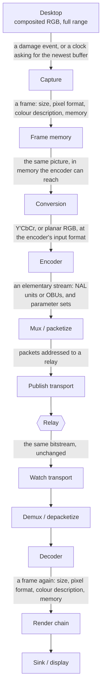
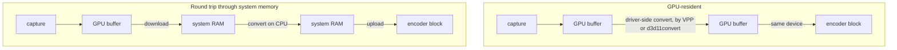
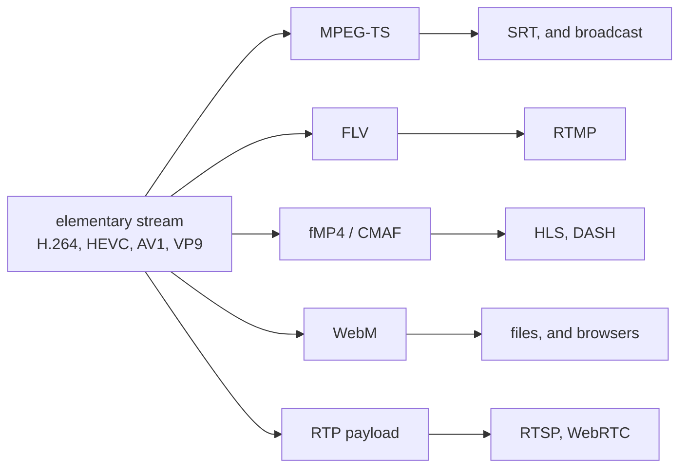
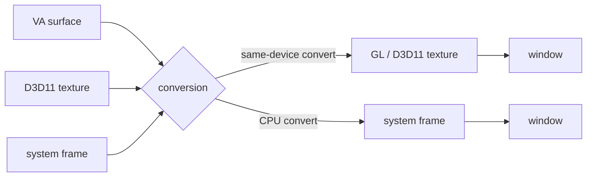
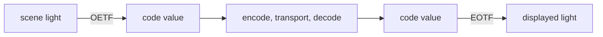
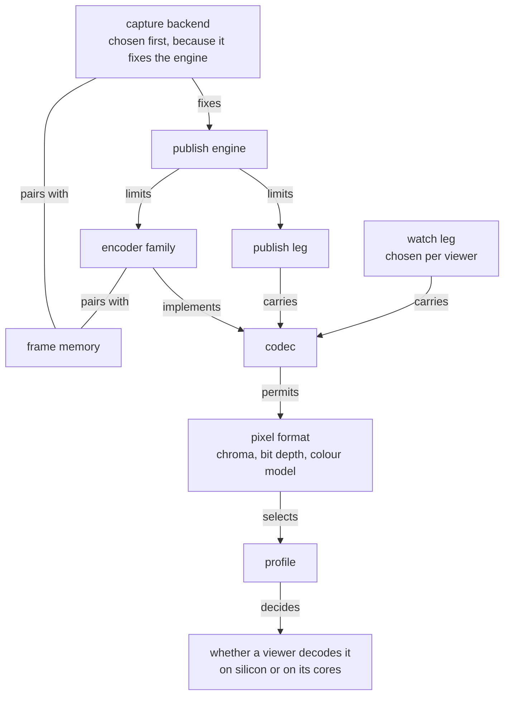

# The video stack

A screen share crosses every layer of the video field: a compositor's buffer, a colour transform, an encoder's rate control, a bitstream, a container, a network protocol, a decoder, a render chain, a monitor.

Three pages divide that ground.
`glossary.md` gives the expansion and one-line meaning of a term.
`domain-model.md` gives which combinations this app offers and where the rule that says so is written.
This page gives the relationships: what each thing sits between, what it constrains, what it costs, and what breaks when it disagrees with its neighbour.

The subject is the field rather than this repository.
Where the app takes a position among the options, the section says so and names the doc that holds it.

## Contents

- [The path](#the-path)
- [What a frame is](#what-a-frame-is)
- [Capture](#capture)
- [Frame memory](#frame-memory)
- [Conversion](#conversion)
- [The encoder](#the-encoder)
- [The bitstream](#the-bitstream)
- [Containers and packetization](#containers-and-packetization)
- [Transport](#transport)
- [The relay](#the-relay)
- [Decode](#decode)
- [The render chain](#the-render-chain)
- [Colour, in full](#colour-in-full)
- [Dynamic range](#dynamic-range)
- [Bit depth](#bit-depth)
- [Latency](#latency)
- [Bitrate and quality](#bitrate-and-quality)
- [The constraint graph](#the-constraint-graph)
- [Symptom to cause](#symptom-to-cause)
- [Where this repo holds each fact](#where-this-repo-holds-each-fact)

## The path

Every stage takes a frame or a bitstream, changes one property of it, and hands it on.

What each stage decides, and nothing else does:

| Stage | Decides |
| --- | --- |
| Capture | geometry, capture rate, which display or window |
| Frame memory | device memory or system memory, and who copies |
| Conversion | colour model, subsampling, bit depth, range |
| Encoder | codec, profile, rate control, GOP, effort, tune |
| Mux / packetize | container or RTP payload format, timestamps |
| Publish transport | loss handling, latency window, encryption, NAT traversal |
| Relay | fan-out, and re-serving on every other protocol |
| Watch transport | chosen per viewer, independent of the publish leg |
| Demux / depacketize | reassembly, jitter buffer, frame boundaries |
| Decoder | which silicon or which cores, and in what surface |
| Render chain | tone mapping, conversion to what the sink takes |
| Sink / display | present time, vsync, the monitor's own transform |

Two properties survive the whole path and one does not.
The picture's geometry and its colour description are carried end to end and are the viewer's business.
The frame's memory is local to each side: what the publisher captured into says nothing about what the viewer decodes into.

## What a frame is

Every stage above reads and rewrites one state vector.
Naming its components separately is what makes the rest of this page tractable, because most colour bugs are one component disagreeing while the others match.

| Component | Values | Set by | Read by |
| --- | --- | --- | --- |
| Geometry | width, height, frame rate, aspect | capture | encoder, viewer's layout |
| Colour model | RGB, Y'CbCr | conversion | encoder's coding matrix |
| Subsampling | 4:4:4, 4:2:2, 4:2:0 | conversion | encoder profile |
| Bit depth | 8, 10, 12 | conversion | encoder profile |
| Plane layout | planar, semi-planar, packed | conversion | encoder input, sink input |
| Primaries | BT.709, BT.2020, DCI-P3 | the source, preserved | display's gamut mapping |
| Transfer | sRGB, BT.709, PQ, HLG, linear | the source, preserved | display's EOTF |
| Matrix | BT.709, BT.601, BT.2020, identity | conversion | decoder's inverse matrix |
| Range | full, limited | conversion | decoder's expansion |
| Chroma siting | co-sited, interstitial | conversion | upsampler |
| Memory | system, VA, D3D11, CUDA, GL, Vulkan, dmabuf | capture and conversion | whatever reads next |

The middle group of five is the *colour description*.
It travels in the bitstream and nowhere else on the transports here, which is why a stream that signals nothing is watched under the viewer's own guess (`capture-architecture.md`, "Colour").

`yuv420p`, `p010le`, `NV12` and the rest are names for a *combination* of colour model, subsampling, bit depth and plane layout.
They say nothing about primaries, transfer, matrix or range.
Two frames both labelled `yuv420p` can be a limited-range BT.601 camera picture and a full-range BT.709 desktop, and nothing in the label distinguishes them.

## Capture

A capture backend is the interface a frame leaves the desktop through.
It fixes three things: which compositor or display server it can talk to, whether frames arrive on damage or on a clock, and what memory the frames land in.

| Backend | Platform | Source | Produces |
| --- | --- | --- | --- |
| `x11grab`, `ximagesrc` | X11 | X server, through the SHM extension | system memory RGB |
| Portal + PipeWire | Wayland and X11 | xdg-desktop-portal ScreenCast | dmabuf, or system memory |
| `kmsgrab` | Linux, no compositor needed | the scanout buffer through DRM/KMS | dmabuf |
| DDA (`ddagrab`, `d3d11screencapturesrc`) | Windows | DXGI Desktop Duplication | D3D11 texture |
| `gdigrab` | Windows | GDI | system memory RGB |
| AVFoundation | macOS | the window server | IOSurface |

**Damage against clock.**
A compositor-driven backend emits a frame when a region of the screen changed and emits nothing while the screen is still.
A scanout or duplication backend can be asked for the newest buffer at any rate.
The distinction is why two rates describe one publish: the capture rate is how often the screen produced a picture, and the encoded rate is how often the encoder emitted one.
On a static screen the first falls to zero and the second holds, because the encoder repeats the newest frame to keep the output rate.
Those repeats are *duplicated* frames; frames thrown away for arriving faster than the output rate are *dropped* frames, and the two counts mean opposite things.

A backend that emits nothing while nothing moves is also the one that stalls a clock derived from its buffers, which is a real failure mode rather than a theoretical one (`capture-architecture.md`).

**Permission.**
X11 and KMS grant capture by access to the server or the device node.
Wayland grants it per session through a portal, which returns a PipeWire node identifier the capture then opens.
The portal handshake is a separate protocol from the media path.
A second run skips the picker where the session it reads is still held, and where a compositor issued a restore token for the consent that ended (`capture-architecture.md`).

**What comes out.**
A desktop is composited in full-range RGB.
Every YUV format below is a smaller container, so the conversion stage is where a screen share first loses something, and it is lossless only at 4:4:4 full range.

## Frame memory

A frame that stays in device memory from capture to encoder crosses the bus not at all.
A frame that does not crosses it twice, once down and once back up, at the picture's full uncompressed size times the frame rate.

The pairing is what decides which of the two happens, and neither end decides alone.
A portal capture shares device memory with a VAAPI encoder and not with a software one; a VAAPI encoder shares it with the portal capture and not with an X11 grab.
This app therefore keeps the fact as a table of pairs (`gpupath`), for the reason `domain-model.md` gives.

| Handle | Platform | What it is |
| --- | --- | --- |
| DMA-BUF | Linux | a kernel buffer shared between processes and devices by file descriptor |
| PRIME | Linux | the DRM framework those descriptors are imported and exported through |
| EGLImage | Linux | how a dmabuf becomes a texture a GL context can sample |
| VA surface | Linux | the buffer a VAAPI encoder or decoder takes |
| D3D11 texture | Windows | shared across processes by an NT handle, synchronized by a keyed mutex |
| IOSurface | macOS | the shareable framebuffer VideoToolbox decodes into |
| CUDA array | any NVIDIA | what NVENC takes after a registration step |
| Vulkan image | any | what a Vulkan Video encode operation takes |

**VPP** is the driver's fixed-function scale, format and colour conversion block, reached as `vapostproc`, `scale_vaapi`, `vpp_qsv` or `d3d11convert`.
Where a GPU path exists, the conversion in the next section runs there instead of on the CPU, and the picture never leaves the device.

A GPU path is not automatically the faster one.
A discrete card holds capture and encode on the same device only if the capture came from that device, which on a laptop with an integrated display controller and a discrete GPU it often did not.

## Conversion

The stage between capture and encoder rewrites four components of the frame, and each is a separate decision with a separate cost.

**Colour model.**
Codecs code Y'CbCr, not RGB.
The split exists because luma carries almost all the detail the eye resolves, so the two colour-difference channels can be coded coarsely.
The conversion is a 3x3 matrix, and *which* matrix is a coefficient set named by a standard: BT.601, BT.709, BT.2020.
Using the wrong one at either end tilts hues without changing brightness much, and it is the most common cross-standard mistake because the pixel format label does not carry the matrix.

The *identity* matrix is the escape hatch.
Coding G, B and R into the three channels unchanged keeps RGB as RGB, which is what `gbrp` is, and it requires a codec profile that permits it.

**Subsampling.**
Chroma is stored at full resolution, half horizontally, or half in both directions.

| Sampling | Chroma horizontally | Chroma vertically | Chroma resolution | Samples per pixel |
| --- | --- | --- | --- | --- |
| 4:4:4 | every luma column | every luma row | full | 3 |
| 4:2:2 | every second column | every row | half | 2 |
| 4:2:0 | every second column | every second row | a quarter | 1.5 |

For camera content the loss is close to invisible.
For a desktop it is not: text is a high-frequency edge between two saturated colours, and 4:2:0 gives red-on-black or blue-on-white text visible colour fringing at the stroke.
That is the whole reason a screen-sharing app cares about 4:4:4 while a video-on-demand service does not.

**Chroma siting** says where a subsampled chroma sample sits relative to its luma samples: co-sited with the left luma column, or halfway between.
Mismatched siting shifts colour by half a pixel, which shows up as a coloured edge on one side of high-contrast text.

**Bit depth.**
8, 10 or 12 bits per component.
See [Bit depth](#bit-depth).

**Range.**
Full range spends every code value on picture: 0 to 255 at 8 bits.
Limited range keeps headroom and footroom for the analog era's overshoot: luma 16 to 235, chroma 16 to 240, and 64 to 940 at 10 bits.
A desktop is authored full range.
Coding it limited throws away roughly 14% of the code values before the quantizer ever runs, and expanding it back is where decoders disagree with each other by a code value or two.

Range is the component most often *lost* rather than converted, because it rides in the bitstream's colour description and several encoders write no description at all.
An unsignalled stream is watched as limited range, so full range is the setting that needs the signalling to work and limited range is the one that survives its absence.

## The encoder

Three things get conflated under one word, and the rest of the stack depends on keeping them apart.

| Term | Is | Examples |
| --- | --- | --- |
| Codec | a *format*, a bitstream syntax defined by a standard | H.264, HEVC, AV1, VP9, VP8 |
| Encoder | one *implementation* that produces that format | `libx264`, `hevc_nvenc`, `svtav1enc` |
| Encoder family | the *silicon and API* an encoder runs on | software, NVENC, VAAPI, QSV, AMF, V4L2 M2M, MPP, Vulkan Video |

A codec is what the viewer must understand.
An encoder is what the publisher happens to run, and two encoders of the same codec produce different pictures at the same bitrate while remaining equally decodable.
A family is a property of the machine, and is the axis a capability probe answers.

### Families

| Family | Vendor | Reaches | Notes |
| --- | --- | --- | --- |
| Software | any CPU | every format and profile | the only path to some profiles at all |
| NVENC / NVDEC | NVIDIA | fixed-function block, separate from the shader cores | the hardware path that reaches 4:4:4 and direct RGB |
| VAAPI | Linux, Intel and AMD | whatever the driver exposes as entrypoints | one API over two vendors' silicon |
| QSV, through oneVPL | Intel | the same media block VAAPI reaches on Linux | Intel's own API, and the Windows path |
| AMF | AMD | AMD's media block | the alternative to VAAPI on AMD |
| V4L2 M2M | Linux SoCs | a kernel device that transforms buffers | how embedded codecs appear |
| Rockchip MPP | Rockchip SoCs | that vendor's media block | |
| Vulkan Video | any conformant GPU | encode and decode as Vulkan operations | vendor-neutral, takes Vulkan images |
| VideoToolbox | Apple | Apple's media block | |
| Media Foundation, DXVA2, D3D11VA, D3D12 Video | Windows | whatever the driver exposes | the OS-level wrappers |

Two facts follow from the table and cause most of the confusion in this area.
The same physical encoder block is reachable through more than one API, so "VAAPI against QSV" on an Intel machine is a choice of API rather than of hardware.
A fixed-function block implements a fixed set of profiles in silicon, so a hardware encoder's gaps are not a software limitation and no driver update adds 4:2:2 to a block that has no entrypoint for it.

### Inside the encoder

Every block-based codec here runs the same loop, differing in block sizes, transform set and filters.

The reconstruction path exists because the encoder must predict from exactly what the decoder will have, not from the source.
That is why an encoder contains a decoder, and why a bug in the filter chain desynchronizes the two into drifting artifacts rather than a clean failure.

| Codec | Block unit | Entropy coder | Loop filters |
| --- | --- | --- | --- |
| H.264 | 16x16 macroblock | CAVLC or CABAC | deblocking |
| HEVC | up to 64x64 CTU | CABAC | deblocking, SAO |
| VP9 | up to 64x64 superblock | boolean arithmetic | deblocking |
| AV1 | up to 128x128 superblock | multi-symbol arithmetic | deblocking, CDEF, loop restoration |

### Frame types and the GOP

| Order | Sequence |
| --- | --- |
| Display | I0, B1, B2, P3, B4, B5, P6, I7 |
| Decode | I0, **P3**, B1, B2, **P6**, B4, B5, I7 |

B1 references both I0 and P3, so P3 has to be decoded before B1 can be.
Decode order therefore runs ahead of display order, and the decoder holds frames back to reorder them.

An **I-frame** codes without reference to any other frame.
An **IDR** is an I-frame that also clears the reference buffers, which is what lets a viewer joining mid-stream start decoding.
A **P-frame** predicts from earlier frames; a **B-frame** predicts from earlier and later ones.

The **GOP** is the repeating pattern between keyframes, and the keyframe interval is what sets it.
Short GOP means a mid-stream joiner waits less and the stream costs more bits.
Long GOP means the opposite, plus a longer recovery from a lost packet.

B-frames buy roughly 10 to 20% bitrate at a fixed quality and cost latency unconditionally, because decode order must run ahead of display order by at least the reorder depth.
For a live screen share that trade is usually refused, which is what "low latency" and "zero latency" tunes mean in practice.

### Profiles, levels and tiers

A **profile** is a subset of the codec's tools, and it is what gates chroma and bit depth.
This is why a chroma choice is not a free parameter: 4:4:4 in H.264 exists only in High 4:4:4 Predictive, which almost no fixed-function decoder implements, and lossless H.264 lives in that same profile and is therefore a software decode everywhere.

| Codec | 4:2:0 8-bit | 10-bit | 4:2:2 | 4:4:4 |
| --- | --- | --- | --- | --- |
| H.264 | Baseline, Main, High | High 10 | High 4:2:2 | High 4:4:4 Predictive |
| HEVC | Main | Main 10 | Main 4:2:2 10 | Main 4:4:4, through RExt |
| VP9 | profile 0 | profile 2 | profiles 1, 3 | profiles 1, 3 |
| AV1 | Main (0) | Main (0) | Professional (2) | High (1) |
| VP8 | the only thing it has | none | none | none |

A **level** bounds resolution, frame rate, bitrate and buffer size together, so a decoder can advertise one number instead of a matrix.
HEVC and AV1 add a **tier**, a higher bitrate ceiling at the same level.

Profile support is asymmetric between encode and decode, and between vendors.
Full chroma reaches fixed-function decode in HEVC alone, through the Range Extensions profiles some vendors carry and others do not (`viewer-architecture.md`, "What each path decodes").

### Rate control

Rate control decides the QP for each block, which is the only mechanism turning a quality target into a bit count.

| Mode | Holds fixed | Lets vary | Fits |
| --- | --- | --- | --- |
| CQP | the quantizer | bitrate, quality | measurement |
| CRF, CQ | perceived quality | bitrate | files, and links with headroom |
| ABR | average bitrate over the stream | short-term rate, quality | a fixed total size |
| VBR | a ceiling, targeting an average | rate within the ceiling | most live streams |
| CBR | output bitrate | quality | fixed-capacity links |
| Lossless | the picture | bitrate, entirely | proof, and screen content at close range |

Two knobs shape any of them.
**VBV**, the buffer model, bounds how far ahead of the average the encoder may spend, and a smaller buffer means a tighter short-term rate and a longer quality dip after a scene change.
The **keyframe interval** sets the periodic spike, because an I-frame costs several times a P-frame.

CQ scales are not comparable across encoders: the H.26x encoders count to 51, libvpx and the software AV1 encoders to 63, and some encoders expose a raw quantizer index to 127 or 255.
A number carried across a codec change lands on a different real setting, which is why this app resets rather than remaps (`domain-model.md`, "The two ladders").

**Effort** (the preset ladder) and **tune** are two separate settings.
Effort says how much CPU or how many encoder passes to spend for the same target.
Tune says what to spend it towards: latency, still-image detail, a metric, or grain retention.
They are separate because a live encode drops lookahead and frame reordering whatever effort it spends.

## The bitstream

An encoder emits an **elementary stream**: coded pictures and the headers needed to decode them, and nothing about files, time bases or networks.

| Codec | Unit | Framing |
| --- | --- | --- |
| H.264, HEVC | NAL unit | Annex B start codes, or a length prefix (`avcC`, `hvcC`) |
| AV1 | OBU | length field in the OBU header |
| VP8, VP9 | frame, with superframes | the container supplies the boundary |

**Parameter sets** carry what applies to more than one picture.
H.264 has SPS and PPS; HEVC adds VPS above them; AV1 carries a sequence header OBU.
They hold resolution, profile, level, chroma format, bit depth and the **VUI**, which is where the colour description lives.

A live stream must repeat its parameter sets, because a viewer joining mid-stream has not seen the first ones.
Sending them once is the classic "works when started together, black when joined late" failure.

**SEI** messages carry side data the decode does not need: the mastering display colour volume (SMPTE ST 2086), the content light level (MaxCLL and MaxFALL), timecode, and closed captions.

Two places can state the colour description: the bitstream's VUI and the container's own header.
Where both exist they can disagree, and which one a player believes varies.
On the transports here, RTP and MPEG-TS carry no colour description of their own, so the bitstream is the only source and an encoder that writes no VUI leaves the viewer guessing (`capture-architecture.md`, "Colour").

## Containers and packetization

A **container** interleaves streams, gives each a time base, and records what they are.
A **protocol** moves bytes between machines.
They are separate axes, and a protocol usually fixes which container it carries.

| Container | Unit | Carries | Notes |
| --- | --- | --- | --- |
| MPEG-TS | 188-byte packets | streams named by stream type, with PAT, PMT and PCR | built for lossy links, and self-synchronizing |
| FLV | tags | H.264 and AAC by its original tag set | E-RTMP adds tags for HEVC, AV1 and VP9 |
| fMP4, CMAF | boxes, in segments | anything with a defined sample entry | the segment format HLS and DASH serve |
| Matroska, WebM | clusters | WebM restricts to royalty-free codecs | |
| IVF | one length and timestamp per frame | one video stream, nothing about colour | which is why it is the framing a colour test uses |

**RTP** is packetization rather than a container.
Each codec has a payload format saying how to split a coded picture across packets that fit an MTU, how to mark the last packet of a frame, and how to carry parameter sets.
H.264 and HEVC have published RFCs; VP9 and AV1 payload formats remain drafts, which is why some muxers refuse them without an explicit opt-in.

**Mux** combines elementary streams into a container, **demux** splits them back, and **remux** rewraps into a different container without re-encoding.
None of the three touches the coded pictures, which is why a relay can re-serve one ingest on several protocols without decoding anything.

## Transport

| Protocol | Runs on | Carries | Loss handling | Latency class |
| --- | --- | --- | --- | --- |
| SRT | UDP | MPEG-TS | ARQ inside a configured latency window | the window, typically 120 ms and up |
| RTSP | TCP control, RTP media over TCP or UDP | RTP | TCP retransmit, or none over UDP | one RTT class |
| RTMP | TCP | FLV | TCP retransmit | seconds, in practice |
| WebRTC | UDP, DTLS-SRTP | RTP | NACK, PLI, FIR, and congestion control | sub-second |
| HLS | HTTP over TCP | fMP4 or TS segments | TCP, plus a playlist reload | a small multiple of the segment duration |
| MoQ | QUIC | its own object model | per-stream reliability | sub-second |

**SRT** adds retransmission and a fixed latency window on top of UDP.
The window is the whole design: the receiver holds packets for that long, and anything retransmitted inside it arrives in time.
A larger window survives more loss and delays every frame by exactly that amount.

**RTSP** negotiates with SDP over a text control channel, then moves media over RTP.
Interleaving that RTP over the same TCP connection needs no second port, which matters behind NAT, and costs head-of-line blocking.

**WebRTC** is a stack rather than a protocol: SDP offer and answer for negotiation, ICE with STUN and TURN for finding a path, DTLS for the key exchange, SRTP for the media, and RTCP feedback plus a congestion controller for the rate.
**WHIP** and **WHEP** replace the signalling with a single HTTP POST of an SDP offer, ingest and egress respectively, which is what makes a WebRTC leg addressable like a URL.

**NAT** is why the connectivity machinery exists.
Return traffic reaches a private host only through a mapping one of its own outbound packets created, so a peer sends from the port that must receive, and ICE probes candidate paths until one answers.
TURN is the fallback that relays the media when no direct path survives, at the cost of carrying all of it.

**HLS** publishes a playlist of segments over ordinary HTTP.
Its latency is structural: a player needs several segments buffered, so the floor is a multiple of the segment duration until low-latency HLS splits segments into parts.
It is a delivery format rather than an ingest one, which makes it a watch leg and never a publish one here.

**Jitter buffer.**
Every receiver holds a queue absorbing the variance in packet arrival, and its depth is a direct latency cost.
The queue is what turns an irregular arrival pattern into a regular presentation cadence, and a queue too shallow for the network drops frames while one too deep adds delay nobody asked for.

## The relay

A relay ingests a stream once and serves it to many.
The important property is what it does *not* do: it does not decode, re-encode, or change the bitstream, so the codec, profile, chroma, bit depth and colour description a publisher chose reach every viewer unchanged.

What it does change is the carriage.
Re-serving one ingest on several protocols means the publish leg and the watch leg are independent choices, and it means the narrowest listener bounds what a stream may contain: a format one protocol has no mapping for cannot be watched over that protocol, however well it was published.

That asymmetry is why carriage is stated per protocol and per leg rather than per codec (`viewer-architecture.md`, "Which protocol carries which format").

## Decode

Decoding is the encoder's loop run once, with no search.
The decoder parses, dequantizes, inverse-transforms, adds the prediction, filters, and writes the result into a reference buffer and an output queue.

**Autoplugging** picks the element by rank, so a hardware decoder takes a stream wherever its capabilities advertise the profile and a software decoder takes everything else.
What decides which is the profile the publisher chose, which is the practical consequence of the chroma decision: 4:2:0 8-bit decodes on silicon nearly everywhere, and full chroma reaches silicon on almost nothing.

**Error concealment** is what a decoder does with a missing reference.
Options are to hold the last good picture, to interpolate, or to stop and request a keyframe, and the visible result of the third is a freeze until the next IDR arrives.
That request travels on the transport's back channel, which is why loss recovery is a WebRTC feature and not an SRT one.

## The render chain

The decoded frame is a frame again, with the same state vector as before the encoder, and it has to reach a window.

The chain does three things: it moves the frame to memory the sink can read, it converts Y'CbCr to what the sink takes, and it applies matrix and range.
What it does *not* do, on every chain in reach, is convert the transfer function.
A frame carrying a PQ curve therefore arrives at a window that will treat it as sRGB, and the picture is wrong until something rolls the range down.

That something is **tone mapping**, and it is its own stage rather than part of conversion.
See [Dynamic range](#dynamic-range).

The last hop belongs to the compositor: present time, vsync, and the monitor's own transform.
A frame presented between refreshes is a tear, and a queue that presents late is judder no encoder setting fixes.

## Colour, in full

Colour is four independent components plus a range flag, and nearly every colour bug is exactly one of them disagreeing across a boundary.

| Component | Says | Fixes |
| --- | --- | --- |
| Primaries | which physical red, green and blue, plus a white point | the gamut |
| Transfer | the curve between code value and light | brightness and contrast |
| Matrix | the coefficients turning RGB into Y'CbCr | hue |
| Range | which code values are picture | black level and white level |

They are orthogonal.
A stream can be BT.2020 primaries with a BT.709 matrix, or sRGB transfer at limited range, and the combination is legal even where it is unusual.
This is why "BT.709" is ambiguous in conversation: the recommendation defines primaries, a transfer function and a matrix, and a given tool may mean any one of them.

### The standards

| Standard | Primaries | Transfer | Matrix | Where it comes from |
| --- | --- | --- | --- | --- |
| BT.601 | two variants, 525 and 625 line | ~gamma 2.2 | Kr 0.299, Kb 0.114 | standard definition |
| BT.709 | HD primaries | ~gamma 2.2, with a linear toe | Kr 0.2126, Kb 0.0722 | high definition |
| sRGB | the same primaries as BT.709 | a different piecewise curve | none, it is RGB | computer graphics |
| BT.2020 | wide gamut | as BT.709 | Kr 0.2627, Kb 0.0593 | ultra high definition |
| BT.2100 | BT.2020 primaries | PQ or HLG | as BT.2020 | HDR |
| DCI-P3 | between BT.709 and BT.2020 | gamma 2.6 | none, it is RGB | cinema, and most laptop panels |

**sRGB against BT.709 is the trap.**
The two share primaries and a matrix and differ only in the transfer curve, and the difference is small in the numbers and clearly visible on screen.
A desktop is authored in sRGB.
A sink that assumes BT.709 for anything it is handed shows that desktop washed out, which is a transfer mismatch and not a range one, and it is fixed by stating the transfer rather than by adjusting levels.

### The transfer functions

An **OETF** maps scene light to a code value, at the camera.
An **EOTF** maps a code value to displayed light, at the monitor.
An **OOTF** is the end-to-end result of both, and it is deliberately not the identity: a picture shown in a dim room needs more contrast than it had in the scene to look the same.

| Curve | Kind | Peak | Reference | Behaviour |
| --- | --- | --- | --- | --- |
| Gamma 2.2, 2.4 | display-referred | whatever the display does | relative | the SDR convention |
| sRGB | display-referred | as above | relative | a linear toe, then ~2.4 |
| PQ (SMPTE ST 2084) | absolute | 10000 cd/m² | 203 cd/m² by BT.2408 | a code value means a luminance, period |
| HLG (ARIB STD-B67) | display-referred | the display's own | relative | the lower half tracks a gamma curve |
| Linear | neither | unbounded | none | what compositing works in |

**PQ is absolute and HLG is relative**, and that single difference decides everything downstream.
A PQ picture shown untouched on a 400-nit display is wrong by the ratio between the format's 10000 nits and the display's peak, and the failure is loud.
An HLG picture shown untouched is approximately right, because its lower range tracks an ordinary gamma curve, which is the property it was designed around.

### Tone mapping

Tone mapping compresses a source's luminance range into what a display can show.
The naive alternatives both fail: clipping loses everything above the display's peak, and scaling linearly makes the whole picture dark.

The source axis is drawn with even spacing per labelled step rather than to scale, so the knee stays visible against PQ's ten thousand nits.

**BT.2390** defines the reference method: a linear segment up to a knee, then a Hermite roll-off that reaches the display's peak asymptotically, so highlights compress and mid-tones do not move.
**BT.2408** fixes where diffuse white sits in an HDR signal, which is what the knee is placed relative to.

Tone mapping is not colour conversion, and a converter that changes the transfer function is not a substitute.
Normalizing PQ against the format's 10000 nits rather than the display's peak produces a picture at a fraction of the input code value, and a darker picture is not a tone map (`viewer-architecture.md`, "Tone mapping").

**Gamut mapping** is the same problem for primaries: BT.2020 covers colours a BT.709 display cannot show, and the choices are to clip them to the boundary or to compress the whole gamut inward.
The two mappings are usually applied together, because a wide-gamut HDR source needs both.

## Dynamic range

**Dynamic range** is the ratio between the brightest and darkest luminance a picture carries.
SDR conventions assume a reference white near 100 cd/m² and say nothing about the display's actual peak.
HDR states absolute luminance, or states a curve the display scales, and reaches an order of magnitude further.

| Term | Is |
| --- | --- |
| nit, cd/m² | luminance, one candela per square metre |
| HDR10 | PQ, BT.2020 primaries, 10-bit, with static metadata |
| HDR10+ | HDR10 plus per-scene dynamic metadata |
| Dolby Vision | PQ with its own dynamic metadata and a proprietary mapping |
| HLG | the broadcast HDR curve, backward compatible with an SDR display |
| ST 2086 | the mastering display's primaries, white point and luminance range |
| MaxCLL | the brightest single pixel in the content |
| MaxFALL | the brightest frame average |

The metadata is advisory: it tells a display what the content was graded on so it can map to its own capability.
Losing it does not break decoding, it removes the information a good tone map would have used.

HDR is the reason a source needs more than 8 bits, because the same 256 code values stretched over a hundred times the luminance range put visible steps in every gradient.

## Bit depth

| Depth | Code values per component | Where it shows |
| --- | --- | --- |
| 8 | 256 | banding in gradients, and in slow fades |
| 10 | 1024 | the delivery depth for HDR, and a quality gain for SDR |
| 12 | 4096 | mastering, and cinema |

10-bit helps even for 8-bit *sources*.
The encoder's internal precision rises with the coded depth, so quantization error accumulates less through the prediction loop, and the result is fewer banding artifacts at the same bitrate rather than more detail.

Storage is the cost: `p010le` holds each 10-bit sample in 16 bits, so a 10-bit 4:2:0 frame occupies twice an 8-bit one before the encoder ever runs.

**Dither** trades banding for noise by adding a small perturbation before quantizing.
It works because the eye integrates noise across an area, and it costs bits because noise is expensive to code.

## Latency

The budget is additive, and the stages divide into those measured in frames and those measured in milliseconds.

| Stage | Costs | Measured in |
| --- | --- | --- |
| Capture | one frame period | frames |
| Conversion | sub-millisecond to a few milliseconds | milliseconds |
| Encode | lookahead depth, plus reorder depth, plus the VBV drain | frames |
| Packetize | sub-millisecond | milliseconds |
| Network | the round trip, plus the ARQ or retransmit window | milliseconds |
| Jitter buffer | the receiver's chosen depth | frames |
| Decode | one frame period | frames |
| Render | one frame period | frames |
| Present | up to one display refresh | milliseconds |

| Knob | Costs | Buys |
| --- | --- | --- |
| B-frames | the reorder depth, in frames | 10 to 20% bitrate |
| Lookahead | its own depth, in frames | better bit allocation |
| Large VBV | a longer drain before a frame goes out | steadier quality |
| Long GOP | a longer wait for a mid-stream joiner | fewer keyframe spikes |
| SRT latency window | exactly the window | loss recovery inside it |
| Deep jitter buffer | its own depth | tolerance of network variance |
| High effort preset | encode time per frame | quality at the same bitrate |

Latency is additive and every stage has a floor of one frame period, so a 60 fps pipeline cannot go below roughly 16 ms per buffering stage however it is configured.
The stages worth attacking first are the ones measured in frames rather than milliseconds: reordering, lookahead and the receiver's buffer.

## Bitrate and quality

Four properties drive the bit cost of a stream: resolution, frame rate, content complexity and the quality target.
Only the first two are visible in the settings; complexity is the content's own, and it is why a screen share's rate varies by an order of magnitude between a still document and a scrolling video.

**Coding efficiency** compares codecs at equal quality.
Each generation roughly halves the bitrate of the last and multiplies the encoder's work: HEVC and VP9 against H.264, then AV1 against those.
The comparison holds only at comparable encoder effort, and a fast AV1 preset can lose to a slow H.264 one.

**Chroma weight** is the other multiplier.
Going from 4:2:0 to 4:4:4 doubles the chroma samples, and the rate rises by well under that because chroma planes code cheaply, but it is not free.

**Screen content** codes unlike camera content, and some codecs say so explicitly.
Large flat regions, repeated glyphs, hard edges and no sensor noise favour palette modes and intra block copy, which the HEVC screen content coding extension and AV1 both carry.
The other half of the same fact is that a screen is often static, so a damage-driven capture and a long GOP together cost almost nothing while nothing moves.

**Quality metrics** exist because "looks right" does not compare.
PSNR measures signal error and correlates poorly with perception.
SSIM compares structure.
VMAF is a trained model targeting subjective scores, and it is the one that ranks encoders closest to how viewers do.

## The constraint graph

Which choice forecloses which other choice.

Reading it in the other direction is what makes it useful.

- A viewer's decode is decided by the *profile*, which follows from the pixel format, which the codec permits and the encoder implements.
- A codec's availability is decided by the *family*, which the engine limits, which the capture backend fixed.
- Whether frames cross the bus is decided by the *pair* of capture backend and encoder family, and by neither alone.
- What may be published is the intersection of what the encoder produces and what the publish protocol carries; what may be watched is the same intersection against the watch protocol, taken separately.

Four things are therefore not free parameters even though each looks like one in a settings form: the engine, the frame memory, the profile, and the carriage.
Each is derived, and this app derives all four from tables rather than restating them (`domain-model.md`).

## Symptom to cause

| Symptom | Component | Cause |
| --- | --- | --- |
| Washed out, greyish, low contrast | transfer | sRGB content shown as BT.709, or an HDR curve shown untouched |
| Black is grey, white is dull | range | full-range content shown as limited, or the reverse |
| Crushed blacks, clipped whites | range | limited-range content expanded twice |
| Hues rotated, skin tones off | matrix | BT.601 coefficients on BT.709 content, or the reverse |
| Oversaturated, neon | primaries | BT.2020 content shown as BT.709 |
| Colour fringes on text | subsampling | 4:2:0 chroma at a high-contrast edge |
| A coloured edge on one side only | chroma siting | siting mismatch across the conversion |
| Banding in gradients | bit depth | 8-bit coding, or a quantizer too coarse |
| Blocky under motion | rate control | the bitrate ceiling, or too small a VBV |
| Freeze until it recovers | error concealment | a lost reference, waiting for the next IDR |
| Black until it recovers | parameter sets | joined mid-stream before the first keyframe |
| Smooth then a periodic stutter | GOP | the keyframe spike exceeding the link |
| Consistent delay, no artifacts | buffering | the jitter buffer, the latency window, or reordering |
| Tearing | present | no vsync |
| Judder at a steady rate | rate mismatch | capture rate against display refresh |

## Where this repo holds each fact

| Concept | Lives in |
| --- | --- |
| Which codec, chroma, mode and ladder each encoder offers | `capabilities` |
| Which protocol carries which format, per leg and per engine | `transport` |
| Whether a capture backend and an encoder family share memory | `gpupath` |
| Which capture sources a platform serves | `platform` |
| What each decoder element takes, for the viewer-cost note | `capabilities/decoders.go` |
| How a greying, a repair and a refusal derive from all of the above | `rules`, and `form` |

`domain-model.md` states why each of those is a table rather than a branch, and `development-principles.md` states the rules that shape any change to them.
