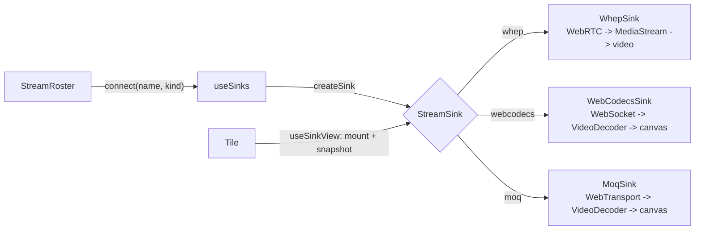

# Viewer architecture

Watching a stream means pulling it from the relay and decoding it for display.
Different codecs need different decoders: a browser plays H.264 over WebRTC, but 4:4:4 codecs need a software decoder the browser owns (WebCodecs) or a native player.
The architecture hides that difference behind one contract on the frontend, so a web grid tile renders any stream without naming a decoder.

Four ways to watch exist, in order of reach:

- The web grid (`StreamGridPage`): a tile grid inside the app window where each tile decodes through a `StreamSink`, over WHEP, the viewer service or Media over QUIC.
- The native grid (`nativegrid`): a GTK4 tile window decoding through GStreamer, with the installed decoder set's breadth instead of the webview's.
- A single-stream native viewer (ffplay or mpv): one window per stream, the same decoder breadth as the native grid.
- A standalone browser page served by the viewer service: the same WebCodecs path as the web grid, for a plain browser on the LAN.

The capture and publish side is the mirror of this seam; see `capture-architecture.md`.

## Two grids, both permanent

The web grid and the native grid are parallel viewers, not a migration from one to the other.
Each buys something the other cannot: the web grid ships inside the app window and needs no second binary, and the native grid decodes through GStreamer, so it carries the formats and chroma the webview refuses.

The native grid is the further-developed of the two and the reference for viewer behaviour: its decode reach is every GStreamer decoder on the plugin path, so a stream that must display correctly belongs there, and new viewer features are designed against it first.
The web grid is the fallback that works with nothing installed beyond the app, which is also why the same decode path serves the standalone LAN page.
Both keep their own view state, so the two can be open on different stream sets at once.

## Two legs, two protocols

A stream crosses the relay in two independent legs: the publish leg from the publisher to the relay, and the watch leg from the relay to one viewer.
Each names its own protocol, because MediaMTX re-serves every ingested stream on all its listeners.
A stream published over SRT is watched over RTSP by one viewer and over WHEP by another, at the same time.

The two legs are not the same list of protocols, and a leg is not one list either.
HLS is served and never ingested, so it is a watch leg alone; RTMP takes four formats in and hands one back; WebRTC ingest is narrower than WHEP playback, and narrower on one publish engine than on the other.
Each transport declares a carriage per leg and per engine beside the code that serializes it (`transport.Formats`), and every rule that offers or refuses a protocol reads the entry for the leg and the engine it means.
The two watch engines are the two receivers here: ffplay and mpv open a URL through libavformat, and a receiving GStreamer pipeline is the native grid's.
A web grid tile is neither, reaching the relay through the webview's own `RTCPeerConnection` and carrying its own table (`webgrid.ts`).

The publish leg is one setting per app instance (`settings.Stream.Transport`, the "Publish transport protocol" field).
The watch leg is two, one per viewer kind, because the two viewer kinds reach different protocol sets.
A single-stream window takes `settings.Stream.WatchTransport` per Watch click, the "Watch over" dropdown, narrowed to the protocols a player opens by URL.
The native grid runs every tile on `settings.Stream.GridTransport`, which its own sidebar sets and which reaches WHEP, a leg no player URL expresses.
One field for both would let each viewer store a leg the other cannot run.
A web grid tile is the exception, its leg fixed by the decode path its sink uses.
Anything the viewer side reports, a tile badge or a stats overlay row, is the watch leg; the publish leg is not observable from there.

Each protocol's own knobs are per leg for the same reason.
The two SRT latency windows are separate fields because each leg is its own SRT link with its own retransmit window, and glass-to-glass delay is their sum.
RTSP names the RTP lower transport once per leg (`RtspPublishProtocol`, `RtspWatchProtocol`), because the two legs cross different networks and it is the network that decides whether a UDP port pair survives.
The jitter buffer is the watch leg's alone (`RtspWatchLatencyMs`): it sizes the receiver's reorder window, and the publish leg has no receiver here.

An SRT latency window is a request, not a result.
SRT negotiates one delay per direction in the handshake and takes the larger of the two sides' values, so a link is never faster than the peer's own setting, whatever this side asks for.
MediaMTX exposes no SRT latency option and runs on its library's 120 ms default, which is therefore the floor of both hops against it: 400 ms is honoured, 60 ms comes back as 120.
The negotiated value is what the grid's tile overlay reports as `buffer` on the watch leg, read off `srtsrc`; the relay's `/v3/srtconns/list` reports both directions of both hops.

## Where the bytes go

The three paths differ in how many hops separate the relay from the decoder, and in which of those hops cross the network.
Every hop below is on the watch leg.
Ports are the defaults from `mediamtx.yml` and `settings.Defaults`.

Double rules cross the network; single rules stay inside one machine.

```
web grid tile, H.264

  MediaMTX ══ WHEP offer + SRTP :8889 ═══▶ RTCPeerConnection ──▶ <video>
  └─────────────── network ──────────────┘ └───── receiver machine ────┘

web grid tile, VP9

  MediaMTX ══ RTSP :8554 ════════════════▶ ffmpeg ──IVF pipe──▶ webviewer ──ws://127.0.0.1:8899──▶ VideoDecoder ──▶ <canvas>
  └─────────────── network ──────────────┘ └────────────────────────────── receiver machine ───────────────────────────────┘

web grid tile, Media over QUIC

  MediaMTX ══ WebTransport :8892/udp ════▶ VideoDecoder ──▶ <canvas>
  └─────────────── network ──────────────┘ └── receiver machine ──┘

native window

  MediaMTX ══ SRT :8890 or RTSP :8554 ═══▶ ffplay or mpv window
  └─────────────── network ──────────────┘ └ receiver machine ┘
```

WHEP is one hop.
The webview's own `RTCPeerConnection` negotiates with the relay and receives SRTP; no process on the receiver sits between them.

Media over QUIC is one hop as well, and the same shape for a different reason: the page holds the subscription itself, over WebTransport, and decodes with WebCodecs.
It is the WebCodecs path without the viewer service, which is what "Reading Media over QUIC" below is about.

The WebCodecs path is two hops, and only the first is network.
The `webviewer` service runs in-process inside the receiving app, so the RTSP subscription and the WebSocket both belong to the machine showing the web grid.
Its ffmpeg child pulls the stream from the relay with `-c:v copy`, so nothing is re-encoded; the service turns the IVF stream back into frames and pushes them to the page over loopback.
The web grid's WebSocket URL is hardcoded to `127.0.0.1`, so a web grid tile's second hop never leaves the machine.

One ffmpeg child serves one WebSocket connection, not one stream.
Two tiles showing the same stream open two RTSP subscriptions against the relay.

The standalone page is the same service reached from elsewhere, which moves the second hop onto the network: the RTSP leg still terminates on the app's machine, and that app instance acts as the gateway for every LAN browser watching through it.

The native viewer is one hop and needs no app process at all.
It is the only path whose watch leg can be made to match the publish one, and the only one that can use SRT.
The native grid shares that shape: each watched tile's pipeline subscribes to the relay directly, over the transport the app chose at launch.

## What each path decodes

A native path decodes every stream this app publishes, so what limits it is the watch leg rather than the decoder.
ffplay and mpv decode through libavcodec.
The grid's `decodebin` autoplugs by rank, so a hardware element takes the stream wherever its sink caps advertise the profile, and a software element takes the rest: `avdec_h264` and `avdec_h265` from gst-libav, `vp9dec` from libvpx, `dav1ddec` for AV1.
Nothing prefers software: the hardware decoders outrank the software ones, and the pixel format the publisher chose is what decides which of them can take the stream.
Which legs carry a format to a player and to the grid is "Which protocol carries which format" below.

The web grid is the side with a decode limit, because each of its paths pins a profile.

| Published stream | Web grid, watch leg | Notes |
|---|---|---|
| H.264, 8-bit 4:2:0 | WHEP | The only combination the webview's WHEP path negotiates, and one hop with no certificate to settle, so it keeps the format even though MoQ also carries it. |
| H.264, 10-bit 4:2:0 (p010le) | none | WebRTC negotiates 8-bit H.264 profiles only, and the MoQ rows promise 8-bit. |
| H.264, 4:4:4 or 4:2:2 | none | WHEP requires 4:2:0. |
| HEVC, 8-bit 4:2:0 | MoQ | The format WHEP refuses outright and MPEG-TS carries: a stream published over SRT is watchable in the web grid through this leg alone. |
| HEVC, 10-bit or full chroma | none promised | The MoQ leg may decode it where the host's WebCodecs does; the verdict promises 8-bit 4:2:0 and nothing wider. |
| AV1 or VP8, 8-bit 4:2:0 | MoQ | Neither reaches WHEP: AV1 negotiates over WebRTC and yields no picture, and VP8 has no other web-grid path. |
| VP9 profile 1, 8-bit 4:4:4 or gbrp | WebCodecs, in a LAN browser | The app's own webview refuses the profile, see "Where responsibilities lie". |
| VP9 profile 0 (4:2:0) | MoQ | The WebCodecs path declares profile 1 and decodes no other bitstream, so 4:2:0 VP9 reached no tile before the MoQ leg existed. |
| VP9 profile 2 (10-bit) | none | Above what any web-grid row promises. |

`capabilities.Decoders` states what each decoder element takes, and the settings form reads it to say what a chroma costs the viewer.
Every fixed-function decoder covers 4:2:0, with 10-bit where the format has a Main-10 equivalent.
Full chroma and RGB reach silicon in HEVC alone, through the Range Extensions profiles NVDEC and Intel's decoder carry and Mesa's VA drivers and DXVA do not.
4:2:2 divides the same way one step narrower: libavcodec decodes it in both H.26x formats, and Intel's HEVC decoder is the one hardware element that does, NVDEC implementing the 4:4:4 Range Extensions profiles without the 4:2:2 one.
H.264 has no hardware 4:4:4 anywhere, no vendor having implemented High 4:4:4 Predictive, which is also why lossless H.264 is a software decode on every machine: the mode exists only in that profile.
AV1 and VP9 are the same story in their own profiles, hardware decoding profile 0 and 2 and never the full-chroma ones.

Audio follows the path, not the stream.
`WhepSink` and `MoqSink` receive the audio track and expose a volume control; the WebCodecs leg and the native grid map video only, so a stream published with desktop audio is silent on those two and audible on the other two.
The two that carry it do so through different machinery: WHEP's rides on the `<video>` element, and MoQ's is an `AudioContext` the reader feeds decoded buffers into, which starts suspended because a page may not make sound before a gesture.
A MoQ tile therefore arrives muted and says so, where a WHEP tile arrives muted only if autoplay was refused.
Which legs carry the track at all follows the audio codec rather than the path: WebRTC carries Opus alone and RTMP AAC alone, which the transport table's audio half states.

## Codec and chroma

`capabilities.Codecs` is the authoritative table; the rows below are the subset the argument builders map, in the shape the viewer side cares about.
The remaining families (V4L2 M2M, Rockchip MPP) are declared with `Implemented: false` and rejected before either builder runs.

Which protocol carries a row is not in it: that follows the bitstream format rather than the encoder, and the next section holds it.

| Codec | Chromas | GStreamer element |
|---|---|---|
| `h264_nvenc` | yuv444p, yuv420p, p010le | `nvh264enc` |
| `hevc_nvenc` | gbrp, yuv444p, yuv420p, p010le | `nvh265enc` |
| `av1_nvenc` | yuv420p, p010le | `nvav1enc` |
| `libx264` | yuv444p, yuv422p, yuv420p, p010le | `x264enc` |
| `libx265` | gbrp, yuv444p, yuv422p, yuv420p, p010le | `x265enc` |
| `libvpx-vp9` | gbrp, yuv444p, yuv420p, p010le | `vp9enc` |
| `libvpx` (VP8) | yuv420p | `vp8enc` |
| `libaom-av1` | gbrp, yuv444p, yuv420p, p010le | `av1enc` |
| `libsvtav1` | yuv420p, p010le | `svtav1enc` |
| `librav1e` | yuv444p, yuv420p, p010le | `rav1enc` |
| `h264_vaapi` | yuv420p | `vah264enc` |
| `hevc_vaapi` | yuv420p, p010le | `vah265enc` |
| `av1_vaapi` | yuv420p, p010le | `vaav1enc` |
| `vp9_vaapi` | yuv420p | `vavp9enc` |
| `vp8_vaapi` | yuv420p | `vavp8enc` |
| `h264_qsv` | yuv420p | `qsvh264enc` |
| `hevc_qsv` | yuv420p, p010le | `qsvh265enc` |
| `av1_qsv` | yuv420p, p010le | `qsvav1enc` |
| `vp9_qsv` | yuv420p | `qsvvp9enc` |
| `h264_amf` | yuv420p | none |
| `hevc_amf` | yuv420p, p010le | none |
| `av1_amf` | yuv420p, p010le | none |
| `h264_vulkan` | yuv420p | none |
| `hevc_vulkan` | yuv420p, p010le | none |
| `av1_vulkan` | yuv420p, p010le | none |

The chroma column is the union over the two publish engines.
A format one engine's encoder will not take carries a `Gap` on the row, so the viewer side sees every chroma a stream may arrive in; which of them a given capture backend can publish is the settings form's question.
4:2:2 is the two software H.26x rows' alone, coded through x264's High 4:2:2 and x265's Main 4:2:2 10: no hardware encoder here has an entrypoint for it, and the royalty-free formats have no 4:2:2 profile a fast encoder implements.

The VAAPI, QSV, AMF and Vulkan rows are 4:2:0 throughout, so nothing they publish reaches the WebCodecs leg's 4:4:4 column, and their `h264` rows at yuv420p are those families' WHEP-viewable ones.
Whether a given GPU runs any of them is the driver's answer, not the table's: `encoders.Detect` probes each per publish engine, test-encoding on the ffmpeg engine and querying the plugin registry for the GStreamer element, and the settings form greys away what this machine refuses on the selected capture backend.

Two families have no GStreamer element at all, the only gaps in the table that take a whole family off an engine.
The `amfcodec` plugin builds its device layer on D3D11 and configures for Windows only; the vulkan plugin's encoder takes images on a Vulkan device, a memory no capture backend on that engine produces, and carries no HEVC or AV1 encoder to take them either.
The portal capture backend therefore publishes neither, and greys each family with its own reason.
On an AMD or Intel card the same silicon is reachable there through the VAAPI rows, which is what both alternatives drive.

## Which protocol carries which format

Each transport declares its carriage per leg and per engine (`transport.Formats`), and the reason a format is in or out belongs to the protocol and to the engine's muxer or source element, never to the encoder that produced the bitstream.
A cell reading none is an engine with no serialization for that leg, and the capability interface is absent with it.

| Transport | ffmpeg publish | GStreamer publish | Player watch | Grid watch |
|---|---|---|---|---|
| `srt` | h264, hevc | h264, hevc | h264, hevc | h264, hevc |
| `rtsp` | all five | all five | all five | all five |
| `rtmp` | h264, hevc, av1, vp9 | none | h264 | h264 |
| `webrtc` | h264 | h264, vp9, vp8 | none | h264, vp9, vp8 |
| `hls` | none | none | h264, hevc, av1, vp9 | none |

Why each row is shaped that way:

- **srt.** MPEG-TS registers a stream type for the two H.26x formats and for none of the others.
  One value covers all four cells, because ffmpeg's `mpegts` muxer and `mpegtsmux` write the same stream types and libavformat and `tsdemux` read them back.
- **rtsp.** RTP has a payload format for every video format and both audio codecs here, and both engines implement all of them, which is why RTSP is the fallback the other refusals point at.
- **rtmp.** The `flv` muxer writes the enhanced-RTMP tags the relay ingests, where `flvmux` writes the legacy ones alone, so there is no GStreamer publish form.
  Both watch cells sit on legacy-tag parsers, libavformat's FLV demuxer and `rtmp2src`.
- **webrtc.** ffmpeg's `whip` muxer writes one H.264 track and has no payloader for anything else, where `whipclientsink` payloads whatever `webrtcbin` negotiates and so reaches VP8 and VP9 over the same endpoint.
  Playback is the WHEP exchange rather than an address, so no player opens it and the grid's `whepsrc` is the only reader.
- **hls.** The relay segments and serves HLS and ingests nothing over it, and nothing on the GStreamer side reads the relay's playlist.

Audio is carried per protocol and not per engine: WebRTC carries Opus alone, RTMP AAC alone, and SRT, RTSP and HLS carry both.

Three rules fall out of the table:

- A codec no transport publishes cannot be published at all: `transport.ValidatePublish` rejects the combination before an encoder is built, and names the transports that would have carried it on the engine that is running.
- What a viewer may receive over is the watch entry for the engine it runs on, never the publish one.
  An SRT viewer opened on a VP9 stream would connect and receive nothing, so `WatchNamesFor` narrows the choice per stream and per engine instead.
- A publish leg the two engines carry differently is the capture backend's business as much as the transport's, since the backend fixes the engine.
  Publishing VP9 over WebRTC therefore means a GStreamer capture backend and no other.

The VP9 and AV1 formats also need `-strict experimental` on the ffmpeg publish leg, which `RTSP.PublishArgs` adds for them.
Both RTP payload formats are still IETF drafts, and the muxer refuses to write a draft payload without it.
The relay ingests them either way.

Two formats WebRTC negotiates are missing from its row all the same.
The relay refuses H.265 over WebRTC for any stream carrying B-frames, which is a property of the encode and unknowable for a stream this app did not produce.
An AV1 track negotiates over WHEP and then yields no picture, with an autoplugged depayloader or an explicit one, which takes AV1 off the publish cells too: a leg nothing can read back is not a leg.
Both stay out of the carriage rather than being offered and failing on the tile.

Which rate-control modes a row offers is not uniform, and a `Gap` naming the mode carries it.
Lossless is the mode that goes missing: only x264, x265 and NVENC H.264/HEVC code bit-exact, VP9 does so through ffmpeg but not through `vp9enc`, and no AV1, VP8, VAAPI, AMF or Vulkan encoder does at all.

Audio is one of two codecs at 128 kbit/s stereo, coded by `libopus` or `aac` on the ffmpeg engine and by `opusenc` or `avenc_aac` on the GStreamer one (`capabilities.AudioCodecs`).
Opus is the codec WebRTC negotiates and AAC the one FLV has always carried, so the publish leg decides which of the two a stream may use.

## Where the web grid and a native window disagree

- **Chroma and bit depth.**
  Each web-grid path decodes one profile, so it pins both axes at once: WHEP negotiates the 8-bit 4:2:0 H.264 profiles, and the WebCodecs sink declares VP9 profile 1, which is 8-bit full chroma.
  WebRTC profile negotiation stops there: VP9 profile 1 and AV1 High are not negotiable, browser HEVC decoding is hardware-only, which excludes the range extensions that code RGB, and 10-bit H.264 is outside the negotiated profiles as well.
  A `p010le` stream therefore misses WHEP on depth rather than on subsampling, and 4:2:0 VP9 misses the WebCodecs path for the mirror-image reason.
  libavcodec has no such rule, so mpv plays an HEVC `gbrp` stream that no web grid tile can.
  `WEB_GRID_DECODE` carries the constraint as each row's `is420` and `bitDepth`, matched against the pixel format's own.
- **Watch leg.**
  The web grid's is fixed by the decode path, never taken from the publish leg: WHEP is always WebRTC and the WebCodecs path is always RTSP, whatever the stream was published over.
  A single-stream native window picks its watch leg per Watch click, and the grid picks one for the whole window in its sidebar, so the same stream can be open over SRT in a player and RTSP in the grid at once.
  WebRTC is absent from the player's choice because it implements no `Watcher`: playback needs WHEP, which neither ffplay nor mpv speaks.
- **Codec breadth.**
  The web grid decodes all five formats at 8-bit 4:2:0, and two of them beyond that.
  A native window decodes whatever the ffmpeg build supports, at any chroma and depth.
  The gap is no longer a format but a profile: what the web grid cannot promise is 10-bit and full chroma outside the one VP9 profile the viewer service declares.
- **Rendering.**
  ffplay is pinned to the SDL X11/XWayland backend, whose window a compositor renders reliably where the SDL Wayland backend may not.
  mpv renders 4:4:4 and a native Wayland window, which is what `SCREENSHARE_VIEWER=mpv` selects.

## The frontend decode seam

The seam is the `StreamSink` interface (`frontend/src/types/sink.ts`).
A sink owns its render surface and its audio, so the tile renders one container and knows nothing about `<video>` versus `<canvas>` or whether the stream carries sound.



A sink exposes three things the tile consumes:

- `mount(container)` / `unmount()`: the sink creates its own `<video>` or `<canvas>`, appends it, fills it, and starts playback. The tile passes a bare `<div>`.
- `subscribe` / `getSnapshot`: the connection state and audio state, read through `useSyncExternalStore` so only the changed tile re-renders. `getSnapshot` returns a stable reference until a real change.
- `stats()`: the decode figures for the overlay (transport, resolution, codec, bitrate, decoder, fps, frames decoded and dropped, jitter, packet loss, latency). The overlay names them as the native grid does, see docs/design-language.md, "Wording". A counter the path takes no measurement of is `NaN`, which the overlay prints as its unknown placeholder rather than as zero: `VideoDecoder` exposes no dropped-frame count, so the WebCodecs tile reports none.

## Connecting is a narrated state

A snapshot carries a `SinkPhase` alongside its state, and every decode path walks the same three: `requesting`, `negotiating`, `buffering`.
The tile renders them as a named step bar (`TileLoading`) and the roster chip mirrors the state, so a click has visible effect immediately and a stall says which step it stalled on.

`connected` means a decoded frame reached the surface, not that the transport came up: `WhepSink` promotes on the video element's `loadeddata`, `WebCodecsSink` on its first drawn `VideoFrame`.
The tile fades its surface in on that transition, so the skeleton never hands over to a black rectangle.

`BaseSink` arms a connect deadline in its constructor and fails the sink when the wait outlives it.
A stream that never produces a frame is indistinguishable from a slow one, so the wait ends either way and the tile offers a retry.

Audio is a nullable capability, not a base method.
A sink with sound exposes an `AudioControl` (`ElementAudioControl` over the media element); the video-only WebCodecs path exposes null, and the tile shows the volume control only when it is present.

## Where responsibilities lie

The seam follows the frontend layering (`frontend-coding-style.md`): the sinks are the first residents of the `services/` layer.

- **services/sinks/** holds the stateful, framework-agnostic sinks.
  `BaseSink` carries the subscriber set, the cached snapshot and the connect deadline.
  `WhepSink` renders a `MediaStream` into a `<video>` and owns the autoplay-muted fallback; `WebCodecsSink` renders decoded `VideoFrame`s into a `<canvas>`; `MoqSink` drives the vendored MoQ reader, which owns its own canvas.
  `createSink` maps a `SinkKind` to the concrete sink.
  `ElementAudioControl` and `MoqAudioControl` are the two shapes of `AudioControl`, one over a media element and one over an `AudioContext`.
- **hooks/** drives the seam.
  `useSinks` owns the live sink map (in a ref, created on connect, so React StrictMode's double-invoke cannot close a connection); `useSinkSnapshot` reads one sink's state and `useSinkView` adds the mount ref for a tile; `useSinkStats` polls `stats()` only while the overlay is open; `usePictureInPicture` moves a tile into a Document Picture-in-Picture window.
- **components/StreamGridPage/** renders.
  `StreamGridPage` composes the roster, the grid and the audio-only strip; `Tile`, `TileLoading`, `VolumeControl`, `StreamStatsOverlay`, `TransportBadge` and `AudioOnlyChip` are presentational.

WHEP needs a working `RTCPeerConnection` in the host webview, which costs two separate things.
WebKitGTK exposes the binding only when built with experimental features on, since `ENABLE_WEB_RTC` rides on that flag and distributions commonly leave it off; the dev shell overrides `webkitgtk_4_1` with `enableExperimental = true` for that reason.
The build flag alone is not enough: the bindings stay behind the `enable-webrtc` and `enable-media-stream` settings, both off by default and never set by Wails, so `desktop/webview_linux.go` turns them on at startup.
Swapping the webkitgtk build changes the flags cgo resolved from `pkg-config`, which Go caches per package, so the first build after the swap needs `go clean -cache` or `go build -a`.
Where the binding exists it runs on GStreamer's `webrtcbin`, which refuses to start unless the libnice elements are on `GST_PLUGIN_SYSTEM_PATH_1_0`; the dev shell replaces that variable, so `flake.nix` carries libnice for the webview's sake and not for the publish pipeline.

WebCodecs in the same webview is narrower than a browser's, and the experimental build does not widen it.
WebKit answers `VideoDecoder.isConfigSupported` from the GStreamer decoders it scans, and those announce no profile in their caps, so it accepts the 4:2:0 strings (`vp09.00`, `av01.0`, `avc1`, `hvc1`) and rejects every 4:4:4 one (`vp09.01`, `vp09.03`, `av01.1`, `avc1.f4`).
`hvc1` at a range-extensions level is accepted at configure and then fails on the first frame, so the accepting answer is not a decoder.
`vp09.01.10.08` is the string `WebCodecsSink` and the standalone page both declare, so the WebCodecs path serves the LAN browser and the app's own tile fails on the rejection, naming the string it was refused.
Full-chroma streams therefore reach a LAN browser or the native grid, not the web grid.

## The web viewer service

The `webviewer` package (Go) serves the WebCodecs path.
It runs in-process, supervised by the app (`webviewer.go`), and starts and stops with the window.
An ffmpeg child pulls the stream from the relay over RTSP and remuxes it to IVF; the server parses each frame and pushes it to the browser over a WebSocket.
Using ffmpeg for the RTSP leg keeps the depayload and reassembly in a component the app already ships, with no RTSP client library.

The WebSocket carries one binary message per encoded frame, the contract shared by `webviewer/server.go` and `WebCodecsSink`:

```
byte 0        flags: bit 0 = keyframe
bytes 1..8    PTS in microseconds, unsigned 64-bit big-endian
bytes 9..     the VP9 frame payload
```

The service also serves a self-contained standalone page (`webviewer/page.go`) that opens the same WebSocket and decodes with WebCodecs, so a browser on the LAN can watch with no build step.
The keyframe flag comes from parsing the VP9 uncompressed header; the PTS comes from the IVF frame header converted through the stream's time base.

The relay location is read from settings per connection, so a host or port change reaches the next viewer without restarting the service.
A bind failure is logged rather than fatal: the rest of the app runs without the WebCodecs path.

## Reading Media over QUIC

MoQ is the third web-grid decode path, and the only one that is a watch leg and nothing else.
No engine this app drives publishes it: ffmpeg has no muxer for it and GStreamer no sink, and no player opens it either, so it is absent from `transport.Formats` rather than being a row with empty cells.
The `transport` registry could not hold it if we wanted it to - `Register` asserts that an entry carries a leg on an engine, and MoQ carries neither - which is the same reason the web grid's other legs live in `webgrid.ts` and not in the Go table.
A MoQ tile is therefore always watching a stream the relay ingested over some other protocol and re-serves here, which is the two-legs rule at its most literal.

What it buys is codec breadth, and it buys it by not pinning a profile.
The other two web-grid paths each declare one: WHEP negotiates the 8-bit 4:2:0 H.264 profiles and the viewer service declares `vp09.01.10.08`.
MoQ subscribes to a catalog that names the codec, and the reader hands that string to a `VideoDecoder`, so the limit is the host webview's WebCodecs reach rather than anything about the leg.
That is why HEVC, AV1, VP8 and 4:2:0 VP9 reach a web grid tile at all, and it is also why `WEB_GRID_DECODE` promises only 8-bit 4:2:0 for the row: a table read before anyone is watching should under-promise where the answer is the host's rather than the protocol's.

The certificate is the part that is not like the others.
WebTransport refuses a plain listener, so the MoQ leg runs over TLS and the relay's certificate is self-signed unless someone gives it a real one.
A browser on the relay's own MoQ page has already accepted that certificate to load the page; the web grid runs on the app's origin and has accepted nothing, so the fingerprint fetch the relay's reader makes fails there before WebTransport is reached.
The app makes that request from Go instead (`moq.Fetch`, `App.MoqCert`), where the verification decision is ours: a verified fetch is tried first so a relay with a real certificate is held to it, and only its failure falls back to an unverified fetch whose answer is still pinned through `serverCertificateHashes`.
The tile's stats overlay reports which of the two happened, because "pinned" means the relay was taken on trust and held to that exact certificate, not that it proved who it is.

Which certificate the endpoint describes is the part worth being precise about, because the obvious reading is wrong.
WebTransport will only pin a certificate that is ECDSA and lives at most fourteen days, and `moqServerCert` is generated for 3650, so pinning that one could never work.
The endpoint does not serve that one: it answers with the HTTP/3 listener's certificate, which MediaMTX generates separately, and the HTTP/3 listener is exactly the peer WebTransport connects to.
Measured against a v1.20.0 relay, the TCP listener presents `auto.crt` byte for byte and the fingerprint endpoint answers with something else, which is the whole reason the endpoint exists.
The consequence is that the pin has a lifetime: `moq.Fetch` runs per sink so every new tile pins afresh, and what it cannot help is a reader retrying inside a tile left open longer than the certificate lived, which fails until the tile is reconnected.

Two more things are worth knowing before the first tile is opened.
The relay has to be at least v1.20.0, because `mediamtx.yml` names `moqQUICAddress` and MediaMTX refuses to start on a key it does not know; `scripts/relay.ps1` pins the version that has it.
And WebTransport is a Chromium-family binding, so the MoQ rows drop out of the WebKitGTK window the way the WHEP row does without `ENABLE_WEB_RTC`; on that host MoQ is a LAN browser's path and the native grid remains the one that decodes everything.

`moqQUICAddress` is native MoQ-over-QUIC, and nothing here reads it.
It is configured anyway because it is the one endpoint a non-browser client could subscribe on, which is what a native MoQ watcher would need: v1.20.0 also widened the accepted drafts to 16, 17 and 19, so an out-of-tree `moqsrc` has a far better chance of handshaking than it did.
That is a leg for the `transport` registry rather than for this file, and it stays unbuilt while the native grid has no format it cannot already decode over RTSP.

The reader itself is vendored (`services/sinks/vendor/mediamtxMoqReader.js`, MIT) rather than loaded from the relay, for the reason the fingerprint is fetched in Go: a cross-origin script load from a self-signed origin fails the same way.
It carries six marked local changes over upstream - an export, a supplied fingerprint, a terminal `close()`, decode counters, a per-frame callback and a gain node - and the header lists them so a re-vendor is a copy plus six patches.
It reconnects on its own after a failure, which is left in place: a stream that drops and comes back is what a grid tile wants, so `MoqSink` treats a reported error as narration and lets `BaseSink`'s connect deadline be what ends a wait that will not resolve.

## The two viewability verdicts

The settings form carries one verdict per grid, both shaped as `ViewVerdict` and both derived rather than restated: whether the web grid can show the configured stream, and whether the native grid can.
Two badges instead of one because the two grids fail on different things, and a stream the web grid refuses is usually still watchable in the native one.

`WEB_GRID_DECODE` (`frontend/src/util/webgrid.ts`) is one row per web-grid decode path: the formats it decodes, the subsampling and bit depth its profile pins, the codec string it declares to `VideoDecoder` where it declares one, and whether it is available.
The MoQ row sits last, so a format an earlier path already carries keeps the path it had and what MoQ adds is the formats neither of the others reaches.
Its consumers read it, so they cannot disagree:

- `webGridCheck` produces the "viewable in web grid" verdict.
- `sinkKindForTracks` picks the decoder the web grid builds for a live relay path from its track codecs.
- `WebCodecsSink` configures its `VideoDecoder` with the row's codec string, so the profile the badge promised is the profile the decoder is given.

That verdict derives from the same `FORMAT_META` and `CHROMA_META` tables as the rest of the settings form (`domain-model.md`), so a codec change updates both.
A codec no path decodes reports not-viewable and points at the native grid.
`sinkKindForTracks` falls back to the first available path for an unrecognized track codec, so the tile connects and surfaces its own decode failure instead of silently doing nothing.

A row's `available` is the host webview's answer, not a constant: each path tests for the API it needs (`RTCPeerConnection`, `VideoDecoder`, `WebTransport`) as the module loads.
A webview without one drops that row, so the verdict explains the gap where the settings form already reports codec support, rather than letting the tile fail on a missing global.

`nativeGridCheck` (`frontend/src/util/nativegrid.ts`) has no decode table of its own, because the native grid's `decodebin` reaches every format the app can encode, at any chroma and bit depth.
That leaves the watch leg as the only gate, so the verdict asks the transport table whether a receiving GStreamer pipeline is served the codec's format over the grid's own leg (`GridTransport`, the leg the window opens on and its sidebar changes).
It reads the GStreamer watch entry and never the publish one, since the two are separate sets: a stream published over RTMP is one the same protocol will not hand back at anything but H.264.
A format with no listener on the selected leg reports not-viewable, names the leg as the reason, and names the protocols that would carry it.

## The native grid

The native grid is a separate GTK4 binary (`nativegrid`), spawned by the app (`nativegrid.go`): the webview process is GTK3, and the two toolkits cannot share a process.
The process contract is a JSON roster built by `watch.BuildGridConfig`: every stream the relay reports live, each as a display name plus the gst-launch source fragment of its watch transport (`transport.GstWatcher`, the watch-side counterpart of `GstPublisher`), and the app state the window's own controls read (`watch.GridApp`).
It is passed once as the `-config` argument, which may be empty, and again as one JSON line on the child's stdin whenever the config the app builds differs from the one the window holds (`pushRoster`), so the window opens on an idle relay and fills up as streams appear.
The config is the whole state rather than what moved in it, which is what makes that comparison the push rule.
The poll rebuilds it from the settings, the live streams and the publish state, so a watch knob turned in the app's own settings form reaches a tile already playing, and a poll that finds nothing moved writes nothing.
On the receiving side a stream whose source fragment changed restarts on the new one, and the tiles whose fragment stayed put keep playing.
The binary appends sidebar rows for new streams and hides the rows of vanished ones, keeping a vanished stream's row while it is watched so its failure state stays on screen.

Which of those streams are watched, in what order, and which one is spotlit belong to the window, and the window persists them itself in a state file beside the app's `settings.json`, keyed by stream name.
Its own geometry is in that file too, written by the window and read before it maps.
So a restart reopens on the tiles it was showing, at the size it was shown at.

The child's stdout carries three kinds of JSON line, told apart by a `type` field.
The first is a watch-leg request (`watch.GridRequest`).
Each roster entry carries the transports that stream can be received over and the knobs of every one of them, all declared by the transport that reads them (`transport.WatchTunable`), so the sidebar renders a control per entry and names no protocol.
Declaring all of them is what lets the popover swap its controls the instant another leg is picked, rather than waiting for the app to answer before it can show what that leg offers.
A request is the whole leg, the transport and the values of the knobs shown with it, and the app answers an accepted one with the roster it produces.
A refused one produces no roster and needs none: the sidebar reads its controls before it asks and redraws them from the entry it holds as the popover closes, so they follow the app rather than their own last click.

An accepted request is written into the settings and saved (`watch.ApplyWatchLeg`), so the leg the sidebar was left on is the leg the next launch opens.
The leg is one setting for the window rather than a deviation per stream: the popover sits on a row because that row's format decides which transports may be offered, and what it changes is the window's.
The backend announces the write with a `settings:changed` event, because the settings form holds its own copy and would otherwise put the old leg back on its next field edit.

The second is a command (`watch.GridCommand`), which acts on the app instead of on a stream: the sidebar's foot raises the app window on the settings form, and starts or stops the publish of this machine's own capture on the settings the app holds.
It is answered like a request, with the push that states what happened, so the publish button draws the app's state and keeps none of its own.
The two publish commands name the state they want rather than toggling, since a button drawn from a push the app has since left would otherwise flip the state the other way, and a command the app refused comes back with its reason for the bar to show.
Because a publish can also start from the app's own form, the state travels both to the window (in every push) and to the frontend (the `publish:state` event), so a publish the grid started is one the form reports and can apply settings to (`capture-architecture.md`, "Changing settings on a live stream").

The third is the watch set (`watch.GridStatus`): the streams with a tile open, reported whenever that set changes and exposed by the app as `NativeGridWatching`.
It travels one way.
The window decides what it watches and states it, the app reads it and never answers with a watch set of its own, so the view state has a single owner even though two processes know it.

Transport knowledge stays in the app, decode knowledge in the binary.
A watched tile runs its own receive pipeline, whose paintable the tile's `GtkPicture` draws, so full chroma reaches the GTK scene graph with no subsampling on the way.
Which elements sit between the source and the sink is a render chain, and the binary carries a table of them rather than one line: the decoder is the same on every row and what differs is where the frames are converted and what that says about their colour.

| Chain | Between source and sink | Colour |
|---|---|---|
| `gl` | `glupload ! glcolorconvert ! glcolorscale`, RGBA/sRGB in `GLMemory` | stated |
| `cpu` | `videoscale ! capsfilter ! videoconvert`, RGBA/sRGB in system memory | stated |
| `d3d11`, `d3d12` | `d3d11upload ! d3d11convert`, then a download | the driver's |
| `raw` | nothing | unstated |

`gl` is the default, and it is the default because it was measured equal to `cpu` rather than because it is faster: rendered through both, flat dark, flat bright and gradient content are bit-identical, and a saturated colour-bar frame differs by at most one code value per channel.
Dark content agreeing is the evidence that matters, since washed-out shadows are the failure the pinned sRGB caps exist to prevent — without them the sink also takes YUV and GTK reads an unknown transfer function as BT.709, lifting every shadow.
What `gl` saves is the download: the CPU chain pulls every decoded frame into system memory and converts and scales it there, which at 1440p144 in 4:4:4 is gigabytes a second per tile.
The two Direct3D rows convert on the device and download because `gtk4paintablesink` negotiates GL memory or system memory and no D3D memory at all, and they state a colorimetry the driver may not honour, so they are offered and never defaulted to.

Only the CPU chain bounds its conversion to the tile's size, through the capsfilter behind its scaler, so a thumbnail in the spotlight's film strip converts a thumbnail rather than the source's full frame (`nativegrid/README.md`).
A GPU chain bounds nothing: the bound pays for itself where a conversion costs its output pixels, and writing it mid-stream is what the GL chain cannot survive, because the reconfigure travels past the scaler to a decoder that cannot answer it.

The choice belongs to the window rather than to the app, for the reason the seam is drawn where it is: whether this machine registers `glcolorscale` is decode knowledge, and the app links no GStreamer to ask.
It is remembered in the window's own state file, as a default for the window and an override per stream, so one window can run two chains at once.
What a running pipeline actually did is the stats overlay's business: it reports the chain, the memory the decoder handed its frames over in, the memory the sink read them from, and the GSK renderer, because a hardware decoder that downloaded its own frames and a GL texture under the Vulkan renderer both cost the download the row promised to avoid.
The tile grid consumes a `Player` interface (the paintable, a first-frame callback, an error callback), not GStreamer, mirroring the web grid's `StreamSink` seam; backends register under a name, so the GStreamer one is a package rather than the binary's only option.
Inside the binary the window is one model and two views of it: a session package decides and remembers what is watched, and the sidebar and the tile area redraw from what they read back off it (`nativegrid/README.md`).

## The native escape hatch

The single-stream ffplay/mpv viewer (`watch` package, `watch.go`) stays alongside the grids.
`watch.Select` picks the engine (ffplay by default, mpv via `SCREENSHARE_VIEWER`), and each builds its command from the transport's `Watcher` URL.
It is the one path with audio for non-WHEP streams, and the dependency-free fallback when the native grid binary is not installed.

A viewer is identified by stream name and transport together, not by name alone, because the relay re-serves each ingested stream on all its listeners and one stream can be open over several transports at once.

## Adding a decoder

Add a `SinkKind`, a `StreamSink` implementation under `services/sinks/`, and a case in `createSink`.
If the decoder should back live relay streams, add its row to `WEB_GRID_DECODE`; the verdict and the runtime selection follow with no further edits.

Two things are keyed by `SinkKind` rather than read off the interface, and the compiler names both: `createSink`'s switch and `TransportBadge`'s label map.
Everything else on the tile consumes the interface, so a new decoder reaches the grid without touching the chrome.
The stats overlay is the exception worth stating: a figure only one decoder can take is an optional field on `SinkStats` and a row that renders when it is present, which is how `certPinned` and the WebRTC-only `jitterMs` and `packetsLost` are carried.
