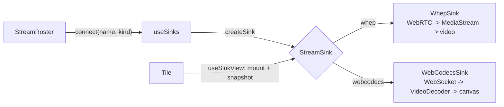

# Viewer architecture

Watching a stream means pulling it from the relay and decoding it for display.
Different codecs need different decoders: a browser plays H.264 over WebRTC, but 4:4:4 codecs need a software decoder the browser owns (WebCodecs) or a native player.
The architecture hides that difference behind one contract on the frontend, so a web grid tile renders any stream without naming a decoder.

Four ways to watch exist, in order of reach:

- The web grid (`StreamGridPage`): a tile grid inside the app window where each tile decodes through a `StreamSink`.
- The native grid (`nativegrid`): a GTK4 tile window decoding through GStreamer, with the installed decoder set's breadth instead of the webview's.
- A single-stream native viewer (ffplay or mpv): one window per stream, the same decoder breadth as the native grid.
- A standalone browser page served by the viewer service: the same WebCodecs path as the web grid, for a plain browser on the LAN.

The capture and publish side is the mirror of this seam; see `capture-architecture.md`.

## Two grids, both permanent

The web grid and the native grid are parallel viewers, not a migration from one to the other.
Each buys something the other cannot: the web grid ships inside the app window and needs no second binary, and the native grid decodes through GStreamer, so it carries the formats and chroma the webview refuses.

The native grid is the further-developed of the two and the reference for viewer behaviour: its decode reach is every GStreamer decoder on the plugin path, so a stream that must display correctly belongs there, and new viewer features are designed against it first.
The web grid is the fallback that works with nothing installed beyond the app, which is also why the same decode path serves the standalone LAN page.
Both keep their own view state, so the two can be open on different stream sets at once.

## Two legs, two protocols

A stream crosses the relay in two independent legs: the publish leg from the publisher to the relay, and the watch leg from the relay to one viewer.
Each names its own protocol, because MediaMTX re-serves every ingested stream on all its listeners.
A stream published over SRT is watched over RTSP by one viewer and over WHEP by another, at the same time.

The two legs are not the same list of protocols.
HLS is served and never ingested, so it is a watch leg alone; WebRTC ingest is narrower than WHEP playback; RTMP takes four formats in and hands one back.
Each transport declares a format set per leg beside the code that serializes it (`transport.Formats`), and every rule that offers or refuses a protocol reads the set for the leg it means.

The publish leg is one setting per app instance (`settings.Stream.Transport`, the "Publish transport protocol" field).
The watch leg is one setting for every viewer the app itself opens (`settings.Stream.WatchTransport`, the "Watch over" dropdown): a single-stream window takes it per Watch click, and the native grid is launched with whatever it reads at that moment.
The grid's sidebar can then move a single stream to another leg, or retune the one it is on, for that window and that stream alone; the setting is where every stream starts, not where it is stuck.
A web grid tile is the exception, its leg fixed by the decode path its sink uses.
Anything the viewer side reports, a tile badge or a stats overlay row, is the watch leg; the publish leg is not observable from there.

Each protocol's own knobs are per leg for the same reason.
The two SRT latency windows are separate fields because each leg is its own SRT link with its own retransmit window, and glass-to-glass delay is their sum.
RTSP carries a watch-leg jitter buffer and a lower transport (`RtspWatchLatencyMs`, `RtspWatchProtocol`); the publish leg interleaves RTP over the session's TCP connection unconditionally, since a publisher that cannot reach the relay has nothing to trade for lower delay.

## Where the bytes go

The three paths differ in how many hops separate the relay from the decoder, and in which of those hops cross the network.
Every hop below is on the watch leg.
Ports are the defaults from `mediamtx.yml` and `settings.Defaults`.

Double rules cross the network; single rules stay inside one machine.

```
web grid tile, H.264

  MediaMTX ══ WHEP offer + SRTP :8889 ═══▶ RTCPeerConnection ──▶ <video>
  └─────────────── network ──────────────┘ └───── receiver machine ────┘

web grid tile, VP9

  MediaMTX ══ RTSP :8554 ════════════════▶ ffmpeg ──IVF pipe──▶ webviewer ──ws://127.0.0.1:8899──▶ VideoDecoder ──▶ <canvas>
  └─────────────── network ──────────────┘ └────────────────────────────── receiver machine ───────────────────────────────┘

native window

  MediaMTX ══ SRT :8890 or RTSP :8554 ═══▶ ffplay or mpv window
  └─────────────── network ──────────────┘ └ receiver machine ┘
```

WHEP is one hop.
The webview's own `RTCPeerConnection` negotiates with the relay and receives SRTP; no process on the receiver sits between them.

The WebCodecs path is two hops, and only the first is network.
The `webviewer` service runs in-process inside the receiving app, so the RTSP subscription and the WebSocket both belong to the machine showing the web grid.
Its ffmpeg child pulls the stream from the relay with `-c:v copy`, so nothing is re-encoded; the service turns the IVF stream back into frames and pushes them to the page over loopback.
The web grid's WebSocket URL is hardcoded to `127.0.0.1`, so a web grid tile's second hop never leaves the machine.

One ffmpeg child serves one WebSocket connection, not one stream.
Two tiles showing the same stream open two RTSP subscriptions against the relay.

The standalone page is the same service reached from elsewhere, which moves the second hop onto the network: the RTSP leg still terminates on the app's machine, and that app instance acts as the gateway for every LAN browser watching through it.

The native viewer is one hop and needs no app process at all.
It is the only path whose watch leg can be made to match the publish one, and the only one that can use SRT.
The native grid shares that shape: each watched tile's pipeline subscribes to the relay directly, over the transport the app chose at launch.

## What each path decodes

The published stream is the row; the two viewer columns give the watch leg each side receives it over, whatever protocol published it.

| Published stream | Web grid, watch leg | Native grid, ffplay, mpv, watch leg | Notes |
|---|---|---|---|
| H.264, 8-bit 4:2:0 | WHEP | srt, rtsp | The only combination WHEP negotiates. |
| H.264, 10-bit 4:2:0 (p010le) | none | srt, rtsp | WebRTC negotiates 8-bit H.264 profiles only. |
| H.264, 4:4:4 | none | srt, rtsp | WHEP requires 4:2:0. |
| HEVC, any chroma | none | srt, rtsp | The WHIP/WHEP leg carries H.264 and Opus only. |
| VP9 profile 1, 8-bit 4:4:4 or gbrp | WebCodecs, in a LAN browser | rtsp | MPEG-TS has no VP9 mapping, so no leg can use SRT. The app's own webview refuses the profile, see "Where responsibilities lie". |
| VP9 profile 0 (4:2:0) or profile 2 (10-bit) | none | rtsp | The WebCodecs path declares profile 1 and decodes no other bitstream, and WHEP carries no VP9. |

The native column is one entry because a software decoder covers every row of it.
ffplay and mpv decode through libavcodec.
The grid's `decodebin` autoplugs by rank, so a hardware element takes the stream wherever its sink caps advertise the profile, and a software element takes the rest: `avdec_h264` and `avdec_h265` from gst-libav, `vp9dec` from libvpx.
That caps match is also what keeps 4:4:4 and high bit depth on the software path, since a VA or NVDEC element enumerates the profiles it implements and the 4:4:4 and 10-bit ones are not among them.

Audio follows the path, not the stream.
`WhepSink` receives the Opus track and exposes a volume control; the WebCodecs leg and the native grid map video only, so a stream published with desktop audio is silent in either grid and audible in a native window.

## Codec and chroma

`capabilities.Codecs` is the authoritative table; the rows below are the subset the argument builders map, in the shape the viewer side cares about.
The remaining families (QSV, V4L2 M2M, Rockchip MPP) are declared with `Implemented: false` and rejected before either builder runs.

Which protocol carries a row is not in it: that follows the bitstream format rather than the encoder, and the next section holds it.

| Codec | Chromas | GStreamer element |
|---|---|---|
| `h264_nvenc` | yuv444p, yuv420p, p010le | `nvh264enc` |
| `hevc_nvenc` | gbrp, yuv444p, yuv420p, p010le | `nvh265enc` |
| `av1_nvenc` | yuv420p, p010le | `nvav1enc` |
| `libx264` | yuv444p, yuv420p, p010le | `x264enc` |
| `libx265` | gbrp, yuv444p, yuv420p, p010le | `x265enc` |
| `libvpx-vp9` | gbrp, yuv444p, yuv420p, p010le | `vp9enc` |
| `libvpx` (VP8) | yuv420p | `vp8enc` |
| `libaom-av1` | gbrp, yuv444p, yuv420p, p010le | `av1enc` |
| `libsvtav1` | yuv420p, p010le | `svtav1enc` |
| `librav1e` | yuv444p, yuv420p, p010le | `rav1enc` |
| `h264_vaapi` | yuv420p | `vah264enc` |
| `hevc_vaapi` | yuv420p, p010le | `vah265enc` |
| `av1_vaapi` | yuv420p, p010le | `vaav1enc` |
| `vp9_vaapi` | yuv420p | `vavp9enc` |
| `vp8_vaapi` | yuv420p | `vavp8enc` |
| `h264_amf` | yuv420p | none |
| `hevc_amf` | yuv420p, p010le | none |
| `av1_amf` | yuv420p, p010le | none |
| `h264_vulkan` | yuv420p | none |
| `hevc_vulkan` | yuv420p, p010le | none |
| `av1_vulkan` | yuv420p, p010le | none |

The chroma column is the union over the two publish engines.
A format one engine's encoder will not take carries a `Gap` on the row, so the viewer side sees every chroma a stream may arrive in; which of them a given capture backend can publish is the settings form's question.

The VAAPI, AMF and Vulkan rows are 4:2:0 throughout, so nothing they publish reaches the WebCodecs leg's 4:4:4 column, and their `h264` rows at yuv420p are those families' WHEP-viewable ones.
Whether a given GPU runs any of them is the driver's answer, not the table's: `encoders.Detect` probes each per publish engine, test-encoding on the ffmpeg engine and querying the plugin registry for the GStreamer element, and the settings form greys away what this machine refuses on the selected capture backend.

Two families have no GStreamer element at all, the only gaps in the table that take a whole family off an engine.
The `amfcodec` plugin builds its device layer on D3D11 and configures for Windows only; the vulkan plugin's encoder takes images on a Vulkan device, a memory no capture backend on that engine produces, and carries no HEVC or AV1 encoder to take them either.
The portal capture backend therefore publishes neither, and greys each family with its own reason.
On an AMD or Intel card the same silicon is reachable there through the VAAPI rows, which is what both alternatives drive.

## Which protocol carries which format

Each transport declares its carriage per leg (`transport.Formats`), and the reason a format is in or out belongs to the protocol, not to the encoder that produced the bitstream.

| Transport | Publishes | Viewers receive | Why the sets differ |
|---|---|---|---|
| `srt` | h264, hevc | h264, hevc | MPEG-TS registers a stream type for the two H.26x formats and for none of the others. |
| `rtsp` | all five | all five | RTP has a payload format for every format here, which is why RTSP is the fallback the others point at. |
| `rtmp` | h264, hevc, av1, vp9 | h264 | The flv muxer writes enhanced-RTMP tags the relay ingests; the FLV demuxers behind the viewers read the original tag set. |
| `webrtc` | h264 | h264, vp9, vp8 | WHIP ingest is ffmpeg's H.264 + Opus muxer; WHEP playback is what the relay negotiates back and a pipeline decodes. |
| `hls` | none | h264, hevc, av1, vp9 | The relay segments and serves HLS and ingests nothing over it, so it has no publish form at all. |

Two rules fall out of the table:

- A codec no transport publishes cannot be published at all: `transport.ValidatePublish` rejects the combination before an encoder is built, and names the transports that would have carried it.
- What a viewer may receive over is the watch column of the leg it is on, never the publish one.
  An SRT viewer opened on a VP9 stream would connect and receive nothing, so `WatchNamesFor` narrows the choice per stream instead.

The VP9 and AV1 formats also need `-strict experimental` on the ffmpeg publish leg, which `RTSP.PublishArgs` adds for them.
Both RTP payload formats are still IETF drafts, and the muxer refuses to write a draft payload without it.
The relay ingests them either way.

Two entries in the watch column are narrower than the protocol:
the relay refuses H.265 over WebRTC for any stream carrying B-frames, which is a property of the encode and unknowable for a stream this app did not produce,
and an AV1 track negotiates over WHEP and then yields no picture, with an autoplugged depayloader or an explicit one.
Both stay out of the set rather than being offered and failing on the tile.

Which rate-control modes a row offers is not uniform, and `ModeGaps` on each carries it.
Lossless is the mode that goes missing: only x264, x265 and NVENC H.264/HEVC code bit-exact, VP9 does so through ffmpeg but not through `vp9enc`, and no AV1, VP8, VAAPI, AMF or Vulkan encoder does at all.

Audio is Opus at 128 kbit/s stereo on both publish engines, the one codec every hop already handles.

## Where the web grid and a native window disagree

- **Chroma and bit depth.**
  Each web-grid path decodes one profile, so it pins both axes at once: WHEP negotiates the 8-bit 4:2:0 H.264 profiles, and the WebCodecs sink declares VP9 profile 1, which is 8-bit full chroma.
  WebRTC profile negotiation stops there: VP9 profile 1 and AV1 High are not negotiable, browser HEVC decoding is hardware-only, which excludes the range extensions that code RGB, and 10-bit H.264 is outside the negotiated profiles as well.
  A `p010le` stream therefore misses WHEP on depth rather than on subsampling, and 4:2:0 VP9 misses the WebCodecs path for the mirror-image reason.
  libavcodec has no such rule, so mpv plays an HEVC `gbrp` stream that no web grid tile can.
  `WEB_GRID_DECODE` carries the constraint as each row's `is420` and `bitDepth`, matched against the pixel format's own.
- **Watch leg.**
  The web grid's is fixed by the decode path, never taken from the publish leg: WHEP is always WebRTC and the WebCodecs path is always RTSP, whatever the stream was published over.
  A native viewer picks its watch leg per window and, in the grid, per stream, so the same stream can be open twice over SRT and RTSP at once.
  WebRTC is absent from that choice because it implements no `Watcher`: playback needs WHEP, which neither ffplay nor mpv speaks.
- **Codec breadth.**
  The web grid decodes two formats.
  A native window decodes whatever the ffmpeg build supports.
  HEVC 4:2:0 is the least obvious gap: the chroma is browser-shaped, but no web-grid path carries the format.
- **Rendering.**
  ffplay is pinned to the SDL X11/XWayland backend, whose window a compositor renders reliably where the SDL Wayland backend may not.
  mpv renders 4:4:4 and a native Wayland window, which is what `SCREENSHARE_VIEWER=mpv` selects.

## The frontend decode seam

The seam is the `StreamSink` interface (`frontend/src/types/sink.ts`).
A sink owns its render surface and its audio, so the tile renders one container and knows nothing about `<video>` versus `<canvas>` or whether the stream carries sound.



A sink exposes three things the tile consumes:

- `mount(container)` / `unmount()`: the sink creates its own `<video>` or `<canvas>`, appends it, fills it, and starts playback. The tile passes a bare `<div>`.
- `subscribe` / `getSnapshot`: the connection state and audio state, read through `useSyncExternalStore` so only the changed tile re-renders. `getSnapshot` returns a stable reference until a real change.
- `stats()`: the decode figures for the overlay (transport, resolution, codec, bitrate, decoder, fps, frames decoded and dropped, jitter, packet loss, latency). The overlay names them as the native grid does, see docs/design-language.md, "Wording". A counter the path takes no measurement of is `NaN`, which the overlay prints as its unknown placeholder rather than as zero: `VideoDecoder` exposes no dropped-frame count, so the WebCodecs tile reports none.

## Connecting is a narrated state

A snapshot carries a `SinkPhase` alongside its state, and every decode path walks the same three: `requesting`, `negotiating`, `buffering`.
The tile renders them as a named step bar (`TileLoading`) and the roster chip mirrors the state, so a click has visible effect immediately and a stall says which step it stalled on.

`connected` means a decoded frame reached the surface, not that the transport came up: `WhepSink` promotes on the video element's `loadeddata`, `WebCodecsSink` on its first drawn `VideoFrame`.
The tile fades its surface in on that transition, so the skeleton never hands over to a black rectangle.

`BaseSink` arms a connect deadline in its constructor and fails the sink when the wait outlives it.
A stream that never produces a frame is indistinguishable from a slow one, so the wait ends either way and the tile offers a retry.

Audio is a nullable capability, not a base method.
A sink with sound exposes an `AudioControl` (`ElementAudioControl` over the media element); the video-only WebCodecs path exposes null, and the tile shows the volume control only when it is present.

## Where responsibilities lie

The seam follows the frontend layering (`frontend-coding-style.md`): the sinks are the first residents of the `services/` layer.

- **services/sinks/** holds the stateful, framework-agnostic sinks.
  `BaseSink` carries the subscriber set, the cached snapshot and the connect deadline.
  `WhepSink` renders a `MediaStream` into a `<video>` and owns the autoplay-muted fallback; `WebCodecsSink` renders decoded `VideoFrame`s into a `<canvas>`.
  `createSink` maps a `SinkKind` to the concrete sink.
- **hooks/** drives the seam.
  `useSinks` owns the live sink map (in a ref, created on connect, so React StrictMode's double-invoke cannot close a connection); `useSinkSnapshot` reads one sink's state and `useSinkView` adds the mount ref for a tile; `useSinkStats` polls `stats()` only while the overlay is open; `usePictureInPicture` moves a tile into a Document Picture-in-Picture window.
- **components/StreamGridPage/** renders.
  `StreamGridPage` composes the roster, the grid and the audio-only strip; `Tile`, `TileLoading`, `VolumeControl`, `StreamStatsOverlay`, `TransportBadge` and `AudioOnlyChip` are presentational.

WHEP needs a working `RTCPeerConnection` in the host webview, which costs two separate things.
WebKitGTK exposes the binding only when built with experimental features on, since `ENABLE_WEB_RTC` rides on that flag and distributions commonly leave it off; the dev shell overrides `webkitgtk_4_1` with `enableExperimental = true` for that reason.
The build flag alone is not enough: the bindings stay behind the `enable-webrtc` and `enable-media-stream` settings, both off by default and never set by Wails, so `desktop/webview_linux.go` turns them on at startup.
Swapping the webkitgtk build changes the flags cgo resolved from `pkg-config`, which Go caches per package, so the first build after the swap needs `go clean -cache` or `go build -a`.
Where the binding exists it runs on GStreamer's `webrtcbin`, which refuses to start unless the libnice elements are on `GST_PLUGIN_SYSTEM_PATH_1_0`; the dev shell replaces that variable, so `flake.nix` carries libnice for the webview's sake and not for the publish pipeline.

WebCodecs in the same webview is narrower than a browser's, and the experimental build does not widen it.
WebKit answers `VideoDecoder.isConfigSupported` from the GStreamer decoders it scans, and those announce no profile in their caps, so it accepts the 4:2:0 strings (`vp09.00`, `av01.0`, `avc1`, `hvc1`) and rejects every 4:4:4 one (`vp09.01`, `vp09.03`, `av01.1`, `avc1.f4`).
`hvc1` at a range-extensions level is accepted at configure and then fails on the first frame, so the accepting answer is not a decoder.
`vp09.01.10.08` is the string `WebCodecsSink` and the standalone page both declare, so the WebCodecs path serves the LAN browser and the app's own tile fails on the rejection, naming the string it was refused.
Full-chroma streams therefore reach a LAN browser or the native grid, not the web grid.

## The web viewer service

The `webviewer` package (Go) serves the WebCodecs path.
It runs in-process, supervised by the app (`app_webviewer.go`), and starts and stops with the window.
An ffmpeg child pulls the stream from the relay over RTSP and remuxes it to IVF; the server parses each frame and pushes it to the browser over a WebSocket.
Using ffmpeg for the RTSP leg keeps the depayload and reassembly in a component the app already ships, with no RTSP client library.

The WebSocket carries one binary message per encoded frame, the contract shared by `webviewer/server.go` and `WebCodecsSink`:

```
byte 0        flags: bit 0 = keyframe
bytes 1..8    PTS in microseconds, unsigned 64-bit big-endian
bytes 9..     the VP9 frame payload
```

The service also serves a self-contained standalone page (`webviewer/page.go`) that opens the same WebSocket and decodes with WebCodecs, so a browser on the LAN can watch with no build step.
The keyframe flag comes from parsing the VP9 uncompressed header; the PTS comes from the IVF frame header converted through the stream's time base.

The relay location is read from settings per connection, so a host or port change reaches the next viewer without restarting the service.
A bind failure is logged rather than fatal: the rest of the app runs without the WebCodecs path.

## The two viewability verdicts

The settings form carries one verdict per grid, both shaped as `ViewVerdict` and both derived rather than restated: whether the web grid can show the configured stream, and whether the native grid can.
Two badges instead of one because the two grids fail on different things, and a stream the web grid refuses is usually still watchable in the native one.

`WEB_GRID_DECODE` (`frontend/src/util/webgrid.ts`) is one row per web-grid decode path: the formats it decodes, the subsampling and bit depth its profile pins, the codec string it declares to `VideoDecoder` where it declares one, and whether it is available.
Its consumers read it, so they cannot disagree:

- `webGridCheck` produces the "viewable in web grid" verdict.
- `sinkKindForTracks` picks the decoder the web grid builds for a live relay path from its track codecs.
- `WebCodecsSink` configures its `VideoDecoder` with the row's codec string, so the profile the badge promised is the profile the decoder is given.

That verdict derives from the same `FORMAT_META` and `CHROMA_META` tables as the rest of the settings form (`domain-model.md`), so a codec change updates both.
A codec no path decodes reports not-viewable and points at the native grid.
`sinkKindForTracks` falls back to the first available path for an unrecognized track codec, so the tile connects and surfaces its own decode failure instead of silently doing nothing.

A row's `available` is the host webview's answer, not a constant: each path tests for the API it needs (`RTCPeerConnection`, `VideoDecoder`) as the module loads.
A webview without one drops that row, so the verdict explains the gap where the settings form already reports codec support, rather than letting the tile fail on a missing global.

`nativeGridCheck` (`frontend/src/util/nativegrid.ts`) has no decode table of its own, because the native grid's `decodebin` reaches every format the app can encode, at any chroma and bit depth.
That leaves the watch leg as the only gate, so the verdict asks the transport table whether the relay serves the codec's format over the selected one (`WatchTransport`, the leg `useNativeGrid` launches the window with).
It reads the watch half of that table and never the publish half, since the two are separate sets: a stream published over RTMP is one the same protocol will not hand back at anything but H.264.
A format with no listener on the selected leg reports not-viewable, names the leg as the reason, and names the protocols that would carry it.

## The native grid

The native grid is a separate GTK4 binary (`nativegrid`), spawned by the app (`app_nativegrid.go`): the webview process is GTK3, and the two toolkits cannot share a process.
The process contract is a JSON roster built by `watch.BuildGridConfig`: every stream the relay reports live, each as a display name plus the gst-launch source fragment of its watch transport (`transport.GstWatcher`, the watch-side counterpart of `GstPublisher`), and the app state the window's own controls read (`watch.GridApp`).
It is passed once as the `-config` argument, which may be empty, and again as one JSON line on the child's stdin whenever the set of live streams or the publish state changes (`pushRoster`), so the window opens on an idle relay and fills up as streams appear.
The binary appends sidebar rows for new streams and hides the rows of vanished ones, keeping a vanished stream's row while it is watched so its failure state stays on screen.

Which of those streams are watched, in what order, and which one is spotlit belong to the window, and the window persists them itself in a state file beside the app's `settings.json`, keyed by stream name.
Its own geometry is in that file too, written by the window and read before it maps.
So a restart reopens on the tiles it was showing, at the size it was shown at.

The child's stdout carries three kinds of JSON line, told apart by a `type` field.
The first is a watch-leg request (`watch.GridRequest`).
Each roster entry carries the transports that stream can be received over and the knobs of the one it is on, both declared by the transport that reads them (`transport.WatchTunable`), so the sidebar renders a control per entry and names no protocol.
A request is the whole leg for one stream, and the app answers it by pushing the roster it produces: a refused request is answered too, with the values that still hold, so the sidebar's controls follow the app rather than their own last click.
The choices live in the goroutine that pushes that window's roster and are never written to the settings, since a per-stream copy of every knob is a lot of state to restore for a deviation that lasts one run.

The second is a command (`watch.GridCommand`), which acts on the app instead of on a stream: the sidebar's foot raises the app window on the settings form, and starts or stops the publish of this machine's own capture on the settings the app holds.
It is answered like a request, with the push that states what happened, so the publish button draws the app's state and keeps none of its own.
The two publish commands name the state they want rather than toggling, since a button drawn from a push the app has since left would otherwise flip the state the other way, and a command the app refused comes back with its reason for the bar to show.
Because a publish can also start from the app's own form, the state travels both to the window (in every push) and to the frontend (the `publish:state` event), which is what keeps the settings form locked over a publish the grid started.

The third is the watch set (`watch.GridStatus`): the streams with a tile open, reported whenever that set changes and exposed by the app as `NativeGridWatching`.
It travels one way.
The window decides what it watches and states it, the app reads it and never answers with a watch set of its own, so the view state has a single owner even though two processes know it.

Transport knowledge stays in the app, decode knowledge in the binary.
A watched tile runs its own receive pipeline

```
<source> ! decodebin ! videoscale ! capsfilter ! videoconvert ! RGBA/sRGB ! queue ! gtk4paintablesink
```

whose paintable the tile's `GtkPicture` draws, so full chroma reaches the GTK scene graph with no subsampling on the way.
The capsfilter behind the scaler is what the tile bounds to its own size, so a thumbnail in the spotlight's film strip converts a thumbnail rather than the source's full frame (`nativegrid/README.md`).
The tile grid consumes a `Player` interface (the paintable, a first-frame callback, an error callback), not GStreamer, mirroring the web grid's `StreamSink` seam; backends register under a name, so the GStreamer one is a package rather than the binary's only option.
Inside the binary the window is one model and two views of it: a session package decides and remembers what is watched, and the sidebar and the tile area redraw from what they read back off it (`nativegrid/README.md`).

## The native escape hatch

The single-stream ffplay/mpv viewer (`watch` package, `app_watch.go`) stays alongside the grids.
`watch.Select` picks the engine (ffplay by default, mpv via `SCREENSHARE_VIEWER`), and each builds its command from the transport's `Watcher` URL.
It is the one path with audio for non-WHEP streams, and the dependency-free fallback when the native grid binary is not installed.

A viewer is identified by stream name and transport together, not by name alone, because the relay re-serves each ingested stream on all its listeners and one stream can be open over several transports at once.

## Adding a decoder

Add a `SinkKind`, a `StreamSink` implementation under `services/sinks/`, and a case in `createSink`.
If the decoder should back live relay streams, add its row to `WEB_GRID_DECODE`; the verdict and the runtime selection follow with no further edits.
The tile, chrome and stats overlay need no change, because they consume the interface, not the implementation.
