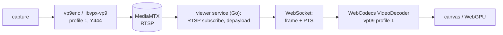

# Web viewer for 4:4:4 streams

Goal: watch a published stream in a stock browser, including the lossless RGB 4:4:4 mode, without custom browser builds.

## Why WHEP cannot carry it

Browsers play H.264, VP9 and AV1 in 4:2:0 over a WebRTC watch leg, and that path stays.
WebRTC profile negotiation stops at 4:2:0: VP9 profile 1 and AV1 High are not negotiable, and HEVC decoding is hardware-only, which excludes range extensions.
A `hevc_nvenc` `gbrp` stream therefore has no WHEP playback form, patched browser or not.

The display side is not the constraint.
Browsers composite in RGB, and WebCodecs plus canvas render full-chroma frames without loss.
The constraint is which decoder the browser owns and which codecs WebRTC negotiates.

## Chosen pipeline

VP9 profile 1 (4:4:4), encoded on the CPU with libvpx, published over RTSP, re-served as encoded frames over WebSocket, decoded in the page with WebCodecs, rendered to canvas.

Why these parts:

- VP9 profile 1 is the one 4:4:4 codec with realtime CPU encoding and universal browser software decoding (libvpx on both ends).
  AV1 High also decodes everywhere (dav1d) but realtime 4:4:4 encoding costs far more CPU; possible later upgrade, same pipeline shape.
  NVENC encodes neither VP9 nor 4:4:4 AV1, so 4:4:4 stays a CPU encode regardless of codec.
- VP9 profile 1 supports the identity (RGB) matrix, so `gbrp` content can stay RGB end to end instead of round-tripping through YUV.
  libvpx also has a lossless mode, matching the existing lossless HEVC mode.
- RTSP is required on the publish leg: MPEG-TS has no VP9 mapping, so the SRT transport cannot carry this codec.
- WebSocket plus WebCodecs bypasses WebRTC negotiation entirely; the browser accepts any codec string `VideoDecoder.isConfigSupported` confirms.

## Work items

1. `capabilities`: add a VP9 profile 1 codec row (ffmpeg `libvpx-vp9`, GStreamer `vp9enc`) with its chroma and transport facts, so engines and UI derive support from the table.
2. `publish`: map the row in both engines.
   Realtime settings: `deadline=realtime`, `row-mt=1`, `cpu-used` 5 to 8, `tune-content=screen`, `-pix_fmt yuv444p` or GBR caps.
3. `transport`: constrain codec and transport pairing from the capabilities table (VP9 excludes SRT).
4. New viewer service in Go: subscribes to the relay over RTSP, depayloads VP9 access units, serves the viewer page and a WebSocket pushing `(frame, PTS)`.
5. Viewer page: configure `VideoDecoder` with the `vp09.01.*` string, feed WebSocket frames, draw each `VideoFrame` to canvas.
6. Measure end-to-end latency; target under 150 ms.

## Costs

- Encoding: libvpx realtime 4:4:4 at 1440p and above takes several cores; no GPU assist exists.
- Decoding: browser software decode, moderate CPU per viewer.
- Latency: roughly one frame for decode plus network; no jitter buffer beyond what the page adds.

## Rejected alternatives

- Custom Chromium with the HEVC software-decode patches: multi-hour build and patch rebase per release, and WHEP would still refuse software HEVC, so the WebSocket and WebCodecs feed would be needed anyway.
- Transcoding to 4:2:0 for WHEP: cheap on the GPU but discards the chroma the lossless mode exists for.
- MediaMTX LL-HLS with MSE: no new server code, but seconds of latency.
  Acceptable fallback for viewers without WebCodecs.
- Raw RGB frames over WebSocket: decode-free but roughly 5 Gbit/s at 1440p60; LAN-only at best.

## Open questions

- Whether an external browser is enough, since the Wails window cannot be the 4:4:4 viewer: WebKitGTK has WebCodecs, but `VideoDecoder.isConfigSupported` rejects `vp09.01` and `vp09.03` along with every other 4:4:4 configuration, accepting only the 4:2:0 strings (see `viewer-architecture.md`).
- Whether GStreamer `vp9enc` exposes lossless and identity-matrix settings directly, or the ffmpeg engine carries the lossless form alone.
